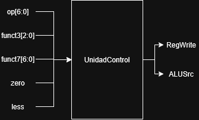
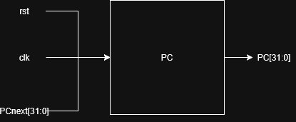
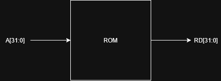
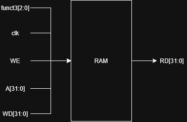

# Proyecto 3 – Batalla Naval sobre microprocesador RISC-V

## 1. Introducción

El siguiente proyecto es la creacion de un juego de "Batalla Naval", este se realiza con la combinacion de el lenguaje 'Assembly' con el HDL 'SystemVerilog' para la creacion de un procesador uniciclo con la arquitectura RISC-V y la logica de juego e interaccion con perifericos respectivamente, ademas de usar 'Python' para la creacion de una aplicacion ejecutable en cualquier computador para el correcto funcionamiento del juego. El juego dispondra de memorias RAM y ROM, ademas de contar con distintos modulos de manejo de perifericos. Por ultimo, se utilizara un modulo completo de UART para realizar la comunicacion serial.

## 2. Objetivos del diseño

### 2.1 Objetivo general

El objetivo general es lograr el correcto funcionamiento de un videojuego que no solo requiere la comunicacion de la PC-FPGA trabajada anteriormente, sino que ademas se tiene que lograr el funcionamiento de el sistema VGA para su implementacion correcta dentro del sistema, un microprocesador de 32 bits y realizar todo el sistema de juego correctamente.

### 2.2 Objetivos específicos

--Lograr la creacion funcional y util del procesador de 32 bits con arquitectura RISC-V.

--Lograr la creacion funcional y util de la memoria ROM y RAM, para el almacenamiento del programa y datos respectivamente.

--Lograr el correcto funcionamiento del períferico VGA para enviar la señal un monitor.

--Lograr el correcto funcionamiento e implementacion del sistema UART para una correcta comunicacion serial.

--Lograr el correcto funcionamiento del períferico de display de 7 segmentos para llevar el conteo de partidas ganadas por cada jugador

--Lograr que el sistema de juego funcione correctamente, siendo capaz de ejecutar su maquina de estados correctamente y mantener el flujo de juego de manera adecuada

## 3. Arquitectura general del sistema

### 3.1 Diagrama top-down

[Diagrama general del sistema]

Explicación del diagrama.

### 3.2 Jerarquía de módulos

[Diagrama jerárquico]

Ejemplo:

Basys3 Top
|
+-- Sistema de cómputo
    |
    +-- RISC-V Core
    +-- ROM
    +-- RAM
    +-- Bus Interconnect
    +-- UART
    +-- VGA
    +-- GPIO
    +-- Displays
    +-- LED
    +-- Buzzer

## 4. Microprocesador RISC-V

### 4.1 Arquitectura del procesador

El sistema utilizará un microprocesador de 32 bits basado en la arquitectura
RISC-V y en el subconjunto de instrucciones RV32I. Se utilizará una arquitectura
uniciclo, por lo que cada instrucción será ejecutada completamente durante un
único ciclo de reloj. 
La arquitectura del procesador se divide principalmente en los siguientes
bloques:

- Contador de programa (PC).
- Banco de registros.
- Generador de inmediatos.
- Unidad aritmético-lógica (ALU).
- Unidad de control.
- Decodificador principal.
- Decodificador de operaciones de la ALU.
- Sumadores para el cálculo de PC + 4 y direcciones de salto.
- Multiplexores para selección de operandos, resultado y siguiente valor del PC.

[Diagrama segundo nivel]

### 4.2 Módulos del procesador

El microprocesador se encuentra dividido en dos bloques principales:
el camino de datos (`datapath`) y la unidad de control (`control_unit`).
El módulo `cpu` funciona como nivel superior del procesador y realiza la
interconexión entre ambos bloques.

#### 4.2.1 ALU

La unidad aritmético-lógica (ALU) es el bloque encargado de realizar las
operaciones aritméticas, lógicas, de comparación y desplazamiento requeridas
por las instrucciones ejecutadas por el procesador.

La ALU recibe dos operandos de 32 bits, denominados `SrcA` y `SrcB`. La
operación que se realiza sobre estos operandos es determinada por la señal
`ALUControl`, de 4 bits, proveniente de la unidad de control.

Como resultado, la ALU genera la señal `ALUResult` de 32 bits. Adicionalmente,
genera las señales `zero` y `less`, utilizadas posteriormente por la unidad
de control para evaluar condiciones asociadas a instrucciones de salto.

Las entradas y salidas del módulo se muestran en la siguiente tabla:

| Señal | Dirección | Tamaño | Descripción |
|---|---|---:|---|
| `SrcA` | Entrada | 32 bits | Primer operando de la ALU. |
| `SrcB` | Entrada | 32 bits | Segundo operando de la ALU. |
| `ALUControl` | Entrada | 4 bits | Selecciona la operación que realiza la ALU. |
| `ALUResult` | Salida | 32 bits | Resultado de la operación realizada. |
| `zero` | Salida | 1 bit | Se activa cuando `ALUResult` es igual a cero. |
| `less` | Salida | 1 bit | Indica si `SrcA` es menor que `SrcB` mediante una comparación con signo. |

#### 4.2.2 Banco de registros

El módulo `reg_file` implementa un banco de 32 registros de 32 bits. Su
función es almacenar los operandos y resultados utilizados durante la
ejecución de las instrucciones.

El banco permite realizar dos lecturas simultáneas mediante las salidas `RD1`
y `RD2`, y una escritura mediante la entrada `WD3`. Las direcciones de los
registros utilizados se indican mediante las señales `A1`, `A2` y `A3`.

Dentro del datapath, estas direcciones se obtienen directamente de los campos
de la instrucción:

- `A1 = Instr[19:15]`
- `A2 = Instr[24:20]`
- `A3 = Instr[11:7]`

La señal `RegWrite`, proveniente de la unidad de control, se conecta a `WE3`
y determina si debe realizarse una escritura. El valor que se escribe en el
registro seleccionado corresponde a la señal `Result`, proveniente del
multiplexor de resultados.

Las salidas `RD1` y `RD2` corresponden al contenido de los registros
seleccionados por `A1` y `A2`, respectivamente. `RD1` se utiliza como primer
operando de la ALU, mientras que `RD2` puede utilizarse como segundo operando
de la ALU o como dato para una operación de escritura en memoria.

El registro `x0` mantiene siempre el valor cero. Cuando `A1` o `A2` seleccionan
el registro cero, la salida correspondiente retorna `0`. De igual manera, las
operaciones de escritura sobre `x0` son ignoradas.

| Señal | Dirección |  Tamaño | Descripción                                                    |
| ----- | --------- | ------: | -------------------------------------------------------------- |
| `clk` | Entrada   |   1 bit | Reloj utilizado para realizar las escrituras en los registros. |
| `WE3` | Entrada   |   1 bit | Habilita la escritura en el banco de registros.                |
| `A1`  | Entrada   |  5 bits | Dirección del primer registro que se desea leer.               |
| `A2`  | Entrada   |  5 bits | Dirección del segundo registro que se desea leer.              |
| `A3`  | Entrada   |  5 bits | Dirección del registro en el cual se realizará la escritura.   |
| `WD3` | Entrada   | 32 bits | Dato que será escrito en el registro seleccionado por `A3`.    |
| `RD1` | Salida    | 32 bits | Dato almacenado en el registro seleccionado por `A1`.          |
| `RD2` | Salida    | 32 bits | Dato almacenado en el registro seleccionado por `A2`.          |

#### 4.2.3 Generador de inmediatos

Generar un valor inmediato de 32 bits a partir de los campos correspondientes
de la instrucción RISC-V, de acuerdo con el formato indicado por la señal de
control `ImmSrc`.

El módulo `Extend` recibe la instrucción completa de 32 bits mediante la señal
`Instr` y utiliza la señal `ImmSrc` para determinar cómo deben reorganizarse y
extenderse los bits que forman el inmediato.

Dependiendo del tipo de instrucción, los bits del inmediato se encuentran en
diferentes posiciones dentro de `Instr`. El módulo se encarga de extraerlos,
ordenarlos y extenderlos hasta obtener un valor de 32 bits denominado
`ImmExt`.

| Señal | Dirección | Tamaño | Descripción |
|---|---|---:|---|
| `Instr` | Entrada | 32 bits | Instrucción actual de la cual se extraen los bits del inmediato. |
| `ImmSrc` | Entrada | 4 bits | Selecciona el formato utilizado para construir el inmediato. |
| `ImmExt` | Salida | 32 bits | Valor inmediato extendido a 32 bits. |

#### 4.2.4 Unidad de control

Este modulo se encarga de decodificar la instrucción que se encuentra en ejecución y generar las señales
de control necesarias para determinar el comportamiento del `datapath`.

El módulo `control_unit` recibe los campos principales de la instrucción:

- `op`: código de operación de la instrucción.
- `funct3`: campo utilizado para diferenciar operaciones que comparten un mismo
  `opcode`.
- `funct7`: campo adicional utilizado para diferenciar ciertas operaciones.

| Señal        | Dirección | Tamaño | Descripción                                                                                     |
| ------------ | --------- | -----: | ----------------------------------------------------------------------------------------------- |
| `op`         | Entrada   | 7 bits | Código de operación de la instrucción.                                                          |
| `funct3`     | Entrada   | 3 bits | Campo de función utilizado para diferenciar instrucciones con un mismo `opcode`.                |
| `funct7`     | Entrada   | 7 bits | Campo adicional utilizado para diferenciar determinadas operaciones.                            |
| `zero`       | Entrada   |  1 bit | Indica que el resultado generado por la ALU es igual a cero.                                    |
| `less`       | Entrada   |  1 bit | Indica que el primer operando de la ALU es menor que el segundo mediante comparación con signo. |
| `RegWrite`   | Salida    |  1 bit | Habilita la escritura en el banco de registros.                                                 |
| `ALUSrc`     | Salida    |  1 bit | Selecciona el segundo operando utilizado por la ALU.                                            |
| `ResultSrc`  | Salida    | 2 bits | Selecciona el resultado que será escrito en el banco de registros.                              |
| `ImmSrc`     | Salida    | 4 bits | Selecciona el formato utilizado por el generador de inmediatos.                                 |
| `ALUControl` | Salida    | 4 bits | Selecciona la operación que debe realizar la ALU.                                               |
| `PCSrc`      | Salida    | 2 bits | Selecciona el siguiente valor del contador de programa.                                         |
| `MemWrite`   | Salida    |  1 bit | Habilita la escritura en la memoria de datos.                                                   |

[Tabla de señales de control]

| Señal | Dirección | Tamaño | Descripción |
|---|---|---:|---|
| `op` | Entrada | 7 bits | Código de operación de la instrucción utilizado para identificar el tipo de instrucción. |
| `funct3` | Entrada | 3 bits | Campo de función utilizado para diferenciar instrucciones que comparten un mismo `opcode`. |
| `funct7` | Entrada | 7 bits | Campo de función adicional utilizado para diferenciar determinadas operaciones. |
| `zero` | Entrada | 1 bit | Indica que el resultado generado por la ALU es igual a cero. |
| `less` | Entrada | 1 bit | Indica que `SrcA` es menor que `SrcB` mediante una comparación con signo. |
| `RegWrite` | Salida | 1 bit | Habilita la escritura de un resultado en el banco de registros. |
| `ALUSrc` | Salida | 1 bit | Selecciona el segundo operando de la ALU entre `RD2` e `ImmExt`. |
| `ResultSrc` | Salida | 2 bits | Selecciona el dato que será escrito nuevamente en el banco de registros. |
| `MemWrite` | Salida | 1 bit | Habilita la escritura en la memoria de datos. |
| `ImmSrc` | Salida | 4 bits | Selecciona el formato de inmediato que debe generar el módulo `Extend`. |
| `ALUControl` | Salida | 4 bits | Selecciona la operación que debe realizar la ALU. |
| `PCSrc` | Salida | 2 bits | Selecciona la fuente utilizada para determinar el siguiente valor del contador de programa. |

#### 4.2.5 Comparador de branch

Determinar si se cumple la condición asociada a una instrucción de salto
condicional y, a partir de dicho resultado, indicar si el contador de programa
debe continuar con la ejecución secuencial o cargar la dirección de salto
`PCTarget`.

En el procesador actual, la comparación necesaria para las instrucciones de
branch no se encuentra implementada como un módulo independiente. Esta función
se encuentra distribuida entre la ALU y la unidad de control.

La ALU recibe los operandos `SrcA` y `SrcB` y genera las señales `zero` y
`less`.

La señal `zero` se activa cuando el resultado de la operación realizada por la
ALU es igual a cero:

`zero = (ALUResult == 32'd0)`

Por otra parte, `less` indica si `SrcA` es menor que `SrcB` mediante una
comparación con signo:

`less = ($signed(SrcA) < $signed(SrcB))`

Estas dos señales son enviadas hacia `control_unit`, donde se combinan con las
señales internas que identifican el tipo de branch. De esta manera se determina
el valor de `PCSrc`.

| Señal | Origen | Tamaño | Descripción |
|---|---|---:|---|
| `zero` | ALU | 1 bit | Indica que `ALUResult` es igual a cero. |
| `less` | ALU | 1 bit | Indica que `SrcA` es menor que `SrcB` mediante comparación con signo. |
| `Branch` | `main_decoder` | 1 bit | Identifica una instrucción `BEQ`. |
| `BranchNE` | `main_decoder` | 1 bit | Identifica una instrucción `BNE`. |
| `BranchLT` | `main_decoder` | 1 bit | Identifica una instrucción `BLT`. |
| `BranchGE` | `main_decoder` | 1 bit | Identifica una instrucción `BGE`. |
| `PCSrc` | `control_unit` | 2 bits | Selecciona la fuente del siguiente valor del PC. |

#### 4.2.6 Program Counter

El módulo `pc` implementa el contador de programa del procesador. Este registro
mantiene un valor de 32 bits denominado `PC`, el cual representa la dirección de
la instrucción actual.

El valor del contador se actualiza en cada flanco positivo de la señal `clk`.
Durante una operación normal, el nuevo valor almacenado corresponde a
`PCnext`, generado por el multiplexor `u_pcmux` dentro del `datapath`.

Cuando la señal `rst` se encuentra activa, el contador de programa se reinicia
a `32'b0`, haciendo que la ejecución comience desde la dirección
`0x00000000`.

| Señal    | Dirección |  Tamaño | Descripción                                                                  |
| -------- | --------- | ------: | ---------------------------------------------------------------------------- |
| `clk`    | Entrada   |   1 bit | Señal de reloj utilizada para actualizar el contador de programa.            |
| `rst`    | Entrada   |   1 bit | Reinicia el contador de programa a `0x00000000`.                             |
| `PCnext` | Entrada   | 32 bits | Dirección que será almacenada como siguiente valor del contador de programa. |
| `PC`     | Salida    | 32 bits | Dirección de la instrucción que se encuentra actualmente en ejecución.       |

### 4.3 Instrucciones soportadas
| Instrucciones                         | Estado actual                                                                                                                         |
| ------------------------------------- | ------------------------------------------------------------------------------------------------------------------------------------- |
| `add`, `sub`, `and`, `or`, `xor`      | Implementadas en la ALU y decodificadas.                                                                                              |
| `slt`, `sll`, `srl`, `sra`            | Implementadas en la ALU y decodificadas.                                                                                              |
| `addi`, `andi`, `ori`, `xori`, `slti` | Implementadas y decodificadas.                                                                                                        |
| `slli`, `srli`, `srai`                | Implementadas y decodificadas.                                                                                                        |
| `beq`, `bne`, `blt`, `bge`            | Contempladas en la unidad de control.                                                                                                 |
| `jal`                                 | Contemplada en la unidad de control y el `datapath`.                                                                                  |
| `lb`, `lh`, `lw`, `lbu`, `lhu`        | Contempladas por la memoria de datos; falta completar la conexión de `funct3` en el `datapath`.                                       |
| `sb`, `sh`, `sw`                      | Contempladas por la memoria de datos; falta completar la conexión de `funct3` en el `datapath`.                                       |
| `jalr`                                | El `datapath` y `PCSrc` contemplan el salto, pero falta completar su decodificación en `main_decoder`.                                |
| `lui`                                 | El generador de inmediatos y la ALU contemplan la operación, pero falta completar la decodificación correspondiente en `alu_decoder`. |
| `sltu`, `sltiu`                       | La ALU contempla la comparación sin signo, pero falta completar su decodificación en `alu_decoder`.                                   |

## 5. Subsistema de memoria

### 5.1 ROM

El módulo `instr_mem` implementa la memoria de instrucciones del procesador.
La memoria está formada por palabras de 32 bits y utiliza como dirección de
entrada la señal `A`, proveniente directamente del contador de programa.

| Señal | Dirección |  Tamaño | Descripción                                                   |
| ----- | --------- | ------: | ------------------------------------------------------------- |
| `A`   | Entrada   | 32 bits | Dirección de la instrucción solicitada, proveniente del `PC`. |
| `RD`  | Salida    | 32 bits | Instrucción almacenada en la dirección seleccionada.          |

| Parámetro | Valor actual | Descripción                                                |
| --------- | -----------: | ---------------------------------------------------------- |
| `DEPTH`   |          256 | Cantidad de palabras de 32 bits almacenadas en la memoria. |

### 5.2 RAM

El módulo `data_mem` implementa la memoria de datos del procesador mediante un
arreglo de 256 palabras de 32 bits.

| `funct3` | Operación | Resultado de lectura                                 |
| -------- | --------- | ---------------------------------------------------- |
| `000`    | `lb`      | Lee 8 bits y realiza extensión de signo a 32 bits.   |
| `001`    | `lh`      | Lee 16 bits y realiza extensión de signo a 32 bits.  |
| `010`    | `lw`      | Lee los 32 bits de la palabra.                       |
| `100`    | `lbu`     | Lee 8 bits y realiza extensión con ceros a 32 bits.  |
| `101`    | `lhu`     | Lee 16 bits y realiza extensión con ceros a 32 bits. |

| `funct3` | Operación | Escritura realizada |
| -------- | --------- | ------------------- |
| `000`    | `sb`      | Escribe `WD[7:0]`.  |
| `001`    | `sh`      | Escribe `WD[15:0]`. |
| `010`    | `sw`      | Escribe `WD[31:0]`. |

### 5.3 Organización de datos en RAM

## Organización de datos en RAM

La memoria RAM se utilizará para almacenar los datos necesarios durante la
ejecución del juego, principalmente los tableros de ambos jugadores y algunas
variables de control.

Cada jugador posee un tablero de 8 × 8 casillas, por lo que se almacenarán
64 posiciones por jugador. Cada posición utilizará una palabra de 32 bits.

La organización propuesta es:

| Región | Dirección inicial | Contenido |
|---|---:|---|
| Tablero Jugador 1 | `0x00002000` | 64 casillas del tablero del Jugador 1 |
| Tablero Jugador 2 | `0x00002100` | 64 casillas del tablero del Jugador 2 |
| Variables de control | `0x00002200` | Turno, fase del juego, contadores y estado de barcos |

Cada casilla del tablero podrá almacenar uno de los siguientes estados:

| Valor | Estado |
|---:|---|
| `0` | Agua |
| `1` | Barco 0 |
| `2` | Barco 1 |
| `3` | Barco 2 |
| `4` | Fallo |
| `5` | Barco 0 impactado |
| `6` | Barco 1 impactado |
| `7` | Barco 2 impactado |

Las posiciones del tablero se almacenarán por filas. La dirección de una
casilla se calculará mediante:

`dirección = BASE + (fila × 8 + columna) × 4`

## 6. Interconexión y mapa de memoria

### 6.1 Bus del sistema

Explicar:

DataAddress
DataOut
DataIn
Write Enable

### 6.2 Decodificación de direcciones

[Diagrama del bus/interconnect]

### 6.3 Mapa de memoria

| Dispositivo | Dirección / rango |
|-------------|-------------------|
| ROM | 0x00000000 – 0x00001FFF |
| RAM | 0x00002000 – 0x00002FFF |
| UART | ... |
| GPIO | ... |
| VGA | ... |
| Buzzer | ... |

## 7. Periféricos

## 7.1 Entradas del Jugador 1

a) Nombre del módulo: j1_input (instancia sync y debouncer)

b) 

Diagrama tercer nivel

c) Objetivo: ntregar al CPU, en un único registro de 32 bits legible por lw, el estado ya sincronizado y filtrado de rebotes de los 6 controles físicos del Jugador 1 (arriba, abajo, izquierda, derecha, OK/rotar, reiniciar).

d) 
| entradas | descripcion |
|-----|---------|
| clk_i, rst_i| Reloj de sistema y reset |
| btns_in[5:0] |	Señales físicas crudas de los pulsadores |
| write_enable_i, addr_i[1:0], wdata_i[31:0] | 	Bus estándar (no se usan para escritura; periférico de solo lectura) |

e)  
| salidas | descripcion |
|-----|---------|
|rdata_o[31:0]	| 	{26'b0, btns_debounced[5:0]} en addr_i=00 |

f) ) Relación con otros módulos: Es consumido exclusivamente por el programa en ensamblador (subrutina leer_botones), que lee este registro por polling. No depende de ningún otro periférico.

### Debouncing

g) El sincronizador de dos etapas resuelve la metaestabilidad de las 6 entradas asíncronas. El filtro antirrebote —replicado 6 veces mediante generate— solo actualiza btn_out[i] cuando la entrada se mantiene estable durante 2²⁰−1 ciclos consecutivos (~10.5 ms a 100 MHz), reiniciando el conteo cada vez que detecta un cambio. El resultado se expone de forma puramente combinacional en rdata_o

### Registro de estado

d) Ecuacion de metaestabilidad t_estable = (2^20 − 1) / CLK_FREQ_HZ ≈ 10.49 ms  (a 100 MHz)

| Bit | Entrada |
|-----|---------|
| 0 | Arriba |
| 1 | Abajo |
| 2 | Izquierda |
| 3 | Derecha |
| 4 | BTN SEL |
| 5 | BTN OK |
| 6 | BTN RST |

## 7.2 UART

Objetivo:
Descripción:

### Módulos internos

- Baud generator
- UART TX
- UART RX
- UART peripheral

### Registros

| Offset | Registro |
|--------|----------|
| 0x00 | Control/Estado |
| 0x04 | TX |
| 0x08 | RX |

## 7.3 VGA
#### Diagrama (Nivel 3)

#### Objetivo: 
El siguiente periférico se encarga de mostrar en un monitor VGA un mapa de tiles correspondiente al juego battleships. Cada tile está compuesto por 32x32 pixeles que muestran un color especifico dependiendo de lo que se encuentre en este (agua, barco, impacto fallido o impacto acertado).
#### Descripción:  
###### tile_map_ram
Este se encarga de almacenar la información de los tiles, esta es modificada por el CPU conforme el juego avanza y la VGA puede leer esta información por medio del módulo tile_renderer.
Entradas:
Salidas:
###### vga_sync:
Genera señales de sincronización para la VGA y recorre cada pixel, para que el resto de módulos procesen la información de este.  
Entradas:
Salidas:
###### tile_renderer:
El módulo se encarga de identificar en que tile se encuentra cada pixel y que color representa a partir del pixel que recibe desde vga_sync y la información de tile_map_ram.
Entradas:
Salidas:
###### vga_periph:
Este integra al resto de módulos recibiendo la información que viene desde el procesador, el reloj con el que trabaja la VGA y generando las salidas físicas a la FPGA. 
Entradas:
Salidas:

### Generación de sincronismos

Explicar 640 × 480 @ 60 Hz.

### Tile Map

Explicar la cuadrícula seleccionada.

[Diagrama de pantalla]

### Memoria de video

Explicar Dual-Port RAM.

### Codificación de tiles

| Código | Contenido |
|--------|-----------|
| ... | Agua |
| ... | Barco |
| ... | Impacto |
| ... | Fallo |
| ... | HUD |

## 7.4 Displays de 7 segmentos

a) Nombre del modulo: display_7seg.sv, seven_seg_mux.sv

b)

Diagrama tercer nivel

c) Objetivo:
Mostrar en los 4 displays físicos de la Basys3 el contador acumulado de partidas ganadas por cada jugador (2 dígitos por jugador), multiplexando en el tiempo.
Descripción:    
Este periferico se encarga de mostrar las partidas totales ganadas por cada uno de los jugadores
Asignación de los cuatro dígitos.

e) 
| entradas | descripcion |
|-----|---------|
| clk_i, rst_i| Reloj de sistema y reset |
| write_enable_i, addr_i[1:0], wdata_i[31:0] | Bus estándar; 4 dígitos BCD empaquetados en wdata_i[15:0] |

f) 
| salidas | descripcion |
|-----|---------|
| rdata_o[31:0]| 	Eco del registro de datos |
| seg[6:0], dp, an[3:0]| Señales físicas hacia los displays |

## 7.5 LED de estado

Objetivo:
Descripción:

Definir cómo se indicarán:

- Colocación
- Batalla
- Fin de partida

## 7.6 Buzzer

Objetivo:
Descripción:

Definir los sonidos para:

- Impacto
- Fallo
- Barco hundido
- Colocación inválida
- Victoria

## 8. Sistema de reloj

### 8.1 Reloj principal

100 MHz de la FPGA.

### 8.2 Reloj VGA

Generación de 25 MHz mediante PLL.

[Diagrama de dominios de reloj]

## 9. Programa en ensamblador

### 9.1 Organización general

[Diagrama de flujo principal]

Implementar la lógica completa del juego de Batalla Naval mediante un programa
en ensamblador RISC-V ejecutado por el microprocesador.

El programa será responsable de controlar la colocación de barcos, los turnos,
los disparos, la detección de impactos, barcos hundidos y la condición de
victoria.

El programa seguirá un flujo principal dividido en las siguientes etapas:

1. Inicialización del sistema.
2. Limpieza de los tableros y variables almacenadas en RAM.
3. Colocación de barcos del Jugador 1 y Jugador 2.
4. Inicio de la fase de batalla.
5. Lectura del jugador correspondiente.
6. Validación del disparo.
7. Actualización del tablero.
8. Verificación de barcos hundidos.
9. Verificación de la condición de victoria.
10. Cambio de turno.
11. Finalización de la partida.

### 9.2 Subrutinas propuestas

Explicar las principales subrutinas:

| Subrutina            | Función                                                              |
| -------------------- | -------------------------------------------------------------------- |
| `sistema_ini`        | Inicializar variables y periféricos.                                 |
| `limpiar_tableros`       | Limpiar los tableros almacenados en RAM.                             |
| `barco_ini`         | Colocar un barco en el tablero correspondiente.                      |
| `barco_valido`      | Verificar que un barco no salga del tablero ni se traslape con otro. |
| `input_j1` | Leer las entradas del Jugador 1.                                     |
| `input_j2`          | Recibir comandos del Jugador 2 mediante UART.                        |
| `verif_shot`       | Procesar un disparo realizado por un jugador.                        |
| `acierto`          | Determinar si un disparo corresponde a impacto o fallo.              |
| `hundir`         | Determinar si un barco fue hundido.                                  |
| `condi_ganar`      | Verificar si todos los barcos de un jugador fueron hundidos.         |
| `sistema_vga`         | Actualizar la información mostrada mediante VGA.                     |
| `uart_p1`          | Enviar información hacia la aplicación del Jugador 2.                |
| `buzzer_sound`         | Activar el buzzer dependiendo del evento ocurrido.                   |

## 10. Protocolo de comunicación UART

### 10.1 PC → FPGA

Definir tramas para:

- Colocación de barco
- Disparo

### 10.2 FPGA → PC

Definir tramas para:

- Colocación aceptada
- Colocación rechazada
- Cambio de turno
- Impacto
- Fallo
- Barco hundido
- Fin de partida

### 10.3 Formato de trama

[Tabla con bytes/campos]

## 11. Aplicación de PC

Explicar brevemente el diseño propuesto para Python.

[Diagrama de flujo de la aplicación]

Funciones principales:

- Conexión serial
- Colocación de barcos
- Visualización de tableros
- Envío de disparos
- Recepción de eventos

## 12. Estrategia de implementación

Explicar el orden de desarrollo propuesto.

Por ejemplo:

Core → Memorias → Bus → Periféricos → VGA → UART →
Integración → Ensamblador → Aplicación Python

## 13. Plan de validación

### 13.1 Pruebas unitarias

Definir testbench para cada módulo.

### 13.2 Pruebas de integración

Core + ROM + RAM

Core + Bus

Core + Periféricos

Sistema completo

### 13.3 Pruebas autoverificables

Explicar los criterios PASS/FAIL de los testbenches.

## 14. Decisiones de diseño y justificación

-Se selecciona la estructura monociclo debido a que no solo se está familiarizado con esta, sino que representa la opción más obvia para el proyecto y sencilla de implementar, 
por lo que da la oportunidad de alocar más tiempo a otras partes del proyecto.

-La organización de la RAM se realizó de esa manera, ya que mantiene un orden lógico (cada uno de los estados de la casilla está ordenado de manera ascendente). 
Además, que cada posición de casilla sea su mismo índice para ser encontrado facilita la lectura y comprensión, por lo que el trabajar con este orden es más fácil.

- Tamaño del tile VGA
- Codificación del tablero
- Protocolo UART
- Manejo de botones
- Organización modular

## 17. Referencias
