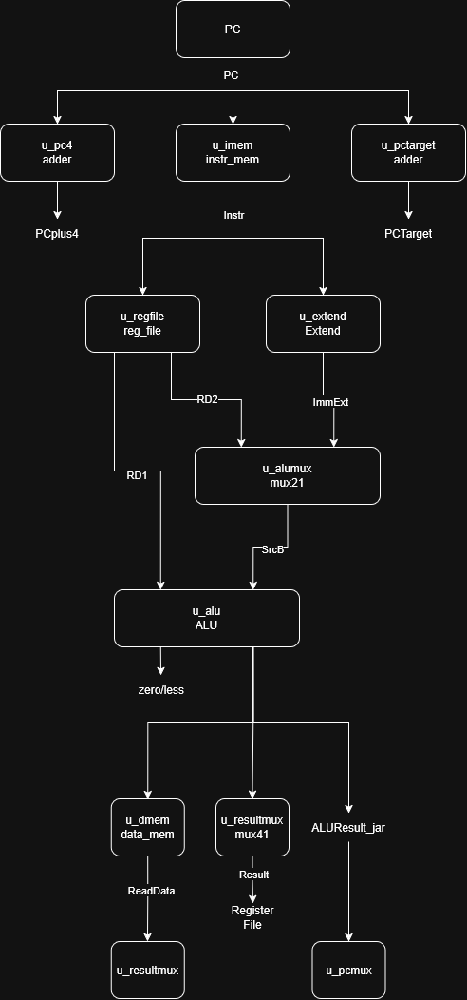
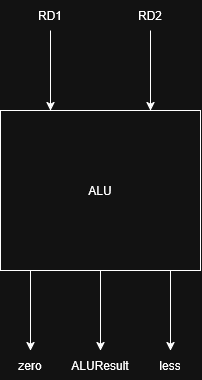
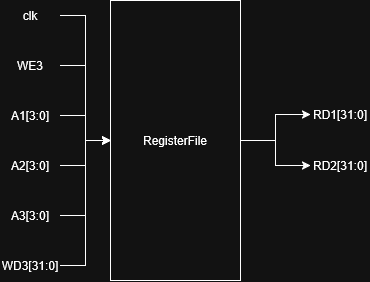
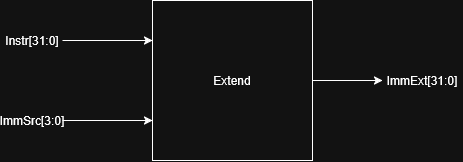

# Proyecto 3 – Batalla Naval sobre microprocesador RISC-V

## 1. Introducción

El siguiente proyecto es la creacion de un juego de "Batalla Naval", este se realiza con la combinacion de el lenguaje 'Assembly' con el HDL 'SystemVerilog' para la creacion de un procesador uniciclo con la arquitectura RISC-V y la logica de juego e interaccion con perifericos respectivamente, ademas de usar 'Python' para la creacion de una aplicacion ejecutable en cualquier computador para el correcto funcionamiento del juego. El juego dispondra de memorias RAM y ROM, ademas de contar con distintos modulos de manejo de perifericos. Por ultimo, se utilizara un modulo completo de UART para realizar la comunicacion serial.

## 2. Objetivos del diseño

### 2.1 Objetivo general

El objetivo general es lograr el correcto funcionamiento de un videojuego que no solo requiere la comunicacion de la PC-FPGA trabajada anteriormente, sino que ademas se tiene que lograr el funcionamiento de el sistema VGA para su implementacion correcta dentro del sistema, un microprocesador de 32 bits y realizar todo el sistema de juego correctamente.

### 2.2 Objetivos específicos

--Lograr la creacion funcional y util del procesador de 32 bits con arquitectura RISC-V.

--Lograr la creacion funcional y util de la memoria ROM y RAM, para el almacenamiento del programa y datos respectivamente.

--Lograr el correcto funcionamiento del períferico VGA para enviar la señal un monitor.

--Lograr el correcto funcionamiento e implementacion del sistema UART para una correcta comunicacion serial.

--Lograr el correcto funcionamiento del períferico de display de 7 segmentos para llevar el conteo de partidas ganadas por cada jugador

--Lograr que el sistema de juego funcione correctamente, siendo capaz de ejecutar su maquina de estados correctamente y mantener el flujo de juego de manera adecuada

## 3. Arquitectura general del sistema

### 3.1 Diagrama top-down

[Diagrama general del sistema]

Explicación del diagrama.

### 3.2 Jerarquía de módulos

[Diagrama jerárquico]

Ejemplo:

Basys3 Top
|
+-- Sistema de cómputo
    |
    +-- RISC-V Core
    +-- ROM
    +-- RAM
    +-- Bus Interconnect
    +-- UART
    +-- VGA
    +-- GPIO
    +-- Displays
    +-- LED
    +-- Buzzer

## 4. Microprocesador RISC-V

### 4.1 Arquitectura del procesador

El sistema utilizará un microprocesador de 32 bits basado en la arquitectura
RISC-V y en el subconjunto de instrucciones RV32I. Se utilizará una arquitectura
uniciclo, por lo que cada instrucción será ejecutada completamente durante un
único ciclo de reloj. 
La arquitectura del procesador se divide principalmente en los siguientes
bloques:

- Contador de programa (PC).
- Banco de registros.
- Generador de inmediatos.
- Unidad aritmético-lógica (ALU).
- Unidad de control.
- Decodificador principal.
- Decodificador de operaciones de la ALU.
- Sumadores para el cálculo de PC + 4 y direcciones de salto.
- Multiplexores para selección de operandos, resultado y siguiente valor del PC.

[Diagrama segundo nivel]

### 4.2 Módulos del procesador

El microprocesador se encuentra dividido en dos bloques principales:
el camino de datos (`datapath`) y la unidad de control (`control_unit`).
El módulo `cpu` funciona como nivel superior del procesador y realiza la
interconexión entre ambos bloques.

#### 4.2.1 ALU

La unidad aritmético-lógica (ALU) es el bloque encargado de realizar las
operaciones aritméticas, lógicas, de comparación y desplazamiento requeridas
por las instrucciones ejecutadas por el procesador.

La ALU recibe dos operandos de 32 bits, denominados `SrcA` y `SrcB`. La
operación que se realiza sobre estos operandos es determinada por la señal
`ALUControl`, de 4 bits, proveniente de la unidad de control.

Como resultado, la ALU genera la señal `ALUResult` de 32 bits. Adicionalmente,
genera las señales `zero` y `less`, utilizadas posteriormente por la unidad
de control para evaluar condiciones asociadas a instrucciones de salto.

Las entradas y salidas del módulo se muestran en la siguiente tabla:

| Señal | Dirección | Tamaño | Descripción |
|---|---|---:|---|
| `SrcA` | Entrada | 32 bits | Primer operando de la ALU. |
| `SrcB` | Entrada | 32 bits | Segundo operando de la ALU. |
| `ALUControl` | Entrada | 4 bits | Selecciona la operación que realiza la ALU. |
| `ALUResult` | Salida | 32 bits | Resultado de la operación realizada. |
| `zero` | Salida | 1 bit | Se activa cuando `ALUResult` es igual a cero. |
| `less` | Salida | 1 bit | Indica si `SrcA` es menor que `SrcB` mediante una comparación con signo. |

#### 4.2.2 Banco de registros

El módulo `reg_file` implementa un banco de 32 registros de 32 bits. Su
función es almacenar los operandos y resultados utilizados durante la
ejecución de las instrucciones.

El banco permite realizar dos lecturas simultáneas mediante las salidas `RD1`
y `RD2`, y una escritura mediante la entrada `WD3`. Las direcciones de los
registros utilizados se indican mediante las señales `A1`, `A2` y `A3`.

Dentro del datapath, estas direcciones se obtienen directamente de los campos
de la instrucción:

- `A1 = Instr[19:15]`
- `A2 = Instr[24:20]`
- `A3 = Instr[11:7]`

La señal `RegWrite`, proveniente de la unidad de control, se conecta a `WE3`
y determina si debe realizarse una escritura. El valor que se escribe en el
registro seleccionado corresponde a la señal `Result`, proveniente del
multiplexor de resultados.

Las salidas `RD1` y `RD2` corresponden al contenido de los registros
seleccionados por `A1` y `A2`, respectivamente. `RD1` se utiliza como primer
operando de la ALU, mientras que `RD2` puede utilizarse como segundo operando
de la ALU o como dato para una operación de escritura en memoria.

El registro `x0` mantiene siempre el valor cero. Cuando `A1` o `A2` seleccionan
el registro cero, la salida correspondiente retorna `0`. De igual manera, las
operaciones de escritura sobre `x0` son ignoradas.

| Señal | Dirección |  Tamaño | Descripción                                                    |
| ----- | --------- | ------: | -------------------------------------------------------------- |
| `clk` | Entrada   |   1 bit | Reloj utilizado para realizar las escrituras en los registros. |
| `WE3` | Entrada   |   1 bit | Habilita la escritura en el banco de registros.                |
| `A1`  | Entrada   |  5 bits | Dirección del primer registro que se desea leer.               |
| `A2`  | Entrada   |  5 bits | Dirección del segundo registro que se desea leer.              |
| `A3`  | Entrada   |  5 bits | Dirección del registro en el cual se realizará la escritura.   |
| `WD3` | Entrada   | 32 bits | Dato que será escrito en el registro seleccionado por `A3`.    |
| `RD1` | Salida    | 32 bits | Dato almacenado en el registro seleccionado por `A1`.          |
| `RD2` | Salida    | 32 bits | Dato almacenado en el registro seleccionado por `A2`.          |

#### 4.2.3 Generador de inmediatos

Objetivo:
Generar un valor inmediato de 32 bits a partir de los campos correspondientes
de la instrucción RISC-V, de acuerdo con el formato indicado por la señal de
control `ImmSrc`.

Descripción:
El módulo `Extend` recibe la instrucción completa de 32 bits mediante la señal
`Instr` y utiliza la señal `ImmSrc` para determinar cómo deben reorganizarse y
extenderse los bits que forman el inmediato.

Dependiendo del tipo de instrucción, los bits del inmediato se encuentran en
diferentes posiciones dentro de `Instr`. El módulo se encarga de extraerlos,
ordenarlos y extenderlos hasta obtener un valor de 32 bits denominado
`ImmExt`.

| Señal | Dirección | Tamaño | Descripción |
|---|---|---:|---|
| `Instr` | Entrada | 32 bits | Instrucción actual de la cual se extraen los bits del inmediato. |
| `ImmSrc` | Entrada | 4 bits | Selecciona el formato utilizado para construir el inmediato. |
| `ImmExt` | Salida | 32 bits | Valor inmediato extendido a 32 bits. |

#### 4.2.4 Unidad de control

Objetivo:
Descripción:

[Tabla de señales de control]

#### 4.2.5 Comparador de branch

Objetivo:
Descripción:

#### 4.2.6 Program Counter

Objetivo:
Descripción:

### 4.3 Instrucciones soportadas

| Tipo | Instrucciones |
|------|---------------|
| Load/Store | lw, sw |
| Aritméticas | add, sub, addi |
| Lógicas | and, or, xor, ... |
| Branch | beq, bne, blt, bge |
| Jump | jal, jalr |
| ... | ... |

## 5. Subsistema de memoria

### 5.1 ROM

Objetivo:
Tamaño:
Rango de direcciones:
Funcionamiento:

### 5.2 RAM

Objetivo:
Tamaño:
Rango de direcciones:
Funcionamiento:

### 5.3 Organización de datos en RAM

Explicar cómo se almacenarán:

- Tablero del Jugador 1
- Tablero del Jugador 2
- Barcos
- Turno actual
- Contadores
- Variables del juego

## 6. Interconexión y mapa de memoria

### 6.1 Bus del sistema

Explicar:

DataAddress
DataOut
DataIn
Write Enable

### 6.2 Decodificación de direcciones

[Diagrama del bus/interconnect]

### 6.3 Mapa de memoria

| Dispositivo | Dirección / rango |
|-------------|-------------------|
| ROM | 0x00000000 – 0x00001FFF |
| RAM | 0x00002000 – 0x00002FFF |
| UART | ... |
| GPIO | ... |
| VGA | ... |
| Buzzer | ... |

## 7. Periféricos

## 7.1 Entradas del Jugador 1

Objetivo:
Descripción:

### Debouncing

Explicar el método propuesto.

### Registro de estado

| Bit | Entrada |
|-----|---------|
| ... | Arriba |
| ... | Abajo |
| ... | Izquierda |
| ... | Derecha |
| ... | BTN SEL |
| ... | BTN OK |
| ... | BTN RST |

## 7.2 UART

Objetivo:
Descripción:

### Módulos internos

- Baud generator
- UART TX
- UART RX
- UART peripheral

### Registros

| Offset | Registro |
|--------|----------|
| 0x00 | Control/Estado |
| 0x04 | TX |
| 0x08 | RX |

## 7.3 VGA

Objetivo:
Descripción:

### Generación de sincronismos

Explicar 640 × 480 @ 60 Hz.

### Tile Map

Explicar la cuadrícula seleccionada.

[Diagrama de pantalla]

### Memoria de video

Explicar Dual-Port RAM.

### Codificación de tiles

| Código | Contenido |
|--------|-----------|
| ... | Agua |
| ... | Barco |
| ... | Impacto |
| ... | Fallo |
| ... | HUD |

## 7.4 Displays de 7 segmentos

Objetivo:
Mostrar la cantidad de partidas ganadas por cada jugador
Descripción:    
Este periferico se encarga de mostrar las partidas totales ganadas por cada uno de los jugadores
Asignación de los cuatro dígitos.

## 7.5 LED de estado

Objetivo:
Descripción:

Definir cómo se indicarán:

- Colocación
- Batalla
- Fin de partida

## 7.6 Buzzer

Objetivo:
Descripción:

Definir los sonidos para:

- Impacto
- Fallo
- Barco hundido
- Colocación inválida
- Victoria

## 8. Sistema de reloj

### 8.1 Reloj principal

100 MHz de la FPGA.

### 8.2 Reloj VGA

Generación de 25 MHz mediante PLL.

[Diagrama de dominios de reloj]

## 9. Programa en ensamblador

### 9.1 Organización general

[Diagrama de flujo principal]

Inicialización
      |
      v
Colocación
      |
      v
Batalla
      |
      v
Fin de partida

### 9.2 Subrutinas propuestas

Explicar las principales subrutinas:

- Inicializar sistema
- Limpiar tableros
- Colocar barco
- Validar colocación
- Realizar disparo
- Validar disparo
- Detectar impacto
- Detectar barco hundido
- Detectar victoria
- Actualizar VGA
- Enviar UART

## 10. Protocolo de comunicación UART

### 10.1 PC → FPGA

Definir tramas para:

- Colocación de barco
- Disparo

### 10.2 FPGA → PC

Definir tramas para:

- Colocación aceptada
- Colocación rechazada
- Cambio de turno
- Impacto
- Fallo
- Barco hundido
- Fin de partida

### 10.3 Formato de trama

[Tabla con bytes/campos]

## 11. Aplicación de PC

Explicar brevemente el diseño propuesto para Python.

[Diagrama de flujo de la aplicación]

Funciones principales:

- Conexión serial
- Colocación de barcos
- Visualización de tableros
- Envío de disparos
- Recepción de eventos

## 12. Estrategia de implementación

Explicar el orden de desarrollo propuesto.

Por ejemplo:

Core → Memorias → Bus → Periféricos → VGA → UART →
Integración → Ensamblador → Aplicación Python

## 13. Plan de validación

### 13.1 Pruebas unitarias

Definir testbench para cada módulo.

### 13.2 Pruebas de integración

Core + ROM + RAM

Core + Bus

Core + Periféricos

Sistema completo

### 13.3 Pruebas autoverificables

Explicar los criterios PASS/FAIL de los testbenches.

## 14. Decisiones de diseño y justificación

Explicar y justificar decisiones como:

- Procesador monociclo o arquitectura seleccionada
- Organización de RAM
- Tamaño del tile VGA
- Codificación del tablero
- Protocolo UART
- Manejo de botones
- Organización modular

## 15. Estructura del repositorio

[Árbol del repositorio]

## 16. Referencias
