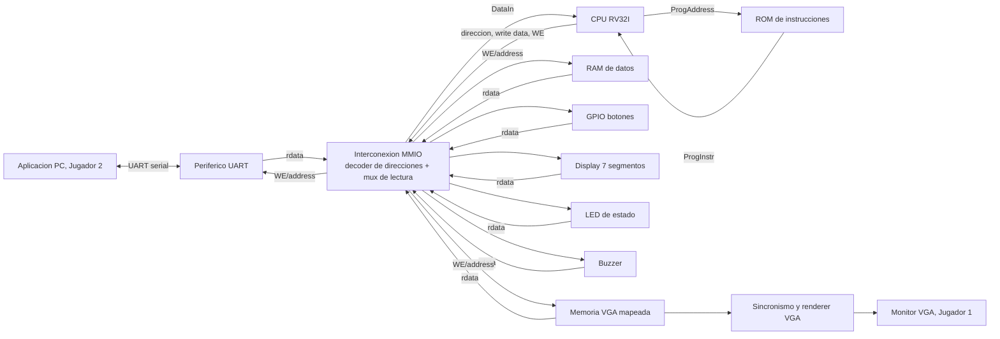
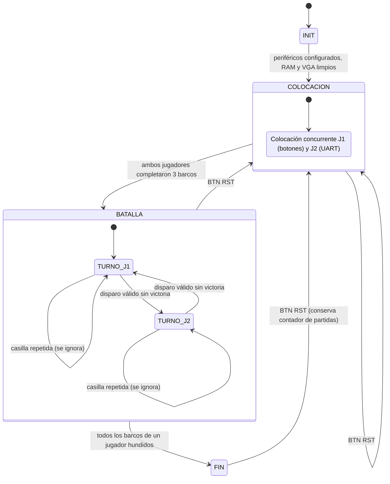

# Proyecto 3 – Batalla Naval sobre microprocesador RISC-V con periférico VGA

## 1. Introducción y objetivos

### 1.1 Introducción

El proyecto consiste en la creación de un juego de *Batalla Naval* para dos jugadores. Se combina el lenguaje ensamblador RISC-V (lógica del juego) con SystemVerilog (procesador uniciclo con arquitectura RISC-V y periféricos mapeados en memoria), y Python para una aplicación de PC que actúa como terminal remota del Jugador 2 por UART.

- **Jugador 1:** interactúa con la FPGA, observa su tablero y el del oponente en el monitor VGA y juega con los botones locales.
- **Jugador 2:** interactúa por la aplicación de PC, que se comunica con la FPGA por UART.
- **Control de la partida:** colocación, turnos, validación de disparos, barcos hundidos y victoria se ejecutan **exclusivamente** en el microprocesador. La aplicación de PC no tiene lógica de juego.

El sistema dispone de memoria ROM (programa) y RAM (datos), módulos de manejo de periféricos y un módulo UART completo para la comunicación serial.

### 1.2 Objetivo general

Lograr el funcionamiento correcto de un videojuego que requiere, además de la comunicación PC–FPGA trabajada en el Proyecto 2, el funcionamiento del sistema VGA, de un microprocesador de 32 bits y de todo el sistema de juego.

### 1.3 Objetivos específicos

- Lograr la creación funcional y útil del procesador de 32 bits con arquitectura RISC-V.
- Lograr la creación funcional y útil de las memorias ROM y RAM, para el almacenamiento del programa y de los datos respectivamente.
- Lograr el funcionamiento correcto del periférico VGA para enviar la señal a un monitor.
- Lograr el funcionamiento e implementación correctos del sistema UART para la comunicación serial.
- Lograr el funcionamiento correcto del periférico de displays de 7 segmentos para llevar el conteo de partidas ganadas por cada jugador.
- Lograr que el sistema de juego ejecute correctamente su máquina de estados y mantenga el flujo de juego de manera adecuada.

---

## 2. Abreviaturas y definiciones

| Término | Definición |
|---|---|
| **FPGA** | Field Programmable Gate Array |
| **RISC-V / RV32I** | Arquitectura de conjunto de instrucciones abierta / subconjunto base entero de 32 bits |
| **CPU / SoC** | Unidad central de procesamiento / sistema en chip (CPU + memorias + periféricos) |
| **ROM / RAM** | Memoria de programa (solo lectura) / memoria de datos |
| **MMIO** | *Memory-Mapped I/O*: periféricos accedidos con `lw`/`sw` mediante direcciones |
| **UART** | Universal Asynchronous Receiver-Transmitter |
| **VGA** | Video Graphics Array; aquí 640×480 @ 60 Hz con reloj de píxel de 25 MHz |
| **Tile** | Bloque de 32×32 píxeles de color sólido que representa una casilla en pantalla |
| **PLL / MMCM** | Lazo de seguimiento de fase usado para derivar relojes (`clk_wiz_0`) |
| **HUD** | *Heads-Up Display*: zona de la pantalla con turno, fase y mensajes |
| **Debouncing** | Filtrado de los rebotes mecánicos de un pulsador |
| **Polling** | Lectura periódica de un registro de estado por parte del programa |
| **STX / ETX / CHK** | Delimitador de inicio / delimitador de fin / byte de verificación (XOR) de una trama UART |
| **Datapath** | Camino de datos del procesador |

---

## 3. Referencias

[1] RISC-V International. *The RISC-V Instruction Set Manual, Volume I: Unprivileged Architecture*.

[2] S. Harris y D. Harris. *Digital Design and Computer Architecture: RISC-V Edition*. Morgan Kaufmann, 2022. ISBN: 978-0-12-820064-3.

[3] VESA. *Estándar de temporización VGA 640×480 @ 60 Hz*.

[4] Documentación de pySerial: https://pyserial.readthedocs.io/

[5] Documentación del periférico UART desarrollado en el Proyecto 2 del curso EL3313.

[6] J. González-Gómez y R. Coto Calderón. *Proyecto 3 — Batalla Naval: juego de dos jugadores sobre un microprocesador RISC-V con periférico VGA*. EL3313 Taller de Diseño Digital, Tecnológico de Costa Rica, II Semestre 2026.

---

## 4. Desarrollo

### 4.1 Arquitectura general del sistema

#### 4.1.1 Diagramas por nivel

El diseño sigue un enfoque *top-down*: el primer nivel muestra el sistema completo, el segundo nivel separa procesador, memorias e interconexión y periféricos, y el tercer nivel detalla cada bloque.

**Primer nivel**


**Segundo nivel**


**Tercer nivel**


**Diagrama top-down**


**Jerarquía de módulos**


#### 4.1.2 Organización de buses

La arquitectura se organiza alrededor de dos buses de propósito distinto:

- **Bus de programa (dedicado, de solo lectura).** El módulo `cpu` entrega `ProgAddress_o` a `instr_mem` y recibe `ProgInstr_i`. Este bus transporta únicamente instrucciones, siguiendo una organización tipo Harvard que evita que el *fetch* compita con los accesos a datos.
- **Bus de datos (compartido, mapeado en memoria).** La RAM y todos los periféricos (UART, buzzer, display/LED y GPIO de botones) comparten un mismo bus de tres líneas: `address`, `write` y `read`. Para el procesador, escribir en un periférico y escribir en RAM es la misma operación (`sw`); solo cambia la dirección. La lógica de interconexión de `soc_top` decodifica `DataAddress_o` para enrutar cada acceso y multiplexa las lecturas hacia el procesador.
- **Excepción VGA.** El periférico VGA comparte el mismo bus eléctrico, pero se comporta como una **memoria de video** en lugar de un conjunto de registros de comando, por lo que requiere un campo de dirección más ancho que el resto de los periféricos.

Conviene distinguir dos decodificaciones diferentes:

| Decodificación | Módulo | Entrada | Resultado |
|---|---|---|---|
| De instrucción | `control_unit` | `opcode` / `funct3` / `funct7` | Señales de control del CPU |
| De dirección | `soc_top` (lógica de interconexión) | `DataAddress_o` | Selección de RAM o periférico y mux de lectura |

La UART no está en el camino de *fetch*: la ROM alimenta directamente el puerto de instrucciones del CPU, mientras que la UART conecta la aplicación de PC con el bus de datos mapeado en memoria.


```mermaid
flowchart LR
  PCApp[Aplicacion PC, Jugador 2] <-->|UART serial| UART[Periferico UART]
  CPU[CPU RV32I] -->|ProgAddress| ROM[ROM de instrucciones]
  ROM -->|ProgInstr| CPU
  CPU -->|direccion, write data, WE| BUS[Interconexion MMIO<br/>decoder de direcciones + mux de lectura]
  BUS -->|WE/address| RAM[RAM de datos]
  RAM -->|rdata| BUS
  BUS -->|WE/address| UART
  UART -->|rdata| BUS
  BUS --> GPIO[GPIO botones]
  GPIO -->|rdata| BUS
  BUS --> DISP[Display 7 segmentos]
  DISP -->|rdata| BUS
  BUS --> LED[LED de estado]
  LED -->|rdata| BUS
  BUS --> BUZ[Buzzer]
  BUZ -->|rdata| BUS
  BUS -->|WE/address| VRAM[Memoria VGA mapeada]
  VRAM -->|rdata| BUS
  BUS -->|DataIn| CPU
  VRAM --> RENDER[Sincronismo y renderer VGA]
  RENDER --> MON[Monitor VGA, Jugador 1]
```

Bajo este esquema, todo el comportamiento específico del juego reside exclusivamente en el programa ensamblador. El hardware es agnóstico a la aplicación: el mismo conjunto de bloques serviría para ejecutar cualquier otro programa rv32i que use los mismos periféricos.

#### 4.1.3 Jerarquía de módulos

El top `soc_top` instancia el CPU, la ROM, `soc_data_ram`, los periféricos mapeados y el generador PLL del reloj VGA. La ROM permanece conectada directamente a `ProgAddress_o`/`ProgInstr_i`; las lecturas y escrituras de datos pasan por la lógica de interconexión. Las escrituras se habilitan solo en el destino decodificado y las lecturas regresan por el mux de lectura.

**Organización de `modulos/src`**

```text
modulos/src/
├── cpu/
│   ├── adder.sv, alu_decoder.sv, ALU.sv, ALUMux.sv
│   ├── control_unit.sv, cpu.sv, datapath.sv, Extend.sv
│   ├── data_mem.sv, Instr_mem.sv, program.hex, main_decoder.sv
│   ├── MemoryMux.sv, mux21.sv, mux41.sv, pc.sv, PCPlus4.sv
│   ├── reg_file.sv, SumPCTarget.sv
├── peripheral/
│   ├── buzzer/   buzzer_driver.sv, buzzer_perifico.sv
│   ├── display/  display_7seg.sv, led.sv, seven_seg_mux.sv, status_led.sv
│   ├── gpio/     debouncer.sv, j1_input.sv, synchronizer.sv
│   └── vga/      tile_map_ram.sv, tile_renderer.sv, vga_periph.sv,
│                 vga_sync.sv, vga_top_dut.sv, vga_top_dut_board.sv
├── top/
│   ├── soc_data_ram.sv
│   ├── soc_top.sv
│   └── vga_clock_gen.sv
└── uart/
    ├── uart_generador_baudios.sv
    ├── uart_rx.sv, uart_top.sv, uart_tx.sv
    └── uart_peripheral.sv (alternativo, no instanciado por soc_top)
```

**Jerarquía RTL activa de `soc_top`**

```text
soc_top
├── u_clock_gen: vga_clock_gen
│   └── u_clk_wiz_0: clk_wiz_0 [IP requerido]
├── u_program_rom: instr_mem
│   └── u_bram_inst: batalla_naval_mem [IP requerido]
├── u_cpu: cpu
│   ├── dp: datapath
│   │   ├── u_pc, u_pc4, u_pctarget, u_alumux, u_alu
│   │   ├── u_regfile, u_extend, u_resultmux, u_pcmux
│   │   └── u_imem y u_dmem [memorias locales no usadas en modo SoC]
│   └── cu: control_unit
│       ├── md: main_decoder
│       └── ad: alu_decoder
├── u_data_ram: soc_data_ram
├── u_gpio: j1_input
│   ├── sync_btns: sync
│   └── debounce_btns: debouncer
├── u_led: led_perifico
│   └── u_status_led: status_led
├── u_display: display_7seg
│   └── u_seven_seg: seven_seg_mux
├── u_buzzer: buzzer_perifico
│   └── u_buzzer: buzzer_driver
├── u_uart: uart_top
│   ├── baud_gen: uart_generador_baudios
│   ├── rx_inst: uart_rx
│   └── tx_inst: uart_tx
└── u_vga: vga_periph
    ├── u_vram: tile_map_ram
    ├── u_sync: vga_sync
    └── u_renderer: tile_renderer
```

**Notas sobre la jerarquía**

- El decodificador de direcciones y el multiplexor combinacional de lectura están descritos dentro de `soc_top`; **no existe** un módulo independiente `bus_interconnect`.
- `uart_peripheral` declara una implementación UART alternativa que no se instancia en esta jerarquía (la instancia activa es `uart_top`). Puede conservarse como fuente para su testbench, sin seleccionarla en la síntesis del SoC.
- `vga_top_dut_board` y `vga_top_dut` son una jerarquía independiente de demostración VGA, no hijos de `soc_top`.
- `ALUMux`, `MemoryMux`, `PCPlus4` y `SumPCTarget` no se instancian en el datapath actual, que usa `mux21`, `mux41` y `adder`. Se pueden excluir del *fileset* de síntesis, pero deben seguir disponibles en los de simulación que ejecutan sus testbenches.
- Esta jerarquía describe las instancias RTL; por sí sola no acredita que la síntesis e implementación estén cerradas. `clk_wiz_0` y `batalla_naval_mem` requieren sus IP de Vivado (ver [sección 5.2](#52-configuración-de-vivado-y-constraints)).

---

### 4.2 Microprocesador RISC-V

#### 4.2.1 Arquitectura del procesador

Se utiliza un microprocesador de 32 bits basado en el subconjunto RV32I con arquitectura **uniciclo**: cada instrucción se ejecuta completamente en un único ciclo de reloj. El procesador se divide en dos bloques, el camino de datos (`datapath`) y la unidad de control (`control_unit`); el módulo `cpu` es el nivel superior y los interconecta.

Bloques principales:

- Contador de programa (PC).
- Banco de registros.
- Generador de inmediatos.
- Unidad aritmético-lógica (ALU).
- Unidad de control, con decodificador principal y decodificador de operaciones de la ALU.
- Sumadores para PC + 4 y dirección de salto.
- Multiplexores para selección de operandos, resultado y siguiente valor del PC.


#### 4.2.2 Módulo `cpu` (nivel superior del procesador)

##### 1. Encabezado del módulo

```SystemVerilog
module cpu(
    input  logic        clk_i,
    input  logic        rst_i,
    output logic [31:0] ProgAddress_o,
    input  logic [31:0] ProgInstr_i,
    output logic [31:0] DataAddress_o,
    output logic [31:0] DataOut_o,
    input  logic [31:0] DataIn_i,
    output logic [2:0]  DataFunct3_o,
    output logic        DataWriteEnable_o
);
```

> Encabezado derivado de las señales documentadas del bus; verificar nombres y orden contra `cpu.sv`.

##### 2. Parámetros

Sin parámetros documentados.

##### 3. Entradas y salidas

| Señal | Dirección | Tamaño | Descripción |
|---|---|---:|---|
| `clk_i` | Entrada | 1 bit | Reloj del sistema (`clk_fpga`, 100 MHz). |
| `rst_i` | Entrada | 1 bit | Reinicio; el PC vuelve a `0x0000_0000`. |
| `ProgAddress_o` | Salida | 32 bits | Dirección de instrucción (PC) hacia la ROM. |
| `ProgInstr_i` | Entrada | 32 bits | Instrucción leída desde la ROM. |
| `DataAddress_o` | Salida | 32 bits | Dirección de acceso a datos (RAM o periférico). |
| `DataOut_o` | Salida | 32 bits | Dato de escritura distribuido a RAM y periféricos. |
| `DataIn_i` | Entrada | 32 bits | Dato de lectura seleccionado por la interconexión. |
| `DataFunct3_o` | Salida | 3 bits | Tamaño y tipo de acceso a memoria (`lb`, `lh`, `lw`, ...). |
| `DataWriteEnable_o` | Salida | 1 bit | Indica escritura; se combina con la selección de dirección. |

##### 4. Criterios de diseño

Se elige la estructura uniciclo por familiaridad y simplicidad, lo que libera tiempo para VGA, UART y el programa del juego (ver [sección 7](#7-decisiones-de-diseño-y-justificación)). La separación `datapath`/`control_unit` permite verificar cada bloque de forma aislada. Las memorias locales `u_imem` y `u_dmem` del datapath no se usan en modo SoC.

##### 5. Testbench

Ver [sección 6](#6-plan-de-validación): prueba unitaria del núcleo con un programa que cubre todas las instrucciones soportadas.

#### 4.2.3 ALU

##### 1. Encabezado del módulo

```SystemVerilog
module ALU(
    input  logic [31:0] SrcA,
    input  logic [31:0] SrcB,
    input  logic [3:0]  ALUControl,
    output logic [31:0] ALUResult,
    output logic        zero,
    output logic        less
);
```

##### 2. Parámetros

Sin parámetros documentados.

##### 3. Entradas y salidas

| Señal | Dirección | Tamaño | Descripción |
|---|---|---:|---|
| `SrcA` | Entrada | 32 bits | Primer operando de la ALU. |
| `SrcB` | Entrada | 32 bits | Segundo operando de la ALU. |
| `ALUControl` | Entrada | 4 bits | Selecciona la operación que realiza la ALU. |
| `ALUResult` | Salida | 32 bits | Resultado de la operación realizada. |
| `zero` | Salida | 1 bit | Se activa cuando `ALUResult` es igual a cero. |
| `less` | Salida | 1 bit | Indica si `SrcA` es menor que `SrcB` (comparación con signo). |

##### 4. Criterios de diseño

La ALU realiza las operaciones aritméticas, lógicas, de comparación y de desplazamiento requeridas por el conjunto de instrucciones. Genera `zero` y `less`, que la unidad de control usa para evaluar las condiciones de los saltos (ver [Lógica de branch](#424-lógica-de-branch)).


##### 5. Testbench

Cubierto por el testbench del núcleo (sección 6). Casos de borde: resultado cero, comparación con signo con valores negativos, desplazamientos aritméticos.

#### 4.2.4 Lógica de branch

En el procesador actual la comparación para las instrucciones de salto condicional **no es un módulo independiente**: se distribuye entre la ALU y la unidad de control.

La ALU genera:

`zero = (ALUResult == 32'd0)`

`less = ($signed(SrcA) < $signed(SrcB))`

Ambas señales se envían a `control_unit`, donde se combinan con las señales que identifican el tipo de branch para determinar `PCSrc`.

| Señal | Origen | Tamaño | Descripción |
|---|---|---:|---|
| `zero` | ALU | 1 bit | Indica que `ALUResult` es igual a cero. |
| `less` | ALU | 1 bit | Indica que `SrcA` < `SrcB` con signo. |
| `Branch` | `main_decoder` | 1 bit | Identifica una instrucción `BEQ`. |
| `BranchNE` | `main_decoder` | 1 bit | Identifica una instrucción `BNE`. |
| `BranchLT` | `main_decoder` | 1 bit | Identifica una instrucción `BLT`. |
| `BranchGE` | `main_decoder` | 1 bit | Identifica una instrucción `BGE`. |
| `PCSrc` | `control_unit` | 2 bits | Selecciona la fuente del siguiente valor del PC. |

#### 4.2.5 Banco de registros (`reg_file`)

##### 1. Encabezado del módulo

```SystemVerilog
module reg_file(
    input  logic        clk,
    input  logic        WE3,
    input  logic [4:0]  A1, A2, A3,
    input  logic [31:0] WD3,
    output logic [31:0] RD1, RD2
);
```

##### 2. Parámetros

Sin parámetros documentados. Implementa 32 registros de 32 bits.

##### 3. Entradas y salidas

| Señal | Dirección | Tamaño | Descripción |
|---|---|---:|---|
| `clk` | Entrada | 1 bit | Reloj utilizado para realizar las escrituras. |
| `WE3` | Entrada | 1 bit | Habilita la escritura (conectada a `RegWrite`). |
| `A1` | Entrada | 5 bits | Dirección del primer registro a leer. |
| `A2` | Entrada | 5 bits | Dirección del segundo registro a leer. |
| `A3` | Entrada | 5 bits | Dirección del registro de escritura. |
| `WD3` | Entrada | 32 bits | Dato a escribir (señal `Result`). |
| `RD1` | Salida | 32 bits | Contenido del registro `A1`. |
| `RD2` | Salida | 32 bits | Contenido del registro `A2`. |

##### 4. Criterios de diseño

Dos lecturas simultáneas y una escritura. Las direcciones se obtienen directamente de la instrucción:

- `A1 = Instr[19:15]`
- `A2 = Instr[24:20]`
- `A3 = Instr[11:7]`

`RD1` es el primer operando de la ALU; `RD2` puede ser el segundo operando o el dato de una escritura en memoria. El registro `x0` siempre vale cero: las lecturas de `x0` devuelven `0` y las escrituras sobre `x0` se ignoran.


##### 5. Testbench

Cubierto por el testbench del núcleo. Caso de borde: escritura sobre `x0`.

#### 4.2.6 Generador de inmediatos (`Extend`)

##### 1. Encabezado del módulo

```SystemVerilog
module Extend(
    input  logic [31:0] Instr,
    input  logic [3:0]  ImmSrc,
    output logic [31:0] ImmExt
);
```

##### 2. Parámetros

Sin parámetros documentados.

##### 3. Entradas y salidas

| Señal | Dirección | Tamaño | Descripción |
|---|---|---:|---|
| `Instr` | Entrada | 32 bits | Instrucción actual de la cual se extraen los bits del inmediato. |
| `ImmSrc` | Entrada | 4 bits | Selecciona el formato utilizado para construir el inmediato. |
| `ImmExt` | Salida | 32 bits | Inmediato extendido a 32 bits. |

##### 4. Criterios de diseño

Según el tipo de instrucción, los bits del inmediato están en posiciones distintas dentro de `Instr`. El módulo los extrae, los ordena y los extiende hasta obtener `ImmExt`.


##### 5. Testbench

Cubierto por el testbench del núcleo (un caso por formato de inmediato).

#### 4.2.7 Unidad de control (`control_unit`)

##### 1. Encabezado del módulo

```SystemVerilog
module control_unit(
    input  logic [6:0] op,
    input  logic [2:0] funct3,
    input  logic [6:0] funct7,
    input  logic       zero,
    input  logic       less,
    output logic       RegWrite,
    output logic       ALUSrc,
    output logic [1:0] ResultSrc,
    output logic       MemWrite,
    output logic [3:0] ImmSrc,
    output logic [3:0] ALUControl,
    output logic [1:0] PCSrc
);
```

##### 2. Parámetros

Sin parámetros documentados. Instancia `main_decoder` (`md`) y `alu_decoder` (`ad`).

##### 3. Entradas y salidas

| Señal | Dirección | Tamaño | Descripción |
|---|---|---:|---|
| `op` | Entrada | 7 bits | Código de operación; identifica el tipo de instrucción. |
| `funct3` | Entrada | 3 bits | Diferencia instrucciones que comparten `opcode`. |
| `funct7` | Entrada | 7 bits | Campo adicional para diferenciar ciertas operaciones. |
| `zero` | Entrada | 1 bit | `ALUResult` es igual a cero. |
| `less` | Entrada | 1 bit | `SrcA` < `SrcB` con signo. |
| `RegWrite` | Salida | 1 bit | Habilita la escritura en el banco de registros. |
| `ALUSrc` | Salida | 1 bit | Selecciona el segundo operando de la ALU entre `RD2` e `ImmExt`. |
| `ResultSrc` | Salida | 2 bits | Selecciona el dato que se escribe en el banco de registros. |
| `MemWrite` | Salida | 1 bit | Habilita la escritura en la memoria de datos. |
| `ImmSrc` | Salida | 4 bits | Selecciona el formato de inmediato de `Extend`. |
| `ALUControl` | Salida | 4 bits | Selecciona la operación de la ALU. |
| `PCSrc` | Salida | 2 bits | Selecciona la fuente del siguiente valor del PC. |

##### 4. Criterios de diseño

Decodifica la instrucción en ejecución y genera las señales de control del `datapath`. El `main_decoder` clasifica la instrucción por `opcode` y el `alu_decoder` determina la operación de la ALU a partir de `funct3`/`funct7`. La resolución de saltos combina `zero`/`less` con las señales de branch (ver [4.2.4](#424-lógica-de-branch)).


##### 5. Testbench

Cubierto por el testbench del núcleo, verificando las salidas de control para cada instrucción soportada.

#### 4.2.8 Contador de programa (`pc`)

##### 1. Encabezado del módulo

```SystemVerilog
module pc(
    input  logic        clk,
    input  logic        rst,
    input  logic [31:0] PCnext,
    output logic [31:0] PC
);
```

##### 2. Parámetros

Sin parámetros documentados.

##### 3. Entradas y salidas

| Señal | Dirección | Tamaño | Descripción |
|---|---|---:|---|
| `clk` | Entrada | 1 bit | Reloj para actualizar el contador. |
| `rst` | Entrada | 1 bit | Reinicia el contador a `0x00000000`. |
| `PCnext` | Entrada | 32 bits | Siguiente valor del PC (salida del mux `u_pcmux`). |
| `PC` | Salida | 32 bits | Dirección de la instrucción en ejecución. |

##### 4. Criterios de diseño

El PC se actualiza en cada flanco positivo de `clk` con `PCnext`. Con `rst` activo se reinicia a `32'b0`, de modo que la ejecución inicia en `0x00000000` (vector de reset del enunciado).


##### 5. Testbench

Cubierto por el testbench del núcleo (reset y avance secuencial).

#### 4.2.9 Instrucciones soportadas

El enunciado exige como base: `lw`, `sw`, `sll`, `slli`, `srl`, `srli`, `sra`, `srai`, `add`, `and`, `xor`, `or`, `sub`, `addi`, `andi`, `xori`, `ori`, `beq`, `bne`, `blt`, `bge`, `slt`, `slti`, `sltu`, `sltui`, `jal`, `jalr`. Estado actual:

| Instrucciones | Estado actual |
|---|---|
| `add`, `sub`, `and`, `or`, `xor` | Implementadas en la ALU y decodificadas. |
| `slt`, `sll`, `srl`, `sra` | Implementadas en la ALU y decodificadas. |
| `addi`, `andi`, `ori`, `xori`, `slti` | Implementadas y decodificadas. |
| `slli`, `srli`, `srai` | Implementadas y decodificadas. |
| `beq`, `bne`, `blt`, `bge` | Contempladas en la unidad de control. |
| `jal` | Contemplada en la unidad de control y el `datapath`. |
| `lb`, `lh`, `lw`, `lbu`, `lhu` | Contempladas por la memoria de datos; falta completar la conexión de `funct3` en el `datapath`. |
| `sb`, `sh`, `sw` | Contempladas por la memoria de datos; falta completar la conexión de `funct3` en el `datapath`. |
| `jalr` | El `datapath` y `PCSrc` contemplan el salto, pero falta completar su decodificación en `main_decoder`. |
| `lui` | El generador de inmediatos y la ALU contemplan la operación, pero falta decodificarla en `alu_decoder`. |
| `sltu`, `sltiu` | La ALU contempla la comparación sin signo, pero falta decodificarlas en `alu_decoder`. |

> `lw`, `sw`, `jalr`, `sltu` y `sltiu` están en la lista base del enunciado; son prioridad de cierre (ver [sección 8](#8-estado-actual-riesgos-y-trabajo-pendiente)).

---

### 4.3 Subsistema de memoria

#### 4.3.1 ROM de programa (`instr_mem`)

##### 1. Encabezado del módulo

```SystemVerilog
module instr_mem #(
    parameter DEPTH = 1024
)(
    input  logic [31:0] A,
    output logic [31:0] RD
);
```

##### 2. Parámetros

| Parámetro | Valor actual | Descripción |
|---|---:|---|
| `DEPTH` | 1024 | Cantidad de palabras de 32 bits almacenadas en la ROM del SoC. |

##### 3. Entradas y salidas

| Señal | Dirección | Tamaño | Descripción |
|---|---|---:|---|
| `A` | Entrada | 32 bits | Dirección de la instrucción solicitada, proveniente del `PC`. |
| `RD` | Salida | 32 bits | Instrucción almacenada en la dirección seleccionada. |

##### 4. Criterios de diseño

En el SoC, `instr_mem` instancia el IP `batalla_naval_mem`, configurado como ROM síncrona de un puerto, 32 bits de ancho y 1024 palabras. La imagen del firmware se carga desde `modulos/ensamblador/batalla_naval.coe`; ese vector contiene las mismas 571 instrucciones que `batalla_naval.hex`. La dirección del PC es de byte y se convierte a índice de palabra (`A[11:2]`). La lectura debe conservar una latencia síncrona de un ciclo.


##### 5. Testbench

Verificada de forma indirecta con el testbench del núcleo (programa de prueba cargado en ROM simulada).

#### 4.3.2 RAM de datos (`soc_data_ram` y `data_mem`)

##### 1. Encabezado del módulo

Se utiliza la interfaz de memoria del SoC; los nombres exactos de los puertos deben tomarse de `soc_data_ram.sv`.

##### 2. Parámetros

| Memoria | Profundidad | Dirección base | Uso |
|---|---:|---|---|
| `soc_data_ram` | 1024 palabras de 32 bits | `0x0000_2000` | RAM mapeada en el bus de datos del SoC. |
| `data_mem` | 256 palabras | (local al `datapath`) | Memoria local no usada en modo SoC. |

##### 3. Entradas y salidas

Interfaz de memoria síncrona: dirección, dato de escritura, `write enable`, `funct3` (tamaño de acceso) y dato de lectura.

##### 4. Criterios de diseño

Ambas memorias contemplan lectura y escritura de byte, media palabra y palabra:

| `funct3` | Operación | Resultado de lectura |
|---|---|---|
| `000` | `lb` | Lee 8 bits y extiende con signo a 32 bits. |
| `001` | `lh` | Lee 16 bits y extiende con signo a 32 bits. |
| `010` | `lw` | Lee los 32 bits de la palabra. |
| `100` | `lbu` | Lee 8 bits y extiende con ceros a 32 bits. |
| `101` | `lhu` | Lee 16 bits y extiende con ceros a 32 bits. |

| `funct3` | Operación | Escritura realizada |
|---|---|---|
| `000` | `sb` | Escribe `WD[7:0]`. |
| `001` | `sh` | Escribe `WD[15:0]`. |
| `010` | `sw` | Escribe `WD[31:0]`. |


##### 5. Testbench

Prueba de integración *Core + ROM + RAM* (sección 6): `lw`/`sw` sobre distintas direcciones.

#### 4.3.3 Organización de datos en RAM

La RAM almacena los tableros de ambos jugadores y las variables de control. Cada jugador tiene un tablero de 8 × 8 casillas, una palabra de 32 bits por casilla, almacenadas por filas.

| Región | Dirección inicial | Contenido |
|---|---:|---|
| Tablero Jugador 1 | `0x0000_2000` | 64 casillas del tablero del Jugador 1 |
| Tablero Jugador 2 | `0x0000_2100` | 64 casillas del tablero del Jugador 2 |
| Variables de control | `0x0000_2200` | Turno, fase del juego, contadores y estado de barcos |

Dirección de una casilla:

`dirección = BASE + (fila × 8 + columna) × 4`

Estados de cada casilla en RAM:

| Valor | Estado |
|---:|---|
| `0` | Agua |
| `1` | Barco 0 |
| `2` | Barco 1 |
| `3` | Barco 2 |
| `4` | Fallo |
| `5` | Barco 0 impactado |
| `6` | Barco 1 impactado |
| `7` | Barco 2 impactado |

La subrutina `acierto` marca un impacto sumando 4 al valor almacenado de un barco (1–3 → 5–7). Distinguir el barco por casilla facilita la detección de barco hundido en `hundir`.

---

### 4.4 Interconexión y mapa de memoria

#### 4.4.1 Bus del sistema

El bus de datos se compone de las señales que `cpu` intercambia con la lógica de interconexión de `soc_top` durante los accesos a memoria (`lb`, `lh`, `lw`, `lbu`, `lhu`, `sb`, `sh`, `sw`):

- **`DataAddress_o[31:0]`**: dirección generada por el procesador, enviada a la lógica de selección y a los destinos.
- **`DataOut_o[31:0]`**: dato de escritura distribuido a RAM y periféricos; cada bloque lo captura solo si su habilitación está activa.
- **`DataIn_i[31:0]`**: dato seleccionado en `soc_top` desde la RAM o el periférico direccionado.
- **`DataFunct3_o[2:0]`**: tamaño y tipo de acceso a memoria.
- **`DataWriteEnable_o`**: indica una escritura; `soc_top` la combina con la selección de dirección para generar las habilitaciones locales.

#### 4.4.2 Decodificación de direcciones

La lógica de `soc_top` compara `DataAddress_o` con rangos fijos y genera `ram_select`, `uart_select`, `gpio_select`, `display_select`, `led_select`, `buzzer_select` y `vga_select`. Cada selección se combina con `DataWriteEnable_o` para generar la habilitación de escritura local. La ROM queda fuera de esta decodificación y se accede por el bus dedicado de programa.

Para la lectura, un multiplexor combinacional en `soc_top` selecciona entre la RAM y los periféricos con registro de lectura y entrega el resultado como `DataIn_i`. Si no se selecciona un destino con lectura, entrega `32'b0`. El VGA **no** participa en el mux de lectura (es solo de escritura desde el CPU).

#### 4.4.3 Mapa de memoria

| Dispositivo | Dirección / rango |
|---|---|
| ROM | `0x0000_0000` – `0x0000_1FFF` |
| RAM | `0x0000_2000` – `0x0000_2FFF` |
| UART (Control/Estado, TX, RX) | `0x0001_0040` – `0x0001_0048` |
| GPIO (Entradas Jugador 1) | `0x0001_0120` |
| Display 7 segmentos | `0x0001_0130` |
| LED de estado | `0x0001_0138` |
| Buzzer | `0x0001_0140` |
| VGA (memoria de video, tile map) | `0x0001_1000` – `0x0001_17FF` |

---

### 4.5 Periféricos

#### 4.5.1 Visión general e interfaz estándar

Estructura del sistema de periféricos:

- **UART Interface → UART-USB:** único canal de comunicación con el Jugador 2 remoto (aplicación de PC).
- **Buzzer:** recibe códigos de evento (impacto, fallo, hundido, colocación inválida, victoria) y los traduce a tonos.
- **Display (7 seg, LEDs):** agrupa `display_7seg` y `led_perifico`; cada uno vive en su propia dirección, pero ambos son "salida de estado visible".
- **GPIO (botones):** `j1_input`, única entrada local del Jugador 1 (con antirrebote).
- **VGA:** excepción del bus; se comporta como memoria de video en vez de registros de comando, por eso requiere un campo de dirección más ancho.


*Diagrama de segundo nivel del sistema de periféricos.*

**Interfaz estándar** (UART, entradas J1, displays, LED y buzzer):

| Señal | Dirección | Descripción |
|---|---|---|
| `clk_i` | Entrada | Reloj del sistema. |
| `rst_i` | Entrada | Reinicio. |
| `write_enable_i` | Entrada | Escritura cuando está en 1. |
| `addr_i[1:0]` | Entrada | Selecciona el registro interno. |
| `wdata_i[31:0]` | Entrada | Dato de escritura. |
| `rdata_o[31:0]` | Salida | Dato leído del registro seleccionado. |

El VGA conserva `clk_i`, `rst_i`, `write_enable_i`, `wdata_i` y `rdata_o`, pero usa una dirección más ancha y dos relojes (CPU y píxel).

#### 4.5.2 Entradas del Jugador 1 (`j1_input`)

##### 1. Encabezado del módulo

```SystemVerilog
module j1_input(
    input  logic        clk_i,
    input  logic        rst_i,
    input  logic [6:0]  btns_in,        // entradas físicas (asíncronas)
    input  logic        write_enable_i, // periférico de solo lectura
    input  logic [1:0]  addr_i,
    input  logic [31:0] wdata_i,
    output logic [31:0] rdata_o
);
```

> Verificar contra `j1_input.sv` si `btns_in` llega ya sincronizada o cruda (la jerarquía indica que `sync` y `debouncer` son hijos de `j1_input`).

##### 2. Parámetros

Sin parámetros documentados. El filtro antirrebote requiere `2^20 − 1` ciclos estables.

##### 3. Entradas y salidas

| Entrada | Descripción |
|---|---|
| `clk_i`, `rst_i` | Reloj de sistema y reset. |
| `btns_in[6:0]` | Siete entradas físicas del Jugador 1. |
| `write_enable_i`, `addr_i[1:0]`, `wdata_i[31:0]` | Interfaz estándar; el periférico es de solo lectura. |

| Salida | Descripción |
|---|---|
| `rdata_o[31:0]` | `{25'b0, btns_debounced[6:0]}` en `addr_i = 00`. |

**Registro de estado (offset `0x00`, dirección `0x0001_0120`)**

| Bit | Entrada |
|---:|---|
| 0 | BTN OK (confirmación) |
| 1 | BTN SEL (rotación) |
| 2 | Derecha |
| 3 | Izquierda |
| 4 | Abajo |
| 5 | Arriba |
| 6 | BTN RST |

**Asignación física actual en `soc_top`**

| Bit de `btns_in` | Puerto físico |
|---:|---|
| 0 | `sw[0]` (OK/confirmación) |
| 1 | `sw[1]` (SEL/rotación) |
| 2 | `btnR` |
| 3 | `btnL` |
| 4 | `btnD` |
| 5 | `btnU` |
| 6 | `btnC` |

`btnC` también actúa como reset general del SoC. Los switches son entradas mantenidas: deben volver a cero para generar una nueva transición en la aplicación. El firmware usa las mismas máscaras de bits.

##### 4. Criterios de diseño


*Diagrama de tercer nivel.*

- **Objetivo:** entregar al CPU, en un único registro de 32 bits legible por `lw`, el estado ya sincronizado y filtrado de los siete controles del Jugador 1.
- **Sincronizador de dos etapas:** resuelve la metaestabilidad de las 7 entradas asíncronas.
- **Antirrebote:** replicado 7 veces con `generate`; solo actualiza `btn_out[i]` cuando la entrada se mantiene estable `2^20 − 1` ciclos consecutivos, reiniciando el conteo ante cualquier cambio. A 100 MHz: `(2^20 − 1) / 100 MHz ≈ 10.49 ms`. El resultado se expone de forma combinacional en `rdata_o`.
- **Relación con otros módulos:** lo consume el programa ensamblador (subrutina `leer_botones`) por *polling*; no depende de otro periférico.

##### 5. Testbench

Previsto: verificación de rebotes cortos (rechazados) y de pulsaciones estables (aceptadas) con tiempos escalados, y lectura del registro por la interfaz estándar.

#### 4.5.3 UART (`uart_top`)

##### 1. Encabezado del módulo

Se reutiliza el periférico UART del Proyecto 2. La interfaz exacta de puertos debe tomarse de `uart_top.sv`; incluye la interfaz estándar de registros más los pines seriales `rx`/`tx` conectados desde `soc_top`.

##### 2. Parámetros

Valores por defecto de `uart_top`: reloj de 100 MHz, 115200 baudios, 8 bits de datos y sobremuestreo de 16.

##### 3. Entradas y salidas

Interfaz estándar de la [sección 4.5.1](#451-visión-general-e-interfaz-estándar) más los pines seriales. Registros:

| Offset | Dirección | Registro |
|---|---|---|
| `0x00` | `0x0001_0040` | Control/Estado |
| `0x04` | `0x0001_0044` | Datos TX |
| `0x08` | `0x0001_0048` | Datos RX |

##### 4. Criterios de diseño

- **Objetivo:** único canal de interacción del Jugador 2: recibe colocación de barcos y disparos y notifica cada evento relevante (aceptación/rechazo de colocación, cambio de turno, resultado de disparos y fin de partida).
- **Módulos internos:** `uart_generador_baudios`, `uart_tx`, `uart_rx` e interfaz/registros (`uart_top`). El generador deriva el tick de sobremuestreo desde el reloj de sistema.
- El periférico actual **no expone una bandera de overrun** (ver [sección 8](#8-estado-actual-riesgos-y-trabajo-pendiente)).

##### 5. Testbench

Previsto (`tb_uart`): transmisión y recepción de una trama completa a 115200 baudios con temporización bit a bit y banderas de estado, incluyendo un byte corrupto.

#### 4.5.4 VGA (`vga_periph`)

##### 1. Encabezado del módulo

```SystemVerilog
module vga_periph(
    input  logic        clk_cpu_i,
    input  logic        clk_vga_i,
    input  logic        rst_i,
    input  logic        write_enable_i,
    input  logic [31:0] addr_i,
    input  logic [31:0] wdata_i,
    output logic        hsync_o,
    output logic        vsync_o,
    output logic [3:0]  vga_r_o,
    output logic [3:0]  vga_g_o,
    output logic [3:0]  vga_b_o
);
```

##### 2. Parámetros

Sin parámetros documentados. Geometría fija: cuadrícula de 20 × 15 tiles de 32 × 32 píxeles.

##### 3. Entradas y salidas

| Señal | Dirección | Descripción |
|---|---|---|
| `clk_cpu_i` | Entrada | Reloj del CPU (puerto de escritura de la memoria de tiles). |
| `clk_vga_i` | Entrada | Reloj de píxel de 25 MHz. |
| `rst_i` | Entrada | Reinicio. |
| `write_enable_i` | Entrada | Escritura del CPU a la memoria de video. |
| `addr_i[31:0]` | Entrada | Dirección de escritura (se deriva el índice de tile). |
| `wdata_i[31:0]` | Entrada | Palabra de tile. |
| `hsync_o`, `vsync_o` | Salida | Sincronismos horizontal y vertical. |
| `vga_r_o`, `vga_g_o`, `vga_b_o` | Salida | Canales de color (4 bits por canal, DAC resistivo de la Basys3). |

##### 4. Criterios de diseño

**Objetivo.** Mostrar en un monitor VGA el mapa de tiles del juego. Cada tile (32 × 32 píxeles) muestra un color según el contenido de la casilla (agua, barco, impacto, fallo, o elementos de HUD).

**Diagrama (nivel 3)**

<div align="center">

</div>

**Submódulos**

| Módulo | Función | Entradas | Salidas |
|---|---|---|---|
| `tile_map_ram` | Memoria de doble puerto de 512 palabras de 32 bits; el CPU escribe y el renderer lee. Escritura y lectura síncronas en sus respectivos relojes. | `clk_cpu_i`, `write_enable_i`, `addr_cpu_i[8:0]`, `wdata_i[31:0]`, `clk_vga_i`, `addr_vga_i[8:0]` | `rdata_vga_o[31:0]` hacia `tile_renderer` |
| `vga_sync` | Genera los sincronismos y recorre cada píxel. | `clk_pixel_i` (25 MHz), `rst_i` | `hcount_o[9:0]`, `vcount_o[9:0]`, `hsync_o`, `vsync_o`, `video_on_o` |
| `tile_renderer` | Identifica el tile de cada píxel y su color. | `hcount_i[9:0]`, `vcount_i[9:0]`, `video_on_i`, `tile_data_i[31:0]` | `addr_pixel_o[8:0]`, `rgb_o[11:0]` |

`soc_top` decodifica el rango VGA y habilita las escrituras; la RAM de tiles no devuelve datos al bus del CPU.

**Generación de sincronismos.** Con `clk_pixel = 25 MHz`, `vga_sync` mantiene `hcount` (0–799) y `vcount` (0–524):

| Eje | Visibles | Front porch | Sincronismo | Back porch | Total |
|---|---:|---:|---:|---:|---:|
| Horizontal (píxeles) | 640 | 16 | 96 | 48 | 800 |
| Vertical (líneas) | 480 | 10 | 2 | 33 | 525 |

`hsync` y `vsync` son activos en bajo durante su pulso, y `video_on = (hcount < 640) && (vcount < 480)`.

**Tile map.** La pantalla se divide en 20 columnas × 15 filas de bloques de 32 × 32 (640/32 = 20, 480/32 = 15), 300 casillas en total:

| Zona | Columnas | Filas |
|---|---|---|
| Tablero propio J1 (8×8) | 1–8 | 3–10 |
| Tablero rival (vista de J1 sobre el tablero de J2) | 11–18 | 3–10 |
| HUD superior (turno, fase) | — | 0–2 |
| Separadores y mensajes de estado | — | 11–14 |

El diagrama de la cuadrícula está en `docs/diseño/Imagenes` (pestaña "Periférico VGA" de `Proyecto3_BatallaNaval_Diagramas.drawio`).

**Memoria de video.** `tile_map_ram` contiene 512 palabras de 32 bits (300 tiles visibles) en el rango `0x0001_1000`–`0x0001_17FF`. Dirección de un tile: `VGA_BASE + (fila × 20 + columna) × 4`. El puerto de escritura recibe desde `vga_periph` la dirección derivada de `addr_i`; el de lectura, sincronizado con `clk_vga_i`, es direccionado por `tile_renderer` según la posición del píxel.

**Codificación de tiles (bits [2:0] de la palabra)**

| Código | Contenido |
|---:|---|
| 0 | Agua (sin disparar) |
| 1 | Barco propio (visible solo en el tablero propio) |
| 2 | Impacto (disparo acertado) |
| 3 | Fallo (disparo sin acertar) |
| 4 | HUD – fondo / texto |
| 5 | HUD – cursor de selección |
| 6 | HUD – separador de tableros |
| 7 | Reservado |

Los bits [7:3] y [31:8] quedan reservados para uso del equipo (por ejemplo, códigos de carácter en el HUD). **Sincronización entre dominios de reloj:** la memoria de doble puerto desacopla ambos dominios; el CPU solo escribe y el renderer solo lee, por lo que no hay lazo de realimentación entre relojes. Un tile leído durante una escritura puede mostrar un valor transitorio durante un cuadro, sin riesgo de inestabilidad en la señal de video.

##### 5. Testbench

Previsto (`tb_vga_periph`): una escritura `sw` a la memoria de video se refleja en el color leído por el puerto de video, y `vga_sync` genera `hsync`/`vsync` con la temporización 640×480@60 Hz.

#### 4.5.5 Displays de 7 segmentos (`display_7seg`, `seven_seg_mux`)

##### 1. Encabezado del módulo

```SystemVerilog
module display_7seg(
    input  logic        clk_i,
    input  logic        rst_i,
    input  logic        write_enable_i,
    input  logic [1:0]  addr_i,
    input  logic [31:0] wdata_i,
    output logic [31:0] rdata_o,
    output logic [6:0]  seg,
    output logic        dp,
    output logic [3:0]  an
);
```

##### 2. Parámetros

Sin parámetros documentados.

##### 3. Entradas y salidas

| Entradas | Descripción |
|---|---|
| `clk_i`, `rst_i` | Reloj de sistema y reset. |
| `write_enable_i`, `addr_i[1:0]`, `wdata_i[31:0]` | Bus estándar; 4 dígitos BCD empaquetados en `wdata_i[15:0]`. |

| Salidas | Descripción |
|---|---|
| `rdata_o[31:0]` | Eco del registro de datos. |
| `seg[6:0]`, `dp`, `an[3:0]` | Señales físicas hacia los displays. |

##### 4. Criterios de diseño


*Diagrama de tercer nivel.*

- **Objetivo:** mostrar en los 4 displays de la Basys3 el contador acumulado de partidas ganadas por cada jugador (2 dígitos por jugador, 00–99), multiplexando en el tiempo. Los dos dígitos de la izquierda son del Jugador 1 y los dos de la derecha del Jugador 2.
- **Funcionamiento:** un contador de refresco genera un pulso de habilitación periódico que avanza un contador módulo 4; este selecciona, mediante un mux 4:1, cuál de los 4 dígitos BCD mostrar y activa la línea de ánodo correspondiente. El decodificador BCD→7 segmentos traduce el dígito activo al patrón de segmentos.
- **Relación con otros módulos:** el registro se actualiza desde la subrutina `actualizar_contador_partidas` del programa ensamblador.

##### 5. Testbench

Previsto: escritura de un valor BCD, verificación del patrón de segmentos por dígito y de la secuencia de ánodos.

#### 4.5.6 LED de estado (`led_perifico`, `status_led`)

##### 1. Encabezado del módulo

Interfaz estándar de la [sección 4.5.1](#451-visión-general-e-interfaz-estándar) más la salida física `led`.

##### 2. Parámetros

Sin parámetros documentados.

##### 3. Entradas y salidas

Interfaz estándar; el código de fase (`game_state`) se escribe en `wdata_i`. La salida física `led` tiene un bit por fase.

##### 4. Criterios de diseño


- **Objetivo:** indicar con un LED distinto y mutuamente excluyente la fase de la partida: colocación de barcos, batalla o resultado final.
- **Funcionamiento:** tres comparadores combinacionales evalúan en paralelo si `game_state` coincide con cada uno de los 3 códigos válidos; cada resultado enciende un bit distinto de `led`.
- **Relación con otros módulos:** el código de fase lo actualiza el programa ensamblador al transitar entre `fase_colocacion`, `fase_batalla` y `fin_partida`.

##### 5. Testbench

Previsto: para cada código válido, solo el bit correspondiente se activa; un código inválido no enciende ninguno.

#### 4.5.7 Buzzer (`buzzer_perifico`, `buzzer_driver`)

##### 1. Encabezado del módulo

Interfaz estándar de la [sección 4.5.1](#451-visión-general-e-interfaz-estándar) más la salida `buzzer_pwm`.

##### 2. Parámetros

Sin parámetros documentados. Cada evento carga un semiperiodo y una duración propios en `buzzer_driver`.

##### 3. Entradas y salidas

| Entradas | Descripción |
|---|---|
| `clk_i`, `rst_i` | Reloj de sistema y reset. |
| `write_enable_i`, `addr_i[1:0]`, `wdata_i[31:0]` | Bus estándar; `wdata_i[2:0]` = código de evento (1–5). |

| Salida | Descripción |
|---|---|
| `rdata_o[31:0]` | Eco del último código de evento escrito. |
| `buzzer_pwm` | Onda cuadrada hacia el buzzer pasivo. |

##### 4. Criterios de diseño


- **Objetivo:** generar 5 tonos distintos y perceptibles para los eventos del juego (impacto, fallo, barco hundido, colocación inválida, victoria), disparados por el CPU con una única escritura `sw`.
- **Funcionamiento:** el decodificador convierte `wdata_i[2:0]` en uno de 5 pulsos de 1 ciclo (`write_enable_i` dura exactamente 1 ciclo por `sw`). Cada pulso carga en `buzzer_driver` el semiperiodo y la duración del evento; un contador de duración cuenta hacia atrás hasta apagar el tono y un contador de ciclos alterna la salida cada vez que alcanza el semiperiodo, generando la onda cuadrada.
- **Relación con otros módulos:** el código proviene de las subrutinas `procesar_disparo`, `detectar_hundido`, `validar_colocacion` y `verificar_victoria` del programa ensamblador.

**Tabla de códigos de evento**


##### 5. Testbench

Previsto: para cada código 1–5, verificar semiperiodo y duración distintos y que la salida se apague al terminar el tono.

---

### 4.6 Sistema de reloj

| Reloj | Frecuencia | Origen | Uso |
|---|---:|---|---|
| Reloj principal | 100 MHz | Oscilador de la FPGA | Entrada del sistema (`clk_in1`). |
| `clk_fpga` | 100 MHz | `clk_wiz_0` | CPU, RAM y periféricos (incluye debounce/sincronización de botones y baudios de UART). |
| `clk_vga` | 25 MHz | `clk_wiz_0` | Reloj de píxel del periférico VGA. |

La integración de `soc_top` usa el Clocking Wizard `clk_wiz_0`: recibe `clk_in1` de 100 MHz y entrega `clk_fpga` (100 MHz) y `clk_vga` (25 MHz). `tile_map_ram` conecta su puerto de escritura al dominio del CPU y su puerto de lectura al dominio VGA. La demo independiente `vga_top_dut_board` usa un divisor RTL para generar su reloj de píxel.

---

### 4.7 Programa en ensamblador

#### 4.7.1 Organización general

El programa implementa la lógica completa del juego: colocación de barcos, turnos, disparos, detección de impactos, barcos hundidos y condición de victoria. Flujo principal:

1. Inicialización del sistema.
2. Limpieza de los tableros y variables almacenadas en RAM.
3. Colocación de barcos del Jugador 1 y Jugador 2.
4. Inicio de la fase de batalla.
5. Lectura del jugador correspondiente.
6. Validación del disparo.
7. Actualización del tablero.
8. Verificación de barcos hundidos.
9. Verificación de la condición de victoria.
10. Cambio de turno.
11. Finalización de la partida.

Diagrama de flujo completo en `docs/diseño/Imagenes` (pestaña "Flujo programa principal" de `Proyecto3_BatallaNaval_Diagramas.drawio`). El diagrama de estados del control principal está en el [Apéndice A](#apéndice-a-diagrama-de-estados-del-control-principal).

#### 4.7.2 Subrutinas propuestas

| Subrutina | Función |
|---|---|
| `sistema_ini` | Inicializar variables y periféricos. |
| `limpiar_tableros` | Limpiar los tableros almacenados en RAM. |
| `barco_ini` | Colocar un barco en el tablero correspondiente. |
| `barco_valido` | Verificar que un barco no salga del tablero ni se traslape con otro. |
| `input_j1` | Leer las entradas del Jugador 1. |
| `input_j2` | Recibir comandos del Jugador 2 mediante UART. |
| `verif_shot` | Procesar un disparo realizado por un jugador. |
| `acierto` | Determinar si un disparo corresponde a impacto o fallo. |
| `hundir` | Determinar si un barco fue hundido. |
| `condi_ganar` | Verificar si todos los barcos de un jugador fueron hundidos. |
| `sistema_vga` | Actualizar la información mostrada mediante VGA. |
| `uart_p1` | Enviar información hacia la aplicación del Jugador 2. |
| `buzzer_sound` | Activar el buzzer dependiendo del evento ocurrido. |

> Pendiente de documentar: convenciones de llamado (registros preservados, uso de `ra`) y manejo de la pila, requeridos por el enunciado. Los nombres usados en las descripciones de periféricos (`leer_botones`, `actualizar_contador_partidas`, `procesar_disparo`, `detectar_hundido`, `validar_colocacion`, `verificar_victoria`) deben unificarse con esta tabla.

---

### 4.8 Protocolo de comunicación UART

#### 4.8.1 Formato de trama

`STX(0x02) CMD(1B) LEN(1B) PAYLOAD(LEN bytes) CHK(1B) ETX(0x03)`

| Byte(s) | Campo | Descripción |
|---|---|---|
| 0 | `STX` | Delimitador de inicio, valor fijo `0x02`. |
| 1 | `CMD` | Código de comando/evento. |
| 2 | `LEN` | Cantidad de bytes de `PAYLOAD` que siguen. |
| 3 … 3+LEN−1 | `PAYLOAD` | Datos específicos del comando. |
| 3+LEN | `CHK` | XOR de todos los bytes desde `CMD` hasta el último byte de `PAYLOAD`. |
| 4+LEN | `ETX` | Delimitador de fin, valor fijo `0x03`. |

Cualquier byte recibido que no complete una trama válida (delimitadores correctos y `CHK` verificado) se descarta sin afectar la partida en curso.

#### 4.8.2 PC → FPGA

| CMD | Mensaje | PAYLOAD |
|---|---|---|
| `0x01` | Colocación de barco | `id_barco(1B, 0–2)`, `fila(1B, 0–7)`, `columna(1B, 0–7)`, `orientación(1B: 0=horizontal, 1=vertical)` |
| `0x02` | Disparo | `fila(1B, 0–7)`, `columna(1B, 0–7)` |

#### 4.8.3 FPGA → PC

| CMD | Mensaje | PAYLOAD |
|---|---|---|
| `0x80` | Inicio de fase de colocación | — |
| `0x81` | Colocación aceptada | `id_barco(1B)` |
| `0x82` | Colocación rechazada | `id_barco(1B)`, `motivo(1B: 0=traslape, 1=fuera_de_tablero)` |
| `0x83` | Inicio de fase de batalla | — |
| `0x84` | Cambio de turno | `turno(1B: 0=Jugador1, 1=Jugador2)` |
| `0x85` | Resultado de disparo propio (del Jugador 2) | `fila(1B)`, `columna(1B)`, `resultado(1B: 0=fallo, 1=impacto, 2=hundido)` |
| `0x86` | Disparo recibido (del Jugador 1 sobre el tablero del Jugador 2) | `fila(1B)`, `columna(1B)`, `resultado(1B)` |
| `0x87` | Fin de partida | `ganador(1B: 0=J1, 1=J2)`, `disparos_totales(2B, MSB primero)`, `barcos_hundidos_j1(1B)`, `barcos_hundidos_j2(1B)` |

#### 4.8.4 Ejemplo de trama

Colocación del barco 0 en fila 2, columna 3, horizontal:

| STX | CMD | LEN | id | fila | col | orient | CHK | ETX |
|---|---|---|---|---|---|---|---|---|
| `02` | `01` | `04` | `00` | `02` | `03` | `00` | `04` | `03` |

`CHK = 01 ⊕ 04 ⊕ 00 ⊕ 02 ⊕ 03 ⊕ 00 = 04`

---

### 4.9 Aplicación de PC (Jugador 2)

La aplicación vive en `pc_app/battleship_uart.py`; el codec compartido está en `pc_app/uart_protocol.py`. `vga_interactive.py` se conserva como herramienta separada para probar el mapa de tiles y no participa en el juego por UART.

La terminal abre el puerto a 115200 baudios, valida el rango de coordenadas, codifica y recupera tramas binarias, muestra ambos tableros y presenta los eventos notificados por la FPGA. **La FPGA es la autoridad** para aceptar barcos, detectar impactos, cambiar turnos y decidir la victoria; la terminal no valida solapamientos ni calcula reglas del juego.

**Flujo de la aplicación**

1. Espera `0x80` y solicita los tres barcos.
2. Envía cada colocación y espera `0x81` o `0x82`, repitiendo en caso de rechazo.
3. Atiende `0x83` (inicio de batalla) y `0x84` (turno); cuando el turno es del Jugador 2, solicita un disparo.
4. Las tramas `0x85` y `0x86` actualizan las vistas privadas; `0x87` presenta el resumen final.

**Ritmo de transmisión.** Para dar tiempo al firmware de vaciar el registro RX de un byte, la terminal separa por defecto los bytes transmitidos por 2 ms (ajustable con `--inter-byte-delay`). La tasa efectiva es menor que la UART física y debe validarse con el firmware final. Como el periférico no expone bandera de *overrun*, no puede confirmarse que un byte RX anterior no haya sido reemplazado si el CPU no lo leyó a tiempo.

**Ejecución desde la raíz del repositorio**

```bash
python -m pip install -r pc_app/requirements.txt
python pc_app/battleship_uart.py --port COM5
```

Abra la terminal antes de que el firmware emita `0x80`; si el evento ya se transmitió, reinicie la partida con BTN RST. El formato y los códigos deben implementarse de forma idéntica en el programa ensamblador.

Diagrama de flujo de la aplicación en `docs/diseño/Imagenes` (pestaña "Flujo programa principal" de `Proyecto3_BatallaNaval_Diagramas.drawio`, adaptable al flujo de `main.py`).

---

## 5. Estrategia de implementación

### 5.1 Organización del RTL

El RTL se organiza en cuatro grupos:

- `cpu`: procesador y sus memorias locales.
- `peripheral`: GPIO, display, LED, buzzer y VGA.
- `uart`: periférico serial.
- `top`: RAM del SoC, generador de reloj VGA y `soc_top`, que integra los bloques y decodifica el mapa de memoria.

El programa de juego se almacena en `modulos/src/cpu/program.hex` (y `modulos/ensamblador/batalla_naval.coe` para el IP de la ROM). La aplicación de PC y el firmware ensamblador se mantienen fuera de `modulos/src`.

### 5.2 Configuración de Vivado y constraints

La configuración se separa por *top-level*, y los XDC de cada top no deben combinarse:

| Etapa | Top-level | Constraints | Alcance |
|---|---|---|---|
| Demo VGA | `vga_top_dut_board` | `constraints/vga_top_dut_basys3.xdc` | No integra CPU, botones del juego ni UART. |
| SoC completo (Basys 3) | `soc_top` | `constraints/ConstraintsTop.xdc` | `btnC` = reset, cuatro botones direccionales = navegación, `sw[1:0]` = rotación/confirmación. |

- `uart_top` es un periférico instanciado por `soc_top`, no un top de placa; `uart_peripheral` no forma parte de la jerarquía activa.
- `ConstraintsTop.xdc` asigna los pines de la Basys 3 y declara el reloj primario de 100 MHz. El resumen de selección y el mapa de controles están en `constraints/README.md`.
- Para sintetizar el SoC, configurar `clk_wiz_0` con entrada `clk_in1` de 100 MHz y salidas `clk_fpga` de 100 MHz y `clk_vga` de 25 MHz, y disponer del IP `batalla_naval_mem`.
- El repositorio no incluye un `.xpr` ni las configuraciones de esos IP, por lo que la jerarquía RTL no basta para reproducir la implementación desde cero (ver [sección 8](#8-estado-actual-riesgos-y-trabajo-pendiente)).

---

## 6. Plan de validación

### 6.1 Pruebas unitarias

| Testbench | Módulo bajo prueba | Criterio de verificación |
|---|---|---|
| `tb_riscv_core.sv` | `cpu` | Ejecuta un programa de prueba (cargado en ROM simulada) que cubre cada instrucción `rv32i` soportada y compara el contenido final de registros y RAM contra los valores esperados. |
| `tb_uart.sv` | `uart_top` | Verifica la transmisión y recepción de una trama completa a 115200 baudios, con temporización bit a bit y banderas de estado. |
| `tb_vga_periph.sv` | `vga_periph` | Verifica que una escritura `sw` a la memoria de video se refleje en el color leído por el puerto de video, y que `vga_sync` genere `hsync`/`vsync` con la temporización 640×480@60 Hz. |
| `tb_j1_input.sv` | `j1_input` | Rebotes cortos rechazados y pulsaciones estables aceptadas; lectura del registro de estado. |
| `tb_display_led_buzzer.sv` | `display_7seg`, `led_perifico`, `buzzer_perifico` | Patrones de segmentos, un solo bit de LED por fase, y tono distinto por código de evento. |
| `tb_soc_top.sv` | `soc_top` (integración) | Simulación post-implementación temporizada que ejecuta un fragmento representativo del programa completo, incluyendo la validación de un disparo, comprobando el resultado final en RAM y en las salidas de los periféricos. |

> Los nombres de testbench son propuestos y deben alinearse con los archivos reales del repositorio. Los módulos se nombran según la jerarquía RTL activa (`cpu`, `uart_top`, `soc_top`).

### 6.2 Pruebas de integración

- **Core + ROM + RAM:** programa que ejercita `lw`/`sw` sobre distintas direcciones de RAM, verificando el acceso a memoria a través de los dos buses independientes.
- **Core + decodificación de `soc_top`:** verifica que escrituras/lecturas a direcciones de periféricos simulados (registros ficticios) se decodifiquen correctamente y no interfieran con los accesos a RAM.
- **Core + periféricos:** se sustituyen los registros ficticios por los periféricos reales (UART, GPIO, display, LED, buzzer, VGA) uno a la vez, verificando que cada registro responda según la [sección 4.5](#45-periféricos).
- **Sistema completo:** se ejecuta un fragmento representativo del programa (colocación de un barco + un disparo), comparando el estado final de RAM, VGA y salidas físicas contra los valores esperados, a nivel post-implementación temporizado.

### 6.3 Pruebas autoverificables

Cada testbench define un vector de valores esperados calculado independientemente del RTL (a mano o con un modelo de referencia en software), ejecuta la simulación y compara las señales observadas mediante aserciones (`assert`). Al final imprime un contador de aciertos y fallos y un mensaje `TEST PASSED` o `TEST FAILED`, sin requerir inspección manual de formas de onda. Un testbench se aprueba únicamente si reporta cero fallos, incluyendo condiciones de borde, por ejemplo:

- escritura sobre `x0` en el banco de registros;
- colocación de un barco justo en el borde del tablero;
- recepción de un byte corrupto en la UART.

### 6.4 Pruebas en tarjeta

Comprobaciones previstas en FPGA, sin presentar como medidos resultados que aún no se han obtenido: imagen VGA estable, respuesta de botones sin rebotes, comunicación bidireccional con la aplicación de PC, tonos del buzzer, displays y LED de estado, y una partida completa entre ambos jugadores.

---

## 7. Decisiones de diseño y justificación

- **Procesador uniciclo.** Se selecciona por familiaridad y simplicidad de implementación, lo que permite dedicar más tiempo a las demás partes del proyecto.
- **Organización de la RAM.** Los estados de casilla están ordenados de forma ascendente y la posición de cada casilla coincide con su índice, lo que facilita la lectura y comprensión.
- **Codificación del tablero.** Los estados (0 a 7) se numeran de modo que el bit más significativo del grupo de tres bits distinga barco (1–3) de barco impactado (5–7), simplificando `acierto`: basta sumar 4 al valor almacenado, sin tabla de conversión.
- **Tamaño del tile VGA.** Un tile de 32×32 píxeles permite representar los dos tableros de 8×8 (256×256 píxeles cada uno) en 640×480 sin escalado, dejando columnas y filas libres para el HUD. Un tile de 16×16 duplicaría las palabras de video a actualizar sin aportar información adicional; uno de 64×64 no permitiría ubicar ambos tableros y el HUD en una sola pantalla.
- **Protocolo UART.** Se usan delimitadores fijos (`STX`/`ETX`) y un campo `CHK` porque el enlace serie no garantiza la integridad de cada byte; así la FPGA descarta bytes corruptos o tramas incompletas sin bloquear la partida.
- **Manejo de botones.** Un sincronizador de dos etapas seguido de un filtro antirrebote temporizado (en lugar de un flanco simple), porque las siete entradas (cinco pulsadores y dos switches de la Basys3) son mecánicas y asíncronas al reloj; sin este tratamiento, un rebote podría interpretarse como varias pulsaciones y provocar colocaciones o disparos no intencionados.
- **Organización modular.** CPU, memorias y periféricos son módulos separados dentro de `modulos/src`, con la misma interfaz estándar de 32 bits (`clk_i`, `rst_i`, `write_enable_i`, `addr_i`, `wdata_i`, `rdata_o`), lo que permite verificar cada uno de forma aislada antes de integrarlo en `soc_top`. Un fallo detectado en la integración puede así descartar de inmediato los módulos ya validados. VGA conserva una interfaz distinta por sus dos relojes (CPU y píxel).
- **Decodificación dentro de `soc_top`.** La decodificación de direcciones y el mux de lectura se describen en `soc_top` en lugar de un módulo independiente, lo que reduce la jerarquía a costa de acoplar la integración con el mapa de memoria.

---

## 8. Estado actual, riesgos y trabajo pendiente

| Tema | Estado / acción |
|---|---|
| Instrucciones del enunciado | Completar `jalr`, `sltu`, `sltiu` y la conexión de `funct3` en el `datapath` para `lw`/`sw`. |
| Reproducibilidad de Vivado | Incluir las configuraciones de `clk_wiz_0` y `batalla_naval_mem` (`.tcl` o IP) o documentar cómo recrearlas. |
| Overrun UART | El periférico no expone bandera de overrun; evaluar agregarla o mantener el retardo entre bytes de la aplicación de PC. |
| Memoria VGA | Revisar que la memoria de doble puerto se infiera como BRAM y documentar el tratamiento entre dominios de reloj. |
| Flujo completo del juego | Validar de extremo a extremo el programa ensamblador con ambos jugadores. |
| Simulación | Completar la simulación post-implementación temporizada y las pruebas en tarjeta. |
| Documentación del firmware | Documentar convenciones de llamado y manejo de pila; unificar nombres de subrutinas. |
| Mapa de memoria | Reconciliar el tamaño de la ROM: el rango es 8 KB (`0x0000_0000`–`0x0000_1FFF`), pero el IP es de 1024 palabras (4 KB). |

---

## 9. Apéndices

### Apéndice A: Diagrama de estados del control principal

Diagrama propuesto a partir de las fases del enunciado (colocación, batalla y fin de partida); `BTN RST` regresa a la colocación desde cualquier estado conservando el contador de partidas.


```mermaid
stateDiagram-v2
    [*] --> INIT
    INIT --> COLOCACION: periféricos configurados, RAM y VGA limpios
    state COLOCACION {
        [*] --> PLACE_J1_J2
        PLACE_J1_J2: Colocación concurrente J1 (botones) y J2 (UART)
    }
    COLOCACION --> BATALLA: ambos jugadores completaron 3 barcos
    state BATALLA {
        [*] --> TURNO_J1
        TURNO_J1 --> TURNO_J2: disparo válido sin victoria
        TURNO_J2 --> TURNO_J1: disparo válido sin victoria
        TURNO_J1 --> TURNO_J1: casilla repetida (se ignora)
        TURNO_J2 --> TURNO_J2: casilla repetida (se ignora)
    }
    BATALLA --> FIN: todos los barcos de un jugador hundidos
    FIN --> COLOCACION: BTN RST (conserva contador de partidas)
    COLOCACION --> COLOCACION: BTN RST
    BATALLA --> COLOCACION: BTN RST
```

| Estado | LED de estado | Salidas principales |
|---|---|---|
| `COLOCACION` | Bit de colocación | VGA con tablero propio; UART `0x80`, `0x81`/`0x82`. |
| `BATALLA` | Bit de batalla | VGA con ambos tableros; UART `0x83`, `0x84`, `0x85`/`0x86`; buzzer por evento. |
| `FIN` | Bit de resultado | VGA con ganador; UART `0x87`; buzzer de victoria; displays actualizados. |

### Apéndice B: Resumen de registros mapeados

| Periférico | Registro | Dirección | Acceso |
|---|---|---|---|
| UART | Control/Estado | `0x0001_0040` | R/W |
| UART | Datos TX | `0x0001_0044` | W |
| UART | Datos RX | `0x0001_0048` | R |
| Entradas J1 | Estado (`{25'b0, btns[6:0]}`) | `0x0001_0120` | R |
| Displays 7 seg | Datos (BCD, 4 dígitos en `[15:0]`) | `0x0001_0130` | W (eco en R) |
| LED de estado | Código de fase | `0x0001_0138` | W |
| Buzzer | Código de evento (`[2:0]`, 1–5) | `0x0001_0140` | W (eco en R) |
| VGA | Mapa de tiles (una palabra por casilla) | `0x0001_1000`–`0x0001_17FF` | W |
