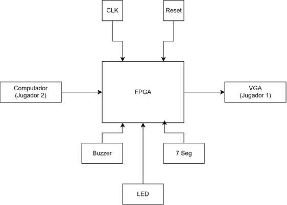
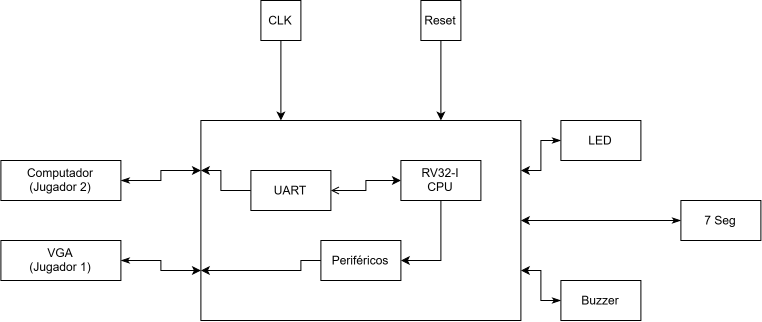
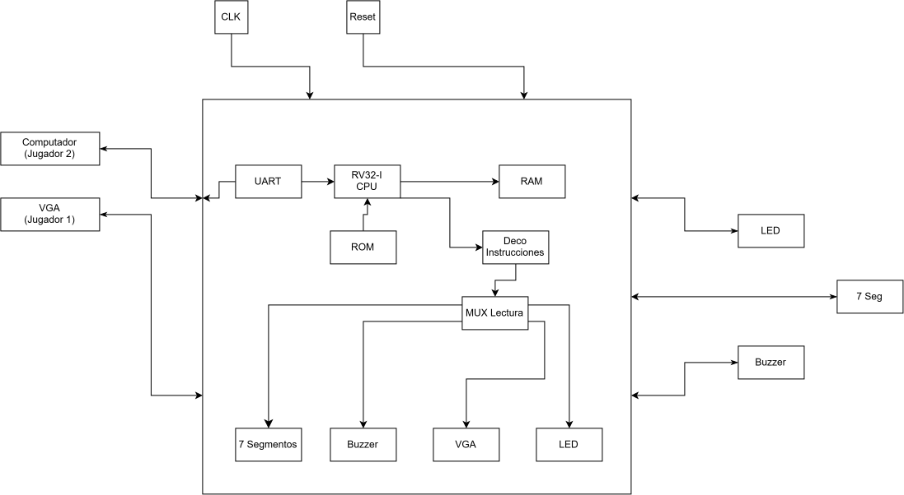
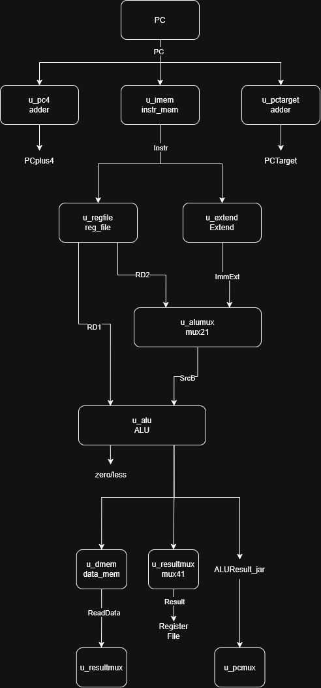
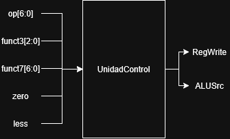
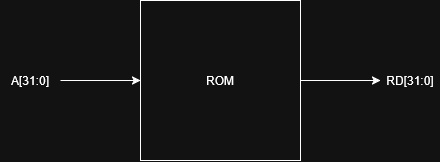
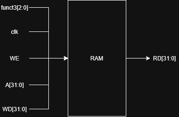

# Proyecto 3 – Batalla Naval sobre microprocesador RISC-V

## Introducción

El siguiente proyecto es la creacion de un juego de "Batalla Naval", este se realiza con la combinacion de el lenguaje 'Assembly' con el HDL 'SystemVerilog' para la creacion de un procesador uniciclo con la arquitectura RISC-V y la logica de juego e interaccion con perifericos respectivamente, ademas de usar 'Python' para la creacion de una aplicacion ejecutable en cualquier computador para el correcto funcionamiento del juego. El juego dispondra de memorias RAM y ROM, ademas de contar con distintos modulos de manejo de perifericos. Por ultimo, se utilizara un modulo completo de UART para realizar la comunicacion serial.

## Objetivos del diseño

### Objetivo general

El objetivo general es lograr el correcto funcionamiento de un videojuego que no solo requiere la comunicacion de la PC-FPGA trabajada anteriormente, sino que ademas se tiene que lograr el funcionamiento de el sistema VGA para su implementacion correcta dentro del sistema, un microprocesador de 32 bits y realizar todo el sistema de juego correctamente.

### Objetivos específicos
- Lograr la creacion funcional y util del procesador de 32 bits con arquitectura RISC-V.
- Lograr la creacion funcional y util de la memoria ROM y RAM, para el almacenamiento del programa y datos respectivamente.
- Lograr el correcto funcionamiento del períferico VGA para enviar la señal un monitor.
- Lograr el correcto funcionamiento e implementacion del sistema UART para una correcta comunicacion serial.
- Lograr el correcto funcionamiento del períferico de display de 7 segmentos para llevar el conteo de partidas ganadas por cada jugador.
- Lograr que el sistema de juego funcione correctamente, siendo capaz de ejecutar su maquina de estados correctamente y mantener el flujo de juego de manera adecuada.


## Arquitectura general del sistema
## Diagramas por nivel
### Primer nivel



### Segundo nivel



### Tercer nivel



### Diagrama top-down


La arquitectura se organiza alrededor de dos buses de propósito distinto:

Bus de programa (dedicado, de solo lectura). El procesador RISC-V (rv32i) accede a la memoria de programa (ROM) mediante un bus exclusivo: rom_addr hacia la ROM y rom_instr de regreso. Este bus nunca transporta datos, únicamente instrucciones, siguiendo una organización tipo Harvard que evita que el fetch de instrucciones compita con los accesos a datos.

Bus de datos (compartido, mapeado en memoria). La memoria de datos (RAM) y todos los periféricos UART, buzzer, displays/LED y GPIO de botones comparten un mismo bus de tres líneas: address, write y read. Desde la perspectiva del procesador, escribir en un periférico y escribir en RAM son la misma operación (sw); lo único que distingue el destino es la dirección utilizada. Un decodificador de direcciones (bloque de interconexión) interpreta address para enrutar cada acceso hacia la RAM o hacia el periférico correspondiente, y multiplexa las señales de lectura de todos los periféricos hacia el procesador.

El periférico VGA comparte el mismo bus eléctrico, pero se comporta como una memoria de video en lugar de un conjunto de registros de comando, por lo que requiere un campo de dirección más ancho que el resto de los periféricos.

Es importante distinguir dos decodificaciones: `control_unit` decodifica el
opcode/funct de cada instruccion para generar controles del CPU; el
`soc_interconnect` decodifica `DataAddress_o` para seleccionar RAM o un
periferico. El multiplexor de lectura del interconnect devuelve al CPU el
`rdata` del destino seleccionado. La UART no esta en el camino de fetch: la
ROM alimenta directamente el puerto de instrucciones del CPU, mientras que
la UART conecta la aplicacion de PC al bus de datos mapeado en memoria.


```mermaid
flowchart LR
  PCApp[Aplicacion PC, Jugador 2] <-->|UART serial| UART[Periferico UART]
  CPU[CPU RV32I] -->|ProgAddress| ROM[ROM de instrucciones]
  ROM -->|ProgInstr| CPU
  CPU -->|direccion, write data, WE| BUS[Interconnect MMIO<br/>decoder de direcciones + mux de lectura]
  BUS -->|WE/address| RAM[RAM de datos]
  RAM -->|rdata| BUS
  BUS -->|WE/address| UART
  UART -->|rdata| BUS
  BUS --> GPIO[GPIO botones]
  GPIO -->|rdata| BUS
  BUS --> DISP[Display 7 segmentos]
  DISP -->|rdata| BUS
  BUS --> LED[LED de estado]
  LED -->|rdata| BUS
  BUS --> BUZ[Buzzer]
  BUZ -->|rdata| BUS
  BUS -->|WE/address| VRAM[Memoria VGA mapeada]
  VRAM -->|rdata| BUS
  BUS -->|DataIn| CPU
  VRAM --> RENDER[Sincronismo y renderer VGA]
  RENDER --> MON[Monitor VGA, Jugador 1]
```

Bajo este esquema, todo el comportamiento específico del juego —colocación de barcos, turnos, validación de disparos, condición de victoria— reside exclusivamente en el programa ensamblador que se ejecuta sobre el procesador. El hardware permanece agnóstico a la aplicación: el mismo conjunto de bloques serviría para ejecutar cualquier otro programa rv32i que utilizara los mismos periféricos.

### Jerarquía de módulos


El top `soc_top` instancia el CPU, la ROM, `soc_data_ram`, `soc_interconnect`,
los periféricos mapeados y el generador PLL del reloj VGA. La ROM permanece
conectada directamente a `ProgAddress_o`/`ProgInstr_i`; las lecturas y
escrituras de datos pasan por `soc_interconnect`. Las escrituras se habilitan
solo en el destino decodificado y las lecturas regresan por el mux de lectura.
#### Organización actual de `modulos/src`

```text
modulos/src/
├── cpu/
│   ├── adder.sv, alu_decoder.sv, ALU.sv, ALUMux.sv
│   ├── control_unit.sv, cpu.sv, datapath.sv, Extend.sv
│   ├── data_mem.sv, Instr_mem.sv, program.hex, main_decoder.sv
│   ├── MemoryMux.sv, mux21.sv, mux41.sv, pc.sv, PCPlus4.sv
│   ├── reg_file.sv, SumPCTarget.sv
├── peripheral/
│   ├── buzzer/   buzzer_driver.sv, buzzer_perifico.sv
│   ├── display/  display_7seg.sv, led.sv, seven_seg_mux.sv, status_led.sv
│   ├── gpio/     debouncer.sv, j1_input.sv, synchronizer.sv
│   └── vga/      tile_map_ram.sv, tile_renderer.sv, vga_periph.sv,
│                vga_sync.sv, vga_top_dut.sv, vga_top_dut_board.sv
├── top/
│   ├── soc_data_ram.sv
│   ├── soc_top.sv
│   └── vga_clock_gen.sv
└── uart/
  ├── uart_generador_baudios.sv
  ├── uart_rx.sv, uart_top.sv, uart_tx.sv
  └── uart_peripheral.sv (alternativo, no instanciado por soc_top)
```

#### Jerarquía RTL activa de `soc_top`

```text
soc_top
├── u_clock_gen: vga_clock_gen
│   └── u_clk_wiz_0: clk_wiz_0 [IP requerido]
├── u_program_rom: instr_mem
│   └── u_bram_inst: batalla_naval_mem [IP requerido]
├── u_cpu: cpu
│   ├── dp: datapath
│   │   ├── u_pc, u_pc4, u_pctarget, u_alumux, u_alu
│   │   ├── u_regfile, u_extend, u_resultmux, u_pcmux
│   │   └── u_imem y u_dmem [memorias locales no usadas en modo SoC]
│   └── cu: control_unit
│       ├── md: main_decoder
│       └── ad: alu_decoder
├── u_data_ram: soc_data_ram
├── u_gpio: j1_input
│   ├── sync_btns: sync
│   └── debounce_btns: debouncer
├── u_led: led_perifico
│   └── u_status_led: status_led
├── u_display: display_7seg
│   └── u_seven_seg: seven_seg_mux
├── u_buzzer: buzzer_perifico
│   └── u_buzzer: buzzer_driver
├── u_uart: uart_top
│   ├── baud_gen: uart_generador_baudios
│   ├── rx_inst: uart_rx
│   └── tx_inst: uart_tx
└── u_vga: vga_periph
    ├── u_vram: tile_map_ram
    ├── u_sync: vga_sync
    └── u_renderer: tile_renderer
```

El decodificador de direcciones y el multiplexor combinacional de lectura están
descritos dentro de `soc_top`; no hay un módulo independiente
`bus_interconnect`. `uart_peripheral` también declara una implementación UART
con instancias internas de RX/TX y generador de baudios, pero no se instancia
en esta jerarquía: la instancia activa del SoC es `uart_top`. Puede conservarse
como fuente para su testbench, sin seleccionarla como parte de la síntesis del
SoC.

`vga_top_dut_board` y `vga_top_dut` corresponden a una jerarquía independiente
de demostración VGA, no a hijos de `soc_top`. Los módulos `ALUMux`,
`MemoryMux`, `PCPlus4` y `SumPCTarget` tampoco se instancian en el datapath
actual, que utiliza `mux21`, `mux41` y `adder`. Se pueden excluir del fileset
de síntesis del SoC, pero deben seguir disponibles en los filesets de
simulación que ejecutan sus testbenches.

Esta jerarquía describe las instancias RTL, no acredita por sí sola que la
síntesis y la implementación estén cerradas. `clk_wiz_0` y
`batalla_naval_mem` requieren sus IP de Vivado; el repositorio no contiene un
`.xpr` ni las configuraciones de esos IP. Véase la sección Configuración de
Vivado para el estado de restricciones y los pendientes de reproducibilidad.


## Microprocesador RISC-V

### Arquitectura del procesador

El sistema utilizará un microprocesador de 32 bits basado en la arquitectura
RISC-V y en el subconjunto de instrucciones RV32I. Se utilizará una arquitectura
uniciclo, por lo que cada instrucción será ejecutada completamente durante un
único ciclo de reloj. 
La arquitectura del procesador se divide principalmente en los siguientes
bloques:

- Contador de programa (PC).
- Banco de registros.
- Generador de inmediatos.
- Unidad aritmético-lógica (ALU).
- Unidad de control.
- Decodificador principal.
- Decodificador de operaciones de la ALU.
- Sumadores para el cálculo de PC + 4 y direcciones de salto.
- Multiplexores para selección de operandos, resultado y siguiente valor del PC.





### Módulos del procesador

El microprocesador se encuentra dividido en dos bloques principales:
el camino de datos (`datapath`) y la unidad de control (`control_unit`).
El módulo `cpu` funciona como nivel superior del procesador y realiza la
interconexión entre ambos bloques.

#### ALU

La unidad aritmético-lógica (ALU) es el bloque encargado de realizar las
operaciones aritméticas, lógicas, de comparación y desplazamiento requeridas
por las instrucciones ejecutadas por el procesador.

La ALU recibe dos operandos de 32 bits, denominados `SrcA` y `SrcB`. La
operación que se realiza sobre estos operandos es determinada por la señal
`ALUControl`, de 4 bits, proveniente de la unidad de control.

Como resultado, la ALU genera la señal `ALUResult` de 32 bits. Adicionalmente,
genera las señales `zero` y `less`, utilizadas posteriormente por la unidad
de control para evaluar condiciones asociadas a instrucciones de salto.

Las entradas y salidas del módulo se muestran en la siguiente tabla:

| Señal | Dirección | Tamaño | Descripción |
|---|---|---:|---|
| `SrcA` | Entrada | 32 bits | Primer operando de la ALU. |
| `SrcB` | Entrada | 32 bits | Segundo operando de la ALU. |
| `ALUControl` | Entrada | 4 bits | Selecciona la operación que realiza la ALU. |
| `ALUResult` | Salida | 32 bits | Resultado de la operación realizada. |
| `zero` | Salida | 1 bit | Se activa cuando `ALUResult` es igual a cero. |
| `less` | Salida | 1 bit | Indica si `SrcA` es menor que `SrcB` mediante una comparación con signo. |


#### Banco de registros

El módulo `reg_file` implementa un banco de 32 registros de 32 bits. Su
función es almacenar los operandos y resultados utilizados durante la
ejecución de las instrucciones.

El banco permite realizar dos lecturas simultáneas mediante las salidas `RD1`
y `RD2`, y una escritura mediante la entrada `WD3`. Las direcciones de los
registros utilizados se indican mediante las señales `A1`, `A2` y `A3`.

Dentro del datapath, estas direcciones se obtienen directamente de los campos
de la instrucción:

- `A1 = Instr[19:15]`
- `A2 = Instr[24:20]`
- `A3 = Instr[11:7]`

La señal `RegWrite`, proveniente de la unidad de control, se conecta a `WE3`
y determina si debe realizarse una escritura. El valor que se escribe en el
registro seleccionado corresponde a la señal `Result`, proveniente del
multiplexor de resultados.

Las salidas `RD1` y `RD2` corresponden al contenido de los registros
seleccionados por `A1` y `A2`, respectivamente. `RD1` se utiliza como primer
operando de la ALU, mientras que `RD2` puede utilizarse como segundo operando
de la ALU o como dato para una operación de escritura en memoria.

El registro `x0` mantiene siempre el valor cero. Cuando `A1` o `A2` seleccionan
el registro cero, la salida correspondiente retorna `0`. De igual manera, las
operaciones de escritura sobre `x0` son ignoradas.

| Señal | Dirección |  Tamaño | Descripción                                                    |
| ----- | --------- | ------: | -------------------------------------------------------------- |
| `clk` | Entrada   |   1 bit | Reloj utilizado para realizar las escrituras en los registros. |
| `WE3` | Entrada   |   1 bit | Habilita la escritura en el banco de registros.                |
| `A1`  | Entrada   |  5 bits | Dirección del primer registro que se desea leer.               |
| `A2`  | Entrada   |  5 bits | Dirección del segundo registro que se desea leer.              |
| `A3`  | Entrada   |  5 bits | Dirección del registro en el cual se realizará la escritura.   |
| `WD3` | Entrada   | 32 bits | Dato que será escrito en el registro seleccionado por `A3`.    |
| `RD1` | Salida    | 32 bits | Dato almacenado en el registro seleccionado por `A1`.          |
| `RD2` | Salida    | 32 bits | Dato almacenado en el registro seleccionado por `A2`.          |


#### Generador de inmediatos

Generar un valor inmediato de 32 bits a partir de los campos correspondientes
de la instrucción RISC-V, de acuerdo con el formato indicado por la señal de
control `ImmSrc`.

El módulo `Extend` recibe la instrucción completa de 32 bits mediante la señal
`Instr` y utiliza la señal `ImmSrc` para determinar cómo deben reorganizarse y
extenderse los bits que forman el inmediato.

Dependiendo del tipo de instrucción, los bits del inmediato se encuentran en
diferentes posiciones dentro de `Instr`. El módulo se encarga de extraerlos,
ordenarlos y extenderlos hasta obtener un valor de 32 bits denominado
`ImmExt`.

| Señal | Dirección | Tamaño | Descripción |
|---|---|---:|---|
| `Instr` | Entrada | 32 bits | Instrucción actual de la cual se extraen los bits del inmediato. |
| `ImmSrc` | Entrada | 4 bits | Selecciona el formato utilizado para construir el inmediato. |
| `ImmExt` | Salida | 32 bits | Valor inmediato extendido a 32 bits. |


#### Unidad de control

Este modulo se encarga de decodificar la instrucción que se encuentra en ejecución y generar las señales
de control necesarias para determinar el comportamiento del `datapath`.

El módulo `control_unit` recibe los campos principales de la instrucción:

- `op`: código de operación de la instrucción.
- `funct3`: campo utilizado para diferenciar operaciones que comparten un mismo
  `opcode`.
- `funct7`: campo adicional utilizado para diferenciar ciertas operaciones.

| Señal | Dirección | Tamaño | Descripción |
|---|---|---:|---|
| `op` | Entrada | 7 bits | Código de operación de la instrucción utilizado para identificar el tipo de instrucción. |
| `funct3` | Entrada | 3 bits | Campo de función utilizado para diferenciar instrucciones que comparten un mismo `opcode`. |
| `funct7` | Entrada | 7 bits | Campo de función adicional utilizado para diferenciar determinadas operaciones. |
| `zero` | Entrada | 1 bit | Indica que el resultado generado por la ALU es igual a cero. |
| `less` | Entrada | 1 bit | Indica que `SrcA` es menor que `SrcB` mediante una comparación con signo. |
| `RegWrite` | Salida | 1 bit | Habilita la escritura de un resultado en el banco de registros. |
| `ALUSrc` | Salida | 1 bit | Selecciona el segundo operando de la ALU entre `RD2` e `ImmExt`. |
| `ResultSrc` | Salida | 2 bits | Selecciona el dato que será escrito nuevamente en el banco de registros. |
| `MemWrite` | Salida | 1 bit | Habilita la escritura en la memoria de datos. |
| `ImmSrc` | Salida | 4 bits | Selecciona el formato de inmediato que debe generar el módulo `Extend`. |
| `ALUControl` | Salida | 4 bits | Selecciona la operación que debe realizar la ALU. |
| `PCSrc` | Salida | 2 bits | Selecciona la fuente utilizada para determinar el siguiente valor del contador de programa. |



#### Comparador de branch

Determinar si se cumple la condición asociada a una instrucción de salto
condicional y, a partir de dicho resultado, indicar si el contador de programa
debe continuar con la ejecución secuencial o cargar la dirección de salto
`PCTarget`.

En el procesador actual, la comparación necesaria para las instrucciones de
branch no se encuentra implementada como un módulo independiente. Esta función
se encuentra distribuida entre la ALU y la unidad de control.

La ALU recibe los operandos `SrcA` y `SrcB` y genera las señales `zero` y
`less`.

La señal `zero` se activa cuando el resultado de la operación realizada por la
ALU es igual a cero:

`zero = (ALUResult == 32'd0)`

Por otra parte, `less` indica si `SrcA` es menor que `SrcB` mediante una
comparación con signo:

`less = ($signed(SrcA) < $signed(SrcB))`

Estas dos señales son enviadas hacia `control_unit`, donde se combinan con las
señales internas que identifican el tipo de branch. De esta manera se determina
el valor de `PCSrc`.

| Señal | Origen | Tamaño | Descripción |
|---|---|---:|---|
| `zero` | ALU | 1 bit | Indica que `ALUResult` es igual a cero. |
| `less` | ALU | 1 bit | Indica que `SrcA` es menor que `SrcB` mediante comparación con signo. |
| `Branch` | `main_decoder` | 1 bit | Identifica una instrucción `BEQ`. |
| `BranchNE` | `main_decoder` | 1 bit | Identifica una instrucción `BNE`. |
| `BranchLT` | `main_decoder` | 1 bit | Identifica una instrucción `BLT`. |
| `BranchGE` | `main_decoder` | 1 bit | Identifica una instrucción `BGE`. |
| `PCSrc` | `control_unit` | 2 bits | Selecciona la fuente del siguiente valor del PC. |

#### Program Counter

El módulo `pc` implementa el contador de programa del procesador. Este registro
mantiene un valor de 32 bits denominado `PC`, el cual representa la dirección de
la instrucción actual.

El valor del contador se actualiza en cada flanco positivo de la señal `clk`.
Durante una operación normal, el nuevo valor almacenado corresponde a
`PCnext`, generado por el multiplexor `u_pcmux` dentro del `datapath`.

Cuando la señal `rst` se encuentra activa, el contador de programa se reinicia
a `32'b0`, haciendo que la ejecución comience desde la dirección
`0x00000000`.

| Señal    | Dirección |  Tamaño | Descripción                                                                  |
| -------- | --------- | ------: | ---------------------------------------------------------------------------- |
| `clk`    | Entrada   |   1 bit | Señal de reloj utilizada para actualizar el contador de programa.            |
| `rst`    | Entrada   |   1 bit | Reinicia el contador de programa a `0x00000000`.                             |
| `PCnext` | Entrada   | 32 bits | Dirección que será almacenada como siguiente valor del contador de programa. |
| `PC`     | Salida    | 32 bits | Dirección de la instrucción que se encuentra actualmente en ejecución.       |


### Instrucciones soportadas
| Instrucciones                         | Estado actual                                                                                                                         |
| ------------------------------------- | ------------------------------------------------------------------------------------------------------------------------------------- |
| `add`, `sub`, `and`, `or`, `xor`      | Implementadas en la ALU y decodificadas.                                                                                              |
| `slt`, `sll`, `srl`, `sra`            | Implementadas en la ALU y decodificadas.                                                                                              |
| `addi`, `andi`, `ori`, `xori`, `slti` | Implementadas y decodificadas.                                                                                                        |
| `slli`, `srli`, `srai`                | Implementadas y decodificadas.                                                                                                        |
| `beq`, `bne`, `blt`, `bge`            | Contempladas en la unidad de control.                                                                                                 |
| `jal`                                 | Contemplada en la unidad de control y el `datapath`.                                                                                  |
| `lb`, `lh`, `lw`, `lbu`, `lhu`        | Contempladas por la memoria de datos; falta completar la conexión de `funct3` en el `datapath`.                                       |
| `sb`, `sh`, `sw`                      | Contempladas por la memoria de datos; falta completar la conexión de `funct3` en el `datapath`.                                       |
| `jalr`                                | El `datapath` y `PCSrc` contemplan el salto, pero falta completar su decodificación en `main_decoder`.                                |
| `lui`                                 | El generador de inmediatos y la ALU contemplan la operación, pero falta completar la decodificación correspondiente en `alu_decoder`. |
| `sltu`, `sltiu`                       | La ALU contempla la comparación sin signo, pero falta completar su decodificación en `alu_decoder`.                                   |


## Subsistema de memoria

### ROM

El módulo `instr_mem` implementa la memoria de instrucciones del procesador.
La memoria está formada por palabras de 32 bits y utiliza como dirección de
entrada la señal `A`, proveniente directamente del contador de programa.

| Señal | Dirección |  Tamaño | Descripción                                                   |
| ----- | --------- | ------: | ------------------------------------------------------------- |
| `A`   | Entrada   | 32 bits | Dirección de la instrucción solicitada, proveniente del `PC`. |
| `RD`  | Salida    | 32 bits | Instrucción almacenada en la dirección seleccionada.          |

| Parámetro | Valor actual | Descripción                                                |
| --------- | -----------: | ---------------------------------------------------------- |
| `DEPTH`   |         1024 | Cantidad de palabras de 32 bits almacenadas en la ROM del SoC. |

En el SoC, `instr_mem` instancia el IP `batalla_naval_mem`, que se configura
como ROM síncrona de un puerto, 32 bits de ancho y 1024 palabras de profundidad.
La imagen del firmware se carga en el IP desde
`modulos/ensamblador/batalla_naval.coe`; ese vector contiene las mismas 571
instrucciones que `batalla_naval.hex`. La dirección del PC es de byte y se
convierte a índice de palabra (`A[11:2]`). La lectura debe conservar una
latencia síncrona de un ciclo.



### RAM

`data_mem` implementa la memoria local de 256 palabras que permanece dentro de
`datapath`. En la integración de `soc_top`, la memoria mapeada en el bus de
datos es `soc_data_ram`, con 1024 palabras de 32 bits a partir de la dirección
base `0x00002000`. Ambas memorias contemplan las operaciones de lectura y
escritura de byte, media palabra y palabra descritas a continuación.

| `funct3` | Operación | Resultado de lectura                                 |
| -------- | --------- | ---------------------------------------------------- |
| `000`    | `lb`      | Lee 8 bits y realiza extensión de signo a 32 bits.   |
| `001`    | `lh`      | Lee 16 bits y realiza extensión de signo a 32 bits.  |
| `010`    | `lw`      | Lee los 32 bits de la palabra.                       |
| `100`    | `lbu`     | Lee 8 bits y realiza extensión con ceros a 32 bits.  |
| `101`    | `lhu`     | Lee 16 bits y realiza extensión con ceros a 32 bits. |

| `funct3` | Operación | Escritura realizada |
| -------- | --------- | ------------------- |
| `000`    | `sb`      | Escribe `WD[7:0]`.  |
| `001`    | `sh`      | Escribe `WD[15:0]`. |
| `010`    | `sw`      | Escribe `WD[31:0]`. |



### Organización de datos en RAM

La memoria RAM se utilizará para almacenar los datos necesarios durante la
ejecución del juego, principalmente los tableros de ambos jugadores y algunas
variables de control.

Cada jugador posee un tablero de 8 × 8 casillas, por lo que se almacenarán
64 posiciones por jugador. Cada posición utilizará una palabra de 32 bits.

La organización propuesta es:

| Región | Dirección inicial | Contenido |
|---|---:|---|
| Tablero Jugador 1 | `0x00002000` | 64 casillas del tablero del Jugador 1 |
| Tablero Jugador 2 | `0x00002100` | 64 casillas del tablero del Jugador 2 |
| Variables de control | `0x00002200` | Turno, fase del juego, contadores y estado de barcos |

Cada casilla del tablero podrá almacenar uno de los siguientes estados:

| Valor | Estado |
|---:|---|
| `0` | Agua |
| `1` | Barco 0 |
| `2` | Barco 1 |
| `3` | Barco 2 |
| `4` | Fallo |
| `5` | Barco 0 impactado |
| `6` | Barco 1 impactado |
| `7` | Barco 2 impactado |

Las posiciones del tablero se almacenarán por filas. La dirección de una
casilla se calculará mediante:

`dirección = BASE + (fila × 8 + columna) × 4`


## Interconexión y mapa de memoria

### Bus del sistema

El bus de datos se compone de señales que `cpu` intercambia con la lógica de
interconexión implementada en `soc_top` durante los accesos a memoria (`lb`,
`lh`, `lw`, `lbu`, `lhu`, `sb`, `sh` y `sw`):

- **`DataAddress_o[31:0]`**: dirección generada por el procesador y enviada a la lógica de selección y a los destinos.
- **`DataOut_o[31:0]`**: dato de escritura distribuido a la RAM y los periféricos; cada bloque solo lo captura cuando su habilitación está activa.
- **`DataIn_i[31:0]`**: dato seleccionado en `soc_top` desde la RAM o el periférico direccionado y devuelto al procesador.
- **`DataFunct3_o[2:0]`**: identifica el tamaño y tipo de acceso a memoria utilizado por el CPU.
- **`DataWriteEnable_o`**: indica una escritura; `soc_top` la combina con la selección de dirección para generar las habilitaciones locales.

### Decodificación de direcciones

La lógica de `soc_top` compara `DataAddress_o` con rangos fijos y genera
selecciones para la RAM y los periféricos (`ram_select`, `uart_select`,
`gpio_select`, `display_select`, `led_select`, `buzzer_select` y `vga_select`).
Cada selección se combina con `DataWriteEnable_o` para generar la habilitación
de escritura local. La ROM queda fuera de esta decodificación y se accede por
el bus dedicado de programa (`ProgAddress_o`/`ProgInstr_i`).

Para la lectura, un multiplexor combinacional en `soc_top` selecciona entre
la RAM y los periféricos con registro de lectura y entrega el resultado como
`DataIn_i`. Si no se selecciona un destino con lectura, entrega `32'b0`.

### Mapa de memoria

| Dispositivo | Dirección / rango |
|-------------|-------------------|
| ROM | 0x0000_0000 – 0x0000_1FFF |
| RAM | 0x0000_2000 – 0x0000_2FFF |
| UART (Control/Estado, TX, RX) | 0x0001_0040 – 0x0001_0048 |
| GPIO (Entradas Jugador 1) | 0x0001_0120 |
| Display 7 segmentos | 0x0001_0130 |
| LED de estado | 0x0001_0138 |
| Buzzer | 0x0001_0140 |
| VGA (memoria de video, tile map) | 0x0001_1000 – 0x0001_17FF |


## Periféricos

Se define la siguiente estructura para el sistema de periféricos: UART Interface → UART-USB: es el único canal de comunicación con el Jugador 2 remoto (aplicación de PC). Todo lo que el CPU necesita decirle o preguntarle al jugador remoto pasa por aquí.
Buzzer: recibe códigos de evento (impacto, fallo, hundido, colocación inválida, victoria) y los traduce a tonos.
Display (7 seg, LEDs): agrupa en el diagrama los periféricos `display_7seg` y `led_perifico` — cada uno vive en su propia dirección, pero conceptualmente ambos son "salida de estado visible".
GPIO (botones): `j1_input`, la única entrada local del Jugador 1 (con antirrebote).
VGA: la excepción del bus — aunque comparte las mismas 3 líneas eléctricas, internamente se comporta como memoria de video en vez de registros de comando, por eso el enunciado le exige un campo de dirección más ancho.


Diagrama segundo nivel sistema de periféricos

### Entradas del Jugador 1

a) Nombre del módulo: `j1_input` (instancia `sync` y `debouncer`)


Bus de programa (dedicado, de solo lectura). El módulo `cpu` entrega
`ProgAddress_o` a `instr_mem` y recibe `ProgInstr_i`. Este bus transporta
instrucciones, separado de los accesos a datos.


Bus de datos (compartido y mapeado en memoria). El `cpu` entrega
`DataAddress_o`, `DataOut_o`, `DataFunct3_o` y `DataWriteEnable_o` a la lógica
de interconexión de `soc_top`. Allí se decodifican los rangos de RAM y
periféricos, se habilita el destino de escritura y se selecciona el dato de
lectura para `DataIn_i`.
Diagrama tercer nivel
El periférico VGA también recibe las señales de dirección y escritura. Su
rango selecciona la memoria de tiles y el renderizador entrega la imagen a las
salidas VGA; no es un registro de lectura dentro del multiplexor `data_read` de
`soc_top`.
c) Objetivo: entregar al CPU, en un único registro de 32 bits legible por `lw`, el estado ya sincronizado y filtrado de rebotes de los siete controles físicos del Jugador 1.

d) 
| Entradas | Descripción |
|---|---|
| `clk_i`, `rst_i` | Reloj de sistema y reset. |
| `btns_in[6:0]` | Siete señales físicas sincronizadas y filtradas; el mapeo efectivo desde los puertos de `soc_top` se detalla abajo. |
| `write_enable_i`, `addr_i[1:0]`, `wdata_i[31:0]` | Interfaz estándar; el periférico es de solo lectura. |

e)  
| salidas | descripcion |
|-----|---------|
|rdata_o[31:0]	| 	`{25'b0, btns_debounced[6:0]}` en `addr_i=00` |

f) Relación con otros módulos: es consumido exclusivamente por el programa en ensamblador (subrutina leer_botones), que lee este registro por polling. No depende de ningún otro periférico.

#### Debouncing

g) El sincronizador de dos etapas resuelve la metaestabilidad de las 7 entradas asíncronas. El filtro antirrebote —replicado 7 veces mediante generate— solo actualiza btn_out[i] cuando la entrada se mantiene estable durante 2²⁰−1 ciclos consecutivos (~10.5 ms a 100 MHz), reiniciando el conteo cada vez que detecta un cambio. El resultado se expone de forma puramente combinacional en rdata_o.

#### Registro de estado y asignación física

El contrato funcional del periférico define el siguiente orden de bits:

| Bit | Entrada |
|-----|---------|
| 0 | BTN OK (confirmación) |
| 1 | BTN SEL (rotación) |
| 2 | Derecha |
| 3 | Izquierda |
| 4 | Abajo |
| 5 | Arriba |
| 6 | BTN RST |

El firmware ensamblador usa las mismas máscaras de entrada. La conexión en
`soc_top` implementa ese orden de bits con este mapeo:

| Bit de `btns_in` | Puerto físico actual |
|---:|---|
| 0 | `sw[0]` (OK/confirmación) |
| 1 | `sw[1]` (SEL/rotación) |
| 2 | `btnR` |
| 3 | `btnL` |
| 4 | `btnD` |
| 5 | `btnU` |
| 6 | `btnC` |

`btnC` también actúa como reset general del SoC. Los switches son entradas
mantenidas; deben volver a cero para generar una nueva transición en la
aplicación. El debounce/sincronización de las entradas corre a `clk_fpga`.

El filtro actual requiere `2^20 - 1` ciclos estables, equivalentes a
`(2^20 - 1) / 100 MHz ≈ 10.49 ms` con el reloj de placa.

### UART

**Objetivo:** reutilizar el periférico UART del Proyecto 2 como único canal de interacción del Jugador 2 con la partida, transmitiendo hacia la FPGA la colocación de barcos y los disparos, y notificando desde la FPGA cada evento relevante (aceptación o rechazo de colocación, cambio de turno, resultado de disparos y fin de partida).

**Descripción:** `uart_top` opera con parámetros por defecto de 100 MHz,
115200 baudios, 8 bits de datos y sobremuestreo de 16. Instancia
`uart_generador_baudios`, `uart_rx` y `uart_tx`; además expone registros de
control/estado, transmisión y recepción mediante su interfaz mapeada en
memoria. `uart_top` se conecta a los pines seriales desde `soc_top`.

#### Módulos internos

- Generador de baudios (`uart_generador_baudios.sv`)
- UART TX (`uart_tx.sv`)
- UART RX (`uart_rx.sv`)
- Interfaz y registros del periférico (`uart_top.sv`)

#### Registros

| Offset | Registro |
|--------|----------|
| 0x00 | Control/Estado |
| 0x04 | TX |
| 0x08 | RX |


### VGA
#### Diagrama (Nivel 3)

<div align="center">

</div>

#### Objetivo

El siguiente periférico se encarga de mostrar en un monitor VGA un mapa de tiles correspondiente al juego de Batalla Naval. Cada tile está compuesto por 32×32 píxeles que muestran un color específico dependiendo de lo que se encuentre en esa casilla (agua, barco, impacto o fallo).

#### Descripción

###### tile_map_ram

Almacena 512 palabras de 32 bits; el CPU escribe las casillas y el
`tile_renderer` obtiene los datos del puerto VGA. La lectura y la escritura
son síncronas en sus respectivos relojes.

- Entradas: `clk_cpu_i`, `write_enable_i`, `addr_cpu_i[8:0]`, `wdata_i[31:0]`, `clk_vga_i` y `addr_vga_i[8:0]`.
- Salida: `rdata_vga_o[31:0]` hacia `tile_renderer`.

El puerto de escritura opera con el reloj del CPU y el puerto de lectura con el
reloj VGA. `soc_top` decodifica el rango VGA y habilita las escrituras; la RAM
no devuelve un dato de lectura al bus del CPU.

###### vga_sync

Genera las señales de sincronización de la VGA y recorre cada píxel, para que el resto de los módulos procesen la información correspondiente.

- Entradas: `clk_pixel_i` (25 MHz), `rst_i`.
- Salidas: `hcount_o[9:0]`, `vcount_o[9:0]`, `hsync_o`, `vsync_o`, `video_on_o`.

###### tile_renderer

Identifica en qué tile se encuentra cada píxel y qué color representa, a partir del píxel recibido desde `vga_sync` y la información de `tile_map_ram`.

- Entradas: `hcount_i[9:0]`, `vcount_i[9:0]`, `video_on_i`, `tile_data_i[31:0]` (desde `tile_map_ram`, puerto B).
- Salidas: `addr_pixel_o[8:0]` (hacia `tile_map_ram`, puerto B), `rgb_o[11:0]` (color del píxel actual, 4 bits por canal según el DAC resistivo de la Basys3).

###### vga_periph

Integra la memoria de tiles, la sincronización y el renderizado, y genera las
salidas físicas VGA.

- Entradas: `clk_cpu_i`, `rst_i`, `write_enable_i`, `addr_i[31:0]`,
  `wdata_i[31:0]` y `clk_vga_i`.
- Salidas: `hsync_o`, `vsync_o` y los canales físicos `vga_r_o`, `vga_g_o` y
  `vga_b_o`.

### Generación de sincronismos

Con `clk_pixel = 25 MHz`, `vga_sync` mantiene dos contadores: `hcount` (0–799) y `vcount` (0–524). El barrido horizontal se compone de 640 píxeles visibles + 16 de *front porch* + 96 de pulso de sincronismo + 48 de *back porch* = 800 ciclos de píxel por línea; el barrido vertical se compone de 480 líneas visibles + 10 + 2 + 33 = 525 líneas por cuadro. `hsync` y `vsync` se activan en bajo durante su respectivo pulso de sincronismo, y `video_on = (hcount < 640) && (vcount < 480)` indica si el píxel actual pertenece al área visible.

### Tile Map

La pantalla se divide en una cuadrícula de 20 columnas × 15 filas de bloques de 32×32 píxeles (640/32 = 20, 480/32 = 15), para un total de 300 casillas. El tablero propio del Jugador 1 ocupa las columnas 1–8, filas 3–10 (8×8); el tablero rival (vista del Jugador 1 sobre el tablero del Jugador 2) ocupa las columnas 11–18, filas 3–10; las filas 0–2 se reservan para el HUD superior (turno activo, fase de la partida) y las filas 11–14 para separadores y mensajes de estado.

Ver diagrama de la cuadrícula en `docs/diseño/Imagenes` (pestaña "Periférico VGA" del archivo `Proyecto3_BatallaNaval_Diagramas.drawio`).

### Memoria de video

`tile_map_ram` contiene 512 palabras de 32 bits (300 tiles visibles). El puerto
de escritura recibe desde `vga_periph` la dirección derivada de `addr_i`; el
puerto de lectura, sincronizado con `clk_vga_i`, es direccionado por
`tile_renderer` a partir de la posición del píxel. La memoria admite accesos
en ambos dominios de reloj mediante sus puertos independientes.

### Codificación de tiles

| Código | Contenido |
|--------|-----------|
| 0 | Agua (sin disparar) |
| 1 | Barco propio (visible solo en el tablero propio) |
| 2 | Impacto (disparo acertado) |
| 3 | Fallo (disparo sin acertar) |
| 4 | HUD – fondo / texto |
| 5 | HUD – cursor de selección |
| 6 | HUD – separador de tableros |
| 7 | Reservado |


### Displays de 7 segmentos

a) Nombre del módulo: display_7seg.sv, seven_seg_mux.sv

b)


Diagrama tercer nivel

c) Objetivo: mostrar en los 4 displays físicos de la Basys3 el contador acumulado de partidas ganadas por cada jugador (2 dígitos por jugador), multiplexando en el tiempo.

Descripción: este periférico se encarga de mostrar las partidas totales ganadas por cada uno de los jugadores, con asignación fija de los cuatro dígitos: los dos dígitos de la izquierda corresponden al Jugador 1 y los dos de la derecha al Jugador 2.

d) 
| entradas | descripcion |
|-----|---------|
| clk_i, rst_i| Reloj de sistema y reset |
| write_enable_i, addr_i[1:0], wdata_i[31:0] | Bus estándar; 4 dígitos BCD empaquetados en wdata_i[15:0] |

e) 
| salidas | descripcion |
|-----|---------|
| rdata_o[31:0]| 	Eco del registro de datos |
| seg[6:0], dp, an[3:0]| Señales físicas hacia los displays |

f) Relación con otros módulos

El registro se actualiza desde la subrutina actualizar_contador_partidas del programa ensamblador.

g) Explicación de funcionamiento

Un contador de refresco genera un pulso de habilitación periódico que avanza un contador módulo 4; este selecciona, mediante un multiplexor 4:1, cuál de los 4 dígitos BCD mostrar y, en paralelo, activa la línea de ánodo correspondiente. El decodificador BCD→7 segmentos traduce el dígito activo al patrón físico de segmentos.


### LED de estado

a) Nombre del módulo led_perifico (instancia status_led)

b) Diagrama modular


Ver diagrama de tercer nivel mostrado arriba.

Objetivo: indicar con un LED distinto y mutuamente excluyente en cuál fase se encuentra la partida: colocación de barcos, batalla, o resultado final.

f) Relación con otros módulos

El código de fase se actualiza desde el flujo principal del programa ensamblador al transitar entre fase_colocacion, fase_batalla y fin_partida.

g) Explicación de funcionamiento

Tres comparadores combinacionales evalúan en paralelo si game_state coincide con cada uno de los 3 códigos válidos; cada resultado enciende un bit distinto de led.

### Buzzer

a) Nombre del módulo

buzzer_perifico (instancia buzzer_driver)

b) Diagrama modular


c) Objetivo: generar 5 tonos distintos y perceptibles para los eventos del juego (impacto, fallo, barco hundido, colocación inválida, victoria), disparados por el CPU mediante una única escritura sw a un registro de control.

d)
| entradas | descripcion |
|-----|---------|
| clk_i, rst_i| Reloj de sistema y reset |
| write_enable_i, addr_i[1:0], wdata_i[31:0] |	Bus estándar; wdata_i[2:0] = código de evento (1–5) |

e)
| Salida| descripcion |
|-----|---------|
| rdata_o[31:0]| 	Eco del último código de evento escrito |
| buzzer_pwm |		Onda cuadrada hacia el buzzer pasivo |

f) Relación con otros módulos

El código de evento proviene de las subrutinas procesar_disparo, detectar_hundido, validar_colocacion y verificar_victoria del programa ensamblador.

g) Explicación de funcionamiento

El decodificador de evento convierte wdata_i[2:0] en uno de 5 pulsos de 1 ciclo (aprovechando que write_enable_i ya dura exactamente 1 ciclo en cada sw). Cada pulso carga en buzzer_driver el semiperiodo y la duración correspondientes a ese evento; un contador de duración cuenta hacia atrás hasta apagar el tono, y en paralelo un contador de ciclos alterna la salida cada vez que alcanza el semiperiodo cargado, generando la onda cuadrada.

h) Diseño — tabla de códigos de evento


## Sistema de reloj

### Reloj principal

100 MHz de la FPGA.

### Reloj VGA

Generación de 25 MHz mediante PLL.

La integración de `soc_top` usa el Clocking Wizard `clk_wiz_0`: recibe
`clk_in1` de 100 MHz, entrega `clk_fpga` a 100 MHz para el sistema y `clk_vga`
a 25 MHz para VGA. La demo independiente `vga_top_dut_board` usa un divisor
RTL para generar su reloj de píxel.

`soc_top` usa `clk_fpga` para el CPU, la RAM y los periféricos. El generador
`uart_generador_baudios` deriva el tick de sobremuestreo desde ese reloj de
sistema. `tile_map_ram` conecta sus puertos de escritura y lectura a los
dominios del CPU y VGA, respectivamente; las entradas de botones pasan por
`sync` y `debouncer`.


## Programa en ensamblador

### Organización general

Implementar la lógica completa del juego de Batalla Naval mediante un programa
en ensamblador RISC-V ejecutado por el microprocesador.

El programa será responsable de controlar la colocación de barcos, los turnos,
los disparos, la detección de impactos, barcos hundidos y la condición de
victoria.

El programa seguirá un flujo principal dividido en las siguientes etapas:

1. Inicialización del sistema.
2. Limpieza de los tableros y variables almacenadas en RAM.
3. Colocación de barcos del Jugador 1 y Jugador 2.
4. Inicio de la fase de batalla.
5. Lectura del jugador correspondiente.
6. Validación del disparo.
7. Actualización del tablero.
8. Verificación de barcos hundidos.
9. Verificación de la condición de victoria.
10. Cambio de turno.
11. Finalización de la partida.

Ver diagrama de flujo completo en `docs/diseño/Imagenes` (pestaña "Flujo programa principal" del archivo `Proyecto3_BatallaNaval_Diagramas.drawio`).

### Subrutinas propuestas

| Subrutina            | Función                                                              |
| -------------------- | -------------------------------------------------------------------- |
| `sistema_ini`        | Inicializar variables y periféricos.                                 |
| `limpiar_tableros`       | Limpiar los tableros almacenados en RAM.                             |
| `barco_ini`         | Colocar un barco en el tablero correspondiente.                      |
| `barco_valido`      | Verificar que un barco no salga del tablero ni se traslape con otro. |
| `input_j1` | Leer las entradas del Jugador 1.                                     |
| `input_j2`          | Recibir comandos del Jugador 2 mediante UART.                        |
| `verif_shot`       | Procesar un disparo realizado por un jugador.                        |
| `acierto`          | Determinar si un disparo corresponde a impacto o fallo.              |
| `hundir`         | Determinar si un barco fue hundido.                                  |
| `condi_ganar`      | Verificar si todos los barcos de un jugador fueron hundidos.         |
| `sistema_vga`         | Actualizar la información mostrada mediante VGA.                     |
| `uart_p1`          | Enviar información hacia la aplicación del Jugador 2.                |
| `buzzer_sound`         | Activar el buzzer dependiendo del evento ocurrido.                   |


## Protocolo de comunicación UART

### PC → FPGA

Formato general de trama: `STX(0x02) CMD(1B) LEN(1B) PAYLOAD(LEN bytes) CHK(1B) ETX(0x03)`

| CMD | Mensaje | PAYLOAD |
|-----|---------|---------|
| 0x01 | Colocación de barco | `id_barco(1B, 0–2)`, `fila(1B, 0–7)`, `columna(1B, 0–7)`, `orientación(1B: 0=horizontal, 1=vertical)` |
| 0x02 | Disparo | `fila(1B, 0–7)`, `columna(1B, 0–7)` |

### FPGA → PC

| CMD | Mensaje | PAYLOAD |
|-----|---------|---------|
| 0x80 | Inicio de fase de colocación | — |
| 0x81 | Colocación aceptada | `id_barco(1B)` |
| 0x82 | Colocación rechazada | `id_barco(1B)`, `motivo(1B: 0=traslape, 1=fuera_de_tablero)` |
| 0x83 | Inicio de fase de batalla | — |
| 0x84 | Cambio de turno | `turno(1B: 0=Jugador1, 1=Jugador2)` |
| 0x85 | Resultado de disparo propio (del Jugador 2) | `fila(1B)`, `columna(1B)`, `resultado(1B: 0=fallo, 1=impacto, 2=hundido)` |
| 0x86 | Disparo recibido (del Jugador 1 sobre tablero del Jugador 2) | `fila(1B)`, `columna(1B)`, `resultado(1B)` |
| 0x87 | Fin de partida | `ganador(1B: 0=J1, 1=J2)`, `disparos_totales(2B, MSB primero)`, `barcos_hundidos_j1(1B)`, `barcos_hundidos_j2(1B)` |

### Formato de trama

| Byte(s) | Campo | Descripción |
|---|---|---|
| 0 | `STX` | Delimitador de inicio, valor fijo `0x02` |
| 1 | `CMD` | Código de comando/evento (tablas anteriores) |
| 2 | `LEN` | Cantidad de bytes de `PAYLOAD` que siguen |
| 3 … 3+LEN−1 | `PAYLOAD` | Datos específicos del comando |
| 3+LEN | `CHK` | XOR de todos los bytes desde `CMD` hasta el último byte de `PAYLOAD`, para detección de error |
| 4+LEN | `ETX` | Delimitador de fin, valor fijo `0x03` |

Cualquier byte recibido que no complete una trama válida (delimitadores correctos y `CHK` verificado) se descarta sin afectar la partida en curso.


## Aplicación de PC

La aplicacion vive en `pc_app/battleship_uart.py`; el codec compartido esta en
`pc_app/uart_protocol.py`. `vga_interactive.py` se conserva como herramienta
separada para la etapa de prueba del mapa de tiles y no participa en el juego
por UART.

La terminal abre el puerto a 115200 baudios, valida el rango de coordenadas,
codifica y recupera tramas binarias, muestra ambos tableros y presenta los
eventos notificados por la FPGA. La FPGA sigue siendo la autoridad para
aceptar barcos, detectar impactos, cambiar turnos y decidir la victoria. La
terminal no valida solapamientos ni calcula reglas del juego.

Para dar tiempo al firmware de vaciar el registro RX de un byte, la terminal
separa por defecto los bytes transmitidos por 2 ms; este valor puede ajustarse
con `--inter-byte-delay`. La tasa efectiva es menor que la UART fisica y debe
validarse con el firmware final. El periférico actual no expone una bandera de
overrun, por lo que no puede confirmar que un byte RX anterior no haya sido
reemplazado si el CPU no lo leyó a tiempo.

Ejecucion desde la raiz del repositorio:

```bash
python -m pip install -r pc_app/requirements.txt
python pc_app/battleship_uart.py --port COM5
```

Abra la terminal antes de que el firmware emita `0x80`; si el evento de inicio
ya se transmitio, reinicie la partida con BTN RST. La terminal espera `0x80`
para solicitar los tres barcos; envia cada
colocacion y espera `0x81` o `0x82`, repitiendo en caso de rechazo. Luego
atiende `0x83` y `0x84`; cuando el turno es del Jugador 2 solicita un disparo.
Las tramas `0x85` y `0x86` actualizan las vistas privadas y `0x87` presenta el
resumen final. El formato y los codigos deben implementarse de forma identica
en el programa ensamblador.

## Configuracion por etapas y estado del repositorio

La configuracion de Vivado se separa por top-level. La demo VGA selecciona
`vga_top_dut_board` con `constraints/vga_top_dut_basys3.xdc`; no integra CPU,
botones del juego ni UART. La integracion Basys 3 selecciona `soc_top` con
`constraints/ConstraintsTop.xdc`. Este XDC asigna `btnC` a reset, los cuatro
botones direccionales a navegacion y `sw[1:0]` a rotacion/confirmacion. La
terminal UART es una aplicacion de PC; `uart_top` es un periferico, no un top
fisico. El resumen de seleccion y el mapa de controles estan en
`constraints/README.md`.
## Configuración de Vivado

Para la integración RTL en Basys 3, seleccione `soc_top` y
`constraints/ConstraintsTop.xdc`. La demo VGA independiente usa
`vga_top_dut_board` con `constraints/vga_top_dut_basys3.xdc`; son tops con
puertos y propósitos distintos, por lo que no se deben combinar sus XDC.
`uart_top` es un periférico instanciado por `soc_top`, no un top de placa;
`uart_peripheral` tampoco forma parte de la jerarquía activa.

1. **Alcance y estado:** requisitos del proyecto, bloques disponibles y
  pendientes; el CPU existente se conserva fuera de este reajuste.
2. **Arquitectura e interfaces:** diagrama top-down, mapas de memoria,
  puertos de periféricos y fronteras entre CPU, memorias, VGA, UART y GPIO.
3. **Configuracion por etapas:** top-level y XDC usados en cada demo de
  Vivado, reloj/reset, dispositivos conectados y criterios de avance.
4. **Protocolo PC-FPGA:** formato de trama, comandos, checksum, ritmo de
  transmision y responsabilidad del firmware frente a la terminal.
5. **Verificacion prevista:** bancos de prueba, casos de borde, evidencias de
  VGA/UART y comprobaciones en tarjeta, sin presentar como medidos resultados
  que aun no se han obtenido.
6. **Riesgos y trabajo pendiente:** validar el flujo completo del juego,
   gestionar overrun UART, revisar inferencia de la memoria VGA y completar
   simulacion post-implementacion y pruebas en la tarjeta.
`ConstraintsTop.xdc` asigna los pines de Basys 3 y declara el reloj primario
de 100 MHz. Para sintetizar el SoC, configure `clk_wiz_0` con entrada
`clk_in1` de 100 MHz y salidas `clk_fpga` de 100 MHz y `clk_vga` de 25 MHz.
También debe estar disponible el IP `batalla_naval_mem`. El repositorio no
incluye un archivo `.xpr` ni las configuraciones de dichos IP, por lo que la
jerarquía RTL no basta para reproducir una implementación Vivado desde cero.

Ver diagrama de flujo de la aplicación en `docs/diseño/Imagenes` (pestaña "Flujo programa principal" del archivo `Proyecto3_BatallaNaval_Diagramas.drawio`, adaptable al flujo de `main.py`).


## Estrategia de implementación
## Organización del RTL

El RTL se organiza en cuatro grupos: `cpu` contiene el procesador y sus
memorias locales; `peripheral` reúne los bloques GPIO, display, LED, buzzer y
VGA; `uart` contiene el periférico serial; y `top` contiene la RAM del SoC,
el generador de reloj VGA y `soc_top`, que integra los bloques y realiza la
decodificación del mapa de memoria. El programa de juego se almacena en
`modulos/src/cpu/program.hex`; la aplicación de PC y el firmware ensamblador
se mantienen fuera de `modulos/src`.


## Plan de validación

### Pruebas unitarias

| Testbench | Módulo bajo prueba | Criterio de verificación |
|---|---|---|
| `tb_riscv_core.sv` | `riscv_core.sv` | Ejecuta un programa de prueba (cargado en ROM simulada) que cubre cada instrucción `rv32i` soportada y compara el contenido final de registros y RAM contra los valores esperados. |
| `tb_uart_periph.sv` | `uart_periph.sv` | Verifica la transmisión y recepción de una trama completa a 115200 baudios, incluyendo la temporización bit a bit y las banderas `tx_busy`/`rx_valid`. |
| `tb_vga_periph.sv` | `vga_periph.sv` | Verifica que una escritura `sw` a una dirección de la memoria de video se refleje en el color leído por el puerto de video, y que `vga_sync` genere `hsync`/`vsync` con la temporización 640×480@60Hz esperada. |
| `tb_sistema_computo.sv` | `sistema_computo.sv` (integración) | Simulación post-implementación temporizada que ejecuta un fragmento representativo del programa completo, incluyendo la validación de un disparo, comprobando el resultado final en RAM y en las salidas de los periféricos. |

### Pruebas de integración

**Core + ROM + RAM:** se carga un programa de prueba que ejercita `lw`/`sw` sobre distintas direcciones de RAM, verificando que el core accede correctamente a memoria a través de sus dos buses independientes.

**Core + Bus:** se agrega `bus_interconnect` y se verifica que escrituras/lecturas a direcciones de periféricos simulados (registros ficticios) sean correctamente decodificadas y no interfieran con los accesos a RAM.

**Core + Periféricos:** se sustituyen los registros ficticios por los periféricos reales (UART, GPIO, display, LED, buzzer, VGA) uno a la vez, verificando en cada paso que el registro de control/estado correspondiente responda según lo documentado en la sección Periféricos.

**Sistema completo:** se integra `sistema_computo` con todos los periféricos y se ejecuta un fragmento representativo del programa completo (colocación de un barco + un disparo), comparando el estado final de RAM, VGA y las salidas físicas contra los valores esperados, a nivel post-implementación temporizado.

### Pruebas autoverificables

Cada testbench de la sección Pruebas unitarias sigue el mismo criterio: se define un vector de valores esperados calculado independientemente del RTL (a mano o mediante un modelo de referencia en software), se ejecuta la simulación y se comparan las señales observadas contra ese vector mediante aserciones (`assert`) dentro del propio testbench. Al finalizar la simulación, el testbench imprime un contador de aciertos y fallos y un mensaje final `TEST PASSED` o `TEST FAILED`, sin requerir inspección manual de formas de onda. Un testbench se considera aprobado únicamente si reporta cero fallos sobre la totalidad de los casos evaluados, incluyendo condiciones de borde documentadas en cada módulo (por ejemplo: escritura sobre `x0` en el banco de registros, colocación de un barco justo en el borde del tablero, o recepción de un byte corrupto en el UART).


## Decisiones de diseño y justificación

Se selecciona la estructura monociclo debido a que no solo se está familiarizado con esta, sino que representa la opción más obvia para el proyecto y sencilla de implementar, por lo que da la oportunidad de alocar más tiempo a otras partes del proyecto.

La organización de la RAM se realizó de esa manera, ya que mantiene un orden lógico (cada uno de los estados de la casilla está ordenado de manera ascendente). Además, que cada posición de casilla sea su mismo índice para ser encontrado facilita la lectura y comprensión, por lo que trabajar con este orden es más fácil.

- **Tamaño del tile VGA:** se selecciona un tile de 32×32 píxeles porque permite representar los dos tableros de 8×8 casillas (256×256 píxeles cada uno) dentro de una resolución de 640×480 sin necesidad de escalado, dejando además columnas y filas libres para el HUD. Un tile más pequeño (16×16) duplicaría la cantidad de palabras de memoria de video a actualizar por casilla del tablero sin aportar información adicional, mientras que uno más grande (64×64) no permitiría ubicar ambos tableros completos junto con el HUD en una sola pantalla.

- **Codificación del tablero:** los estados de cada casilla en RAM (0 a 7) se numeran de forma que el bit más significativo del grupo de tres bits distinga directamente barco (1–3) de barco impactado (5–7), simplificando la subrutina `acierto`: basta con sumar 4 al valor almacenado para marcar un barco como impactado, sin necesidad de una tabla de conversión.

- **Protocolo UART:** se define un formato de trama con delimitadores fijos (`STX`/`ETX`) y un campo de verificación (`CHK`) porque el enlace serie no garantiza la integridad de cada byte transmitido; este formato permite a la FPGA descartar bytes corruptos o tramas incompletas sin bloquear la partida en curso.

- **Manejo de botones:** se emplea un sincronizador de dos etapas seguido de un filtro antirrebote temporizado (en lugar de un flanco simple) porque los seis pulsadores de la Basys3 son entradas mecánicas asíncronas al reloj del sistema; sin este tratamiento, un solo evento de rebote podría interpretarse como múltiples pulsaciones y provocar colocaciones o disparos no intencionados.

- **Organización modular:** cada periférico se implementa como un módulo independiente con la misma interfaz estándar de 32 bits (`clk_i`, `rst_i`, `write_enable_i`, `addr_i`, `wdata_i`, `rdata_o`), de forma que pueda verificarse de manera aislada mediante su propio testbench antes de integrarse al `bus_interconnect`; esto reduce el espacio de búsqueda de errores durante la integración, ya que un fallo detectado en `sistema_computo` puede descartar de inmediato los módulos ya validados individualmente.
- **Organización modular:** CPU, memorias y periféricos se mantienen en módulos separados dentro de `modulos/src`. `soc_top` los conecta y contiene la decodificación del mapa de memoria; VGA conserva una interfaz distinta para los relojes de CPU y píxel.


## Referencias

- RISC-V International. *The RISC-V Instruction Set Manual, Volume I: Unprivileged Architecture*.
- Harris, S. & Harris, D. *Digital Design and Computer Architecture: RISC-V Edition*. Morgan Kaufmann.
- VESA. *Estándar de temporización VGA 640×480 @ 60 Hz*.
- Documentación de pySerial: https://pyserial.readthedocs.io/
- Documentación del periférico UART desarrollado en el Proyecto 2 del curso EL3313.
- González-Gómez, J. & Coto Calderón, R. *Proyecto 3 — Batalla Naval: juego de dos jugadores sobre un microprocesador RISC-V con periférico VGA*. EL3313 Taller de Diseño Digital, Tecnológico de Costa Rica, II Semestre 2026.
