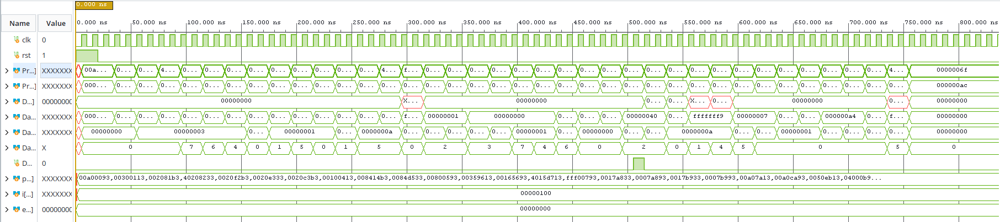
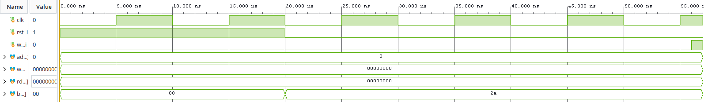
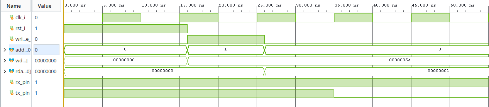
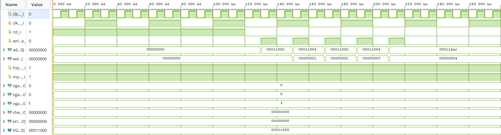

# Informe técnico final — Proyecto 3: Batalla Naval sobre microprocesador RISC-V

Al contar con una estructura compleja del proyecto, se decidió explicar la respuesta de los módulos críticos, los cuales son:

- CPU RV32I (`CPU_P3_tb`)
- Interfaz GPIO del Jugador 1 (`j1_input_tb`)
- Comunicación UART (`uart_top_tb`)
- Generación de video VGA (`vga_top_dut_tb`)

## Resumen

Este proyecto implementa un sistema completo de Batalla Naval para dos jugadores sobre un SoC basado en RISC-V RV32I. El diseño integra un procesador uniciclo, memoria ROM/RAM, periféricos mapeados en memoria, UART para comunicación con una aplicación de PC, lógica VGA para la representación del tablero y un conjunto de periféricos de entrada/salida para la interacción del Jugador 1. La lógica del juego se ejecuta en firmware de ensamblador sobre el microprocesador; la aplicación en Python funciona únicamente como terminal remota del Jugador 2.

## 1. Introducción

El objetivo principal del proyecto es integrar, en una sola plataforma digital, la lógica del juego, el procesamiento de instrucciones del microprocesador y la interfaz con periféricos. El sistema final contempla dos modos de interacción:

- Jugador 1: utiliza la FPGA, observa el juego en VGA y accede al sistema con botones y switches.
- Jugador 2: interactúa desde una PC con una aplicación serial basada en Python.

La solución se apoya en la arquitectura de un SoC con buses de programa y de datos separados. La ROM contiene el firmware con la máquina de estados del juego, mientras que la RAM y los periféricos se acceden mediante memoria mapeada.

## 2. Arquitectura general del sistema

El diseño está centrado en el top-level `soc_top`, que integra:

- `cpu`: procesador RV32I uniciclo.
- `instr_mem`: ROM de instrucciones.
- `soc_data_ram`: RAM de datos.
- `soc_interconnect`: decodificador de direcciones y multiplexor de lectura.
- `j1_input`: GPIO de entrada para botones/switches.
- `uart_top`: periférico UART para la comunicación con la PC.
- `display_7seg`: contador acumulado de victorias.
- `led_perifico`: salida de estado general.
- `buzzer_perifico`: señales sonoras de eventos.
- `vga_periph`: memoria de video y generación de video para el tablero.
- `vga_clock_gen`: reloj de 25 MHz para la salida VGA.

### 2.1 Buses del sistema

El sistema usa dos rutas principales:

- Bus de instrucciones: `ProgAddress_o` -> ROM -> `ProgInstr_i`.
- Bus de datos: direccionamiento MMIO para RAM y periféricos.

La interconexión utiliza selección por rango de dirección y multiplexación de lectura. La lógica del juego no se ejecuta en el PC; solo se interpreta en la CPU.

## 3. Microprocesador RV32I

El núcleo del proyecto es un procesador en una sola etapa (uniciclo), con soporte para las instrucciones del conjunto base RV32I requerido por el firmware del juego. El flujo sigue el esquema clásico:

1. fetch desde ROM;
2. decodificación en la unidad de control;
3. acceso a registros y memoria;
4. ejecución en la ALU;
5. escritura de resultados y control de flujo.

Los módulos relevantes son:

- `main_decoder.sv`
- `alu_decoder.sv`
- `control_unit.sv`
- `datapath.sv`
- `reg_file.sv`
- `ALU.sv`
- `Extend.sv`

La ALU cubre operaciones aritméticas, lógicas y comparaciones; el datapath y la unidad de control resuelven la toma de decisiones del flujo del programa, incluyendo saltos condicionales y de subrutina.

### 3.1 Análisis del testbench `CPU_P3_tb`

El testbench conecta la CPU a una ROM combinacional de prueba y a una memoria de datos. Codifica un programa RV32I que ejercita operaciones aritméticas y lógicas, desplazamientos, comparaciones con y sin signo, accesos `sw`/`lw`, branches, `jal` y `jalr`. Tras mantener el reset activo por dos flancos, libera la CPU y permite ejecutar el programa durante 96 ciclos; luego compara los valores esperados de 26 registros y de la palabra escrita en memoria. Cualquier diferencia incrementa el contador de errores y termina la prueba con `$fatal`.

En la figura se observa el reloj de período 10 ns y la liberación del reset al inicio. Después, la dirección de programa y la instrucción avanzan por el programa de prueba; los buses de datos muestran los resultados de las operaciones y el pulso de escritura en memoria para almacenar el valor `123` en la dirección `64`. La captura llega aproximadamente hasta 800 ns, antes de que el testbench ejecute las comparaciones finales, que ocurren después de los 96 flancos de reloj. Por tanto, la forma de onda ilustra la ejecución y el acceso a memoria, mientras que la confirmación completa depende del mensaje `CPU_P3: todas las verificaciones pasaron`; si un resultado no coincide, la prueba falla explícitamente. El datapath habilita el avance y la escritura de registros en ciclos alternos, lo que permite que las instrucciones y sus resultados se estabilicen antes de actualizar el estado.

## 4. Memoria y mapeo de periféricos

La RAM y los periféricos se acceden mediante direcciones mapeadas en memoria. La tabla muestra los rangos definidos en `soc_interconnect.sv`.

| Periférico | Base | Rango de acceso |
|---|---|---|
| UART | `0x0001_0040` | `0x0001_0040` a `0x0001_004B` |
| GPIO / botones | `0x0001_0120` | `0x0001_0120` a `0x0001_0123` |
| Display 7 segmentos | `0x0001_0130` | `0x0001_0130` a `0x0001_0133` |
| LED | `0x0001_0138` | `0x0001_0138` a `0x0001_013B` |
| Buzzer | `0x0001_0140` | `0x0001_0140` a `0x0001_0143` |
| VGA | `0x0001_1000` | `0x0001_1000` a `0x0001_17FF` |

La RAM de datos se usa para el estado del juego, contadores, tableros y variables del firmware. La arquitectura hace que la aplicación del Jugador 2 sólo envíe entradas al sistema por UART; la validación final se mantiene en la CPU.

## 5. Interfaz del Jugador 1

El periférico de entrada `j1_input` sincroniza, filtra y convierte la señal física de los botones/switches en palabras de 32 bits accesibles desde el bus MMIO. Los bits funcionales del sistema son:

- bit 6: `btnC` / reset general
- bit 5: `btnU` / arriba
- bit 4: `btnD` / abajo
- bit 3: `btnL` / izquierda
- bit 2: `btnR` / derecha
- bit 1: `sw[1]` / rotar
- bit 0: `sw[0]` / confirmar

La lógica de debouncing y sincronización evita rebotes y metabilidad al conectar señales asíncronas de la placa con el dominio del reloj del sistema.

### 5.1 Análisis del testbench `j1_input_tb`

El testbench comprueba tres comportamientos de `j1_input`: que el registro leído sea cero durante el reset, que una entrada de botones recién modificada no aparezca inmediatamente en la lectura y que habilitar una escritura suprima la lectura. Después de liberar el reset, aplica `btns_in = 7'b0101010` (0x2A) y espera cuatro flancos de reloj; como ese intervalo es mucho menor que el requerido por el filtro anti-rebote, `rdata_o[6:0]` debe seguir en cero. Finalmente activa `write_enable_i` y verifica que `rdata_o` permanezca en cero.

La forma de onda muestra el reset inicialmente activo, su liberación cerca de 20 ns y el cambio de las entradas a 0x2A, mientras la salida leída continúa en cero. Esto es lo esperado: el sincronizador y el debouncer evitan que un cambio breve o reciente de los botones se refleje como una pulsación válida. Al activar `write_enable_i`, el periférico también mantiene la salida de lectura en cero, tal como define su interfaz. Las aserciones verifican estos valores y detienen la simulación con `$fatal` ante cualquier discrepancia; por ello, que el testbench termine con `j1_input_tb: PASS` confirma el comportamiento esperado para los casos probados.

## 6. Periféricos de salida

### 6.1 UART

El módulo `uart_top` representa la capa de comunicación entre la FPGA y la aplicación en PC. La terminal serial se configura en 115200 baudios, 8N1, y usa una capa de protocolo para tramas de comando y respuesta. El diseño es compatible con la estructura del programa del Jugador 2 y la lógica del juego en ensamblador.

#### Análisis del testbench `uart_top_tb`

La Figura muestra una prueba de integración breve del top UART. El reloj tiene un período de 10 ns y el testbench mantiene activo el reset al inicio; durante ese intervalo, el registro de estado leído en `addr_i = 0` vale cero. Después libera el reset y activa `write_enable_i` con `addr_i = 1` y `wdata_i = 0x5A`. Esa dirección corresponde al registro de transmisión: la escritura solicita enviar el byte `0x5A` y pone ocupado al transmisor. Al volver a `addr_i = 0`, `rdata_o` muestra `1`, que corresponde al bit `tx_busy` del registro de estado; a continuación, `tx_pin` deja el nivel alto de reposo e inicia la trama con el bit de inicio bajo.

El top tiene un funcionamiento coherente con esta prueba porque conecta el generador de ticks de sobremuestreo con los bloques de transmisión y recepción, inicia la transmisión al escribir en el offset de TX, y expone las banderas y los datos recibidos mediante los offsets de lectura definidos. El reset también inicializa el estado del periférico y mantiene `tx_pin` en reposo alto. En esta simulación se usan `SYS_CLK_FREQ = 1000`, `BAUD_RATE = 10` y `OVERSAMPLE = 4` para ajustar la temporización; no son los parámetros de operación final indicados arriba.

El alcance del testbench es de *smoke test*: comprueba que el estado después del reset es cero, que la lectura del estado no contiene valores desconocidos tras la escritura y que `tx_pin` sigue definido después de 100 ciclos. No compara los bits recibidos por el pin RX ni verifica la trama TX completa, por lo que esta forma de onda valida el reset y el inicio de la ruta de transmisión, pero no sustituye las pruebas específicas de transmisión y recepción.

### 6.2 VGA

El módulo `vga_periph` maneja la memoria de video, el render del tablero y las señales de sincronización `hsync` y `vsync`. Se integra con el reloj de 25 MHz generado por `vga_clock_gen`, y trabaja sobre una memoria de tiles por celda para mostrar el estado del tablero, impactos, barcos y mensajes del HUD.

#### Análisis del testbench `vga_top_dut_tb`

El testbench genera dos relojes (CPU de 10 ns y VGA de 40 ns), libera el reset y escribe cinco tiles en la memoria de video, desde la dirección base `0x00011000`. La figura muestra esa secuencia: las direcciones `0x11000`, `0x11004`, `0x11050`, `0x11054` y `0x114AC` corresponden a los índices 0, 1, 20, 21 y 299, con datos de color de 0 a 4. En el intervalo capturado, `hsync` y `vsync` permanecen altos y los contadores `checks` y `errors` siguen en cero; esto corresponde a la etapa de inicialización y escritura, antes de que el testbench llegue a las verificaciones de píxeles.

Luego, el testbench verifica el pulso de sincronismo horizontal, los colores esperados para agua, barco, impacto, fallo y el tile final, y que la salida RGB sea negra durante el intervalo de blanking. Cada discrepancia incrementa `errors` y, si hay errores, la simulación termina con `$fatal`; por eso, un resultado final con siete verificaciones y cero errores confirma que las escrituras, el render y las señales VGA se comportan de acuerdo con lo esperado. La captura mostrada por sí sola documenta las escrituras iniciales, no el resultado de esas verificaciones posteriores.

### 6.3 Display y buzzer

El display 7 segmentos sirve como marcador de victorias por jugador. El buzzer ofrece retroalimentación sonora para eventos del juego como impacto, fallo, colocación inválida, barco hundido y victoria.

## 7. Firmware y lógica del juego

La programación del juego se desarrolla en lenguaje ensamblador y se genera con el script `modulos/ensamblador/assembly.py`. La ROM del sistema se alimenta con ese firmware; la lógica del juego incluye:

- colocación inicial de barcos,
- turnos alternados,
- validación de entradas del Jugador 1 y del Jugador 2,
- control del tablero,
- detección de impactos y hundimientos,
- manejo del estado final del partido,
- interacción con periféricos de salida.

La aplicación Python no implementa la lógica del juego; es una terminal de entrada/salida del Jugador 2. El control de reglas se mantiene dentro del microprocesador para cumplir el planteamiento del proyecto.

## 8. Protocolo de aplicación para UART

El protocolo serial se define en `pc_app/uart_protocol.py` y en la aplicación hija `battleship_uart.py`. El flujo del sistema incluye tramas de comando y eventos de estado, con delimitadores, longitud y control de errores. La comunicación se realiza con formato compacto para evitar sobrecarga del CPU y mantener un flujo determinista del juego.

## 9. Bancos de prueba y validación

El repositorio incluye una batería de tests SystemVerilog en `modulos/tb` para validar módulos clave del diseño:

- `cpu/`: ALU, datapath, decodificadores, control unit, registros, memoria de instrucciones, memoria de datos, instrucciones RV32I.
- `peripheral/gpio/`: sincronizador, debouncer y entrada de botones.
- `peripheral/uart/`: transmisor, receptor, generador de baudios, UART de sistema.
- `peripheral/vga/`: tiles, render, sync y top de demostración VGA.
- `top/`: RAM de datos, interconexión MMIO y top del SoC.

Estos testbenches son la base de la validación funcional del diseño y cubren los módulos de CPU, periféricos y top-level del sistema.

### 9.1 Resultados visibles y criterios de éxito

Las figuras muestran las señales y etapas indicadas en cada análisis; algunas capturas son parciales y no incluyen el final de la simulación. El código de cada testbench reporta su aprobación después de completar sus comprobaciones y detiene la prueba con `$fatal` si encuentra una discrepancia. Los mensajes de éxito definidos son:

| Testbench | Resultado visible o comprobado | Indicador de aprobación en el código |
|---|---|---|
| `CPU_P3_tb` | Ejecución de instrucciones RV32I y escritura del valor 123 en la dirección 64. | `CPU_P3: todas las verificaciones pasaron` |
| `j1_input_tb` | Reset, rechazo temporal de la entrada `0x2A` por el filtro anti-rebote y supresión de lectura durante escritura. | `j1_input_tb: PASS` |
| `uart_top_tb` | Reset y comienzo de transmisión del byte `0x5A`; se comprueba que el estado y `tx_pin` no sean desconocidos. | `uart_top_tb: PASS` |
| `vga_top_dut_tb` | Escritura de tiles y verificaciones de sincronismo, cinco colores y blanking. | `VGA_TOP_DUT: 7 checks passed` |

La correspondencia de las señales capturadas con los valores esperados respalda el funcionamiento de las etapas mostradas. La confirmación de que una ejecución completa fue exitosa es el mensaje de aprobación correspondiente, no únicamente la figura de tiempos.