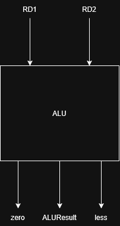
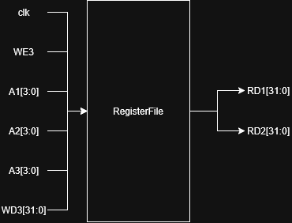
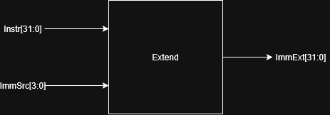
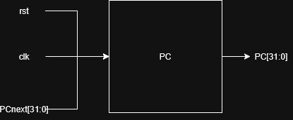

# Documentación técnica

## Informe técnico — Proyecto 3:  Batalla Naval
Curso: EL3313 Taller de Diseño Digital

Semestre: II Semestre 2026

Proyecto: Batalla Naval: juego de dos jugadores sobre un microprocesador RISC-V con periférico VGA

Plataforma FPGA: Digilent Basys 3

### Resumen 
### Introducción 
El objetivo de este proyecto es la implementación del juego batalla naval ("Battleship") integrando elementos como un microprocesador basado en la arquitectura RISC-V, lógica del juego en lenguaje ensamblador, periféricos mapeados a memoria y la generación de video con VGA. El batalla naval puede ser jugado por dos jugadores a la vez, donde de el jugador 1 interactúa por medio de la FPGA, utilizando los botones locales para colocar barcos y disparar, mientras observa el transcurso de la partida desde el monitor VGA, por otro lado, el jugador 2 interactúa con el juego por medio de una aplicación de PC (Python) que se comunica con la FPGA mediante protocolo UART.   

Para este proyecto la lógica del juego reside únicamente en el programa escrito en ensamblador y ejecutado por el microprocesador, este ultimo se comunica con el resto de periféricos, recibiendo y enviando señales por medio de un bus de datos de tres líneas (address, write, read), lo que permite a los jugadores interactuar con el juego a través de los botones de la FPGA o la PC y observar el desarrollo de la partida. A lo largo de este trabajo se usaran conceptos aprendidos en cursos anteriores, en proyectos pasados o que se investigaron para esta implementación. (continuar)  
### Fundamentación Teórica

#### Juego en ensamblador 
#### Microprocesador 
En este proyecto se hará uso de un microprocesador basado en las instrucciones rv32i de RISC-V uniciclo, lo que significa que se ejecutara una sola instrucción por ciclo. Este sistema permite realizar las operaciones requeridas por la lógica del juego, como la suma o lectura de registros. En esta sección se explica la función de cada parte que lo compone, para el desarrollo de cada modulo se uso como base el código, conocimientos y bibliografía de cursos pasados pasados. En la tabla # se muestran las instrucciones soportadas por el microprocesador.

  <b>Tabla 1. Instrucciones soportadas por el microprocesador. </b> 

  
| Instrucciones                         | Estado actual                                                                                                                         |
| ------------------------------------- | ------------------------------------------------------------------------------------------------------------------------------------- |
| `add`, `sub`, `and`, `or`, `xor`      | Implementadas en la ALU y decodificadas.                                                                                              |
| `slt`, `sll`, `srl`, `sra`            | Implementadas en la ALU y decodificadas.                                                                                              |
| `addi`, `andi`, `ori`, `xori`, `slti` | Implementadas y decodificadas.                                                                                                        |
| `slli`, `srli`, `srai`                | Implementadas y decodificadas.                                                                                                        |
| `beq`, `bne`, `blt`, `bge`            | Contempladas en la unidad de control.                                                                                                 |
| `jal`                                 | Contemplada en la unidad de control y el `datapath`.                                                                                  |
| `lb`, `lh`, `lw`, `lbu`, `lhu`        | Contempladas por la memoria de datos; falta completar la conexión de `funct3` en el `datapath`.                                       |
| `sb`, `sh`, `sw`                      | Contempladas por la memoria de datos; falta completar la conexión de `funct3` en el `datapath`.                                       |
| `jalr`                                | El `datapath` y `PCSrc` contemplan el salto, pero falta completar su decodificación en `main_decoder`.                                |
| `lui`                                 | El generador de inmediatos y la ALU contemplan la operación, pero falta completar la decodificación correspondiente en `alu_decoder`. |
| `sltu`, `sltiu`                       | La ALU contempla la comparación sin signo, pero falta completar su decodificación en `alu_decoder`.                                   |

#### ALU
La unidad aritmética lógica en un procesador es la encargada de realizar operaciones aritméticas, lógicas o desplazamientos, esta tiene 3 entradas, 2 para cada operando de 32 bits (`SrcA` y `SrcB`) y una señal de control de 4 bits para indicar la operación (`ALUControl`), a partir de estas genera una señal de salida de 32 bits (`ALUResult`). Para evaluar condiciones de salto la ALU también genera las señales `less` y `zero`, estas son evaluados en la unidad de control. 

  <b>Figura 1. Diagrama de unidad aritmética lógica  </b> 

  

#### Banco de registros   
La unidad de registros esta compuesta por 32 registros cada uno de 32 bits y funciona para escritura y lectura. Existen varios tipos de registro: registros temporales, registros de guardado, punteros, cero, etc. En modo lectura con la instrucción `lw` se pueden recuperar elementos almacenados en el registro utilizando su dirección, en el modo de escritura por otro lado, se pueden escribir los datos usando `sw`. En este proyecto el nombre del modulo es `reg_file`, este permite dos lecturas simultáneas mediante las salidas `RD1` y `RD2`, y una escritura mediante la entrada `WD3`, las direcciones de registro se indican con las señales `A1`, `A2` y `A3`.  
La estructura se realiza por medio de las señales `RegWrite` (de la unidad de control) y `WD3` las cuales determinan si se debe realizar una escritura, al realizarse, se escribe el valor de la señal `Result` en el registro designado. Las salidas `RD1` y `RD2` corresponden al contenido de los registros seleccionados por `A1` y `A2`, `RD1` es el primer operando del ALU y `RD2` puede usarse como segundo operando o para escritura en memoria. Cuándo `A1` o `A2` seleccionan al registro `x0` la salida respectiva es 0, aunque las operaciones de escritura sobre 0 son ignoradas. 

  <b>Figura 2. Diagrama de banco de registros </b> 

  

##### Generador de inmediatos
El generador de inmediatos es el modulo que se encarga de generar un valor inmediato de 32 bits. En este caso el modulo se llama `Extend`, este recibe el instrucción de la que se saca el inmediato `Instr` y la señal `ImmSrc` que le dice al modulo como debe modificar y extender el inmediato, el resultado de la extensión se encuentra en su salida `ImmExt`. La figura # muestra la relación entre entradas y salidas en un diagrama simplificado:   

  <b>Figura 2. Diagrama de generador de inmediatos </b> 

  

##### Comparador de branch
Este modulo se encarga de comparar dos registros y determinar si se debe realizar un salto o no, si se determina que debe realizarse un salto, se carga la nueva dirección de salto en el contador de programa `PCTarget`, de lo contrario este continua aumentando la cuenta secuencialmente. En este microprocesador, las funciones de comprador de branch se reparten entre los módulos de ALU y la unidad de control, en lugar de un modulo propio. 
ALU genera las señales `less` y `zero` a partir de sus entradas, `zero` en caso de que la operación de ALU tuviese resultado 0 y `less` si `SrcA < SrcB` realizando una comparación con signo, estas señales se envían a `control_unit` donde se determina el tipo de branch, de esta forma obteniendo el valor que determinara el siguiente valor del PC `PCSrc`.

##### Contador de programa
Este modulo recibe la dirección de la instrucción y la mantiene durante el periodo, una vez se completa la instrucción el contador aumenta cuatro. El modulo mantiene la dirección de 32 bits llamada `PC` en el código y la actualiza en cada flanco de reloj `clk`, el valor nuevo que se almacenara tiene por nombre `PCnext` y es generado por el mux del datapath `u_pcmux`. En la siguiente figura se presenta la relación de estas señales con el contador:

  <b>Figura 3. Diagrama del contador del programa </b> 

  

##### Unidad de control
Esta unidad se encarga de controlar el resto de módulos por medio de señales de control basadas en una instrucción que recibe del datapath y luego usa para determinar su como debe implementarse la misma. En este microprocesador, la unidad de control recibe el código de operación de la instrucción, los campos adicionales que diferencian ciertas operaciones e instrucciones y los valores de `less` y `zero` descritos en la sección de "comparador de branch". 

#### ROM
Este modulo es la memoria de instrucciones del procesador `instr_mem` recibe una dirección que apunta a una dirección en la memoria de instrucciones llamada `A` y devuelve la instrucción que almacena en la salida `RD`, ambas de 32 bits.

#### RAM
La memoria de datos RAM se encarga de almacenar los valores que se requiere que perduren en el procesador. En el modulo `data_mem` se implementa una memoria de 256 que se mantiene en el `datapath`, por otro lado, en el `soc_top` se implementa la memoria mapeada en el bus de datos `soc_data_ram` con 1024 palabras de 32 bits a partir de la dirección base `0x00002000`.

#### Periférico: VGA
VGA (Video Graphics Array) es un estándar de visualización en monitores analógicos con una resolución de 640x480@60Hz (resolución que se usara en este caso), que indica 640 pixeles de ancho y 480 pixeles de alto con una frecuencia de actualización de pantalla de 60Hz. La FPGA basys 3 sintetiza el controlador de la VGA, este se encarga de generar pulsos de sincronización verticales y horizontales que coordinen la presentación de video en la pantalla (sincronismos), también se encarga de acceder a la memoria de video y aplicar los datos conforme se va recorriendo cada pixel, actualizando la información de cada uno []. El controlador realiza la coordinación según el reloj la VGA de 25MHz, el cual también es generado por la FPGA.    

Para la aplicación de este periférico se genero un modulo de sincronismos `vga_sync`, este en encarga de recorrer las direcciones de cada pixel, para la actualización en la pantalla los cambios que realice el CPU en la memoria de video, también es el modulo que genera las señales de sincronización horizontal y vertical `vsync` y `hsync`. Para la memoria de video se genero el modulo `tile_map_ram`, la cual es una memoria de doble puerto que recibe los datos del CPU desde el modulo `vga_periph` como escritura y para luego ser leídos por el modulo que renderiza los tiles `tile_renderer`. `tile_renderer` se encarga de generar las señales RGB a partir del la información de la memoria de video y de del pixel que se este recorriendo en un momento especifico. `vga_periph` funciona como una interfaz que recibe la información del CPU y envía la información de RGB, `hsync` y `vsync` a los pines del conector VGA. En la tabla 1 se muestra la información utilizada para la coordinación del video en `vga_sync` y en la figura # se muestra un diagrama que relaciona los modulos con sus entradas y salidas:

  <b>Tabla 1. Tiempos y pixeles de VGA. </b> 

  
| Description | Time | Pixels |
| :--- | :--- | :--- |
| Visible area (Horizontal) | 25.422 μs | 640 |
| Horizontal Sync Time | 3.813 μs | 96 |
| Horizontal Back Porch | 1.907 μs | 48 |
| Horizontal Front Porch | 0.636 μs | 16 |
| Whole Horizontal Line | 31.777 μs | 800 |
| Visible area (Vertical) | 15.253 ms | 480 Lines |
| Vertical Sync Time | 0.064 ms | 2 Lines |
| Vertical Back Porch | 1.048 ms | 33 Lines |
| Vertical Front Porch | 0.318 ms | 10 Lines |
| Whole Vertical Line | 16.683 μs | 525 | 
  

(corregir) 
#### Protocolo UART y aplicación PC
#### Periféricos
##### Displays
##### Botones
##### Buzzer 

### Presentación de Resultados 

### Análisis e interpretación de resultados 

### Conclusiones  

 
